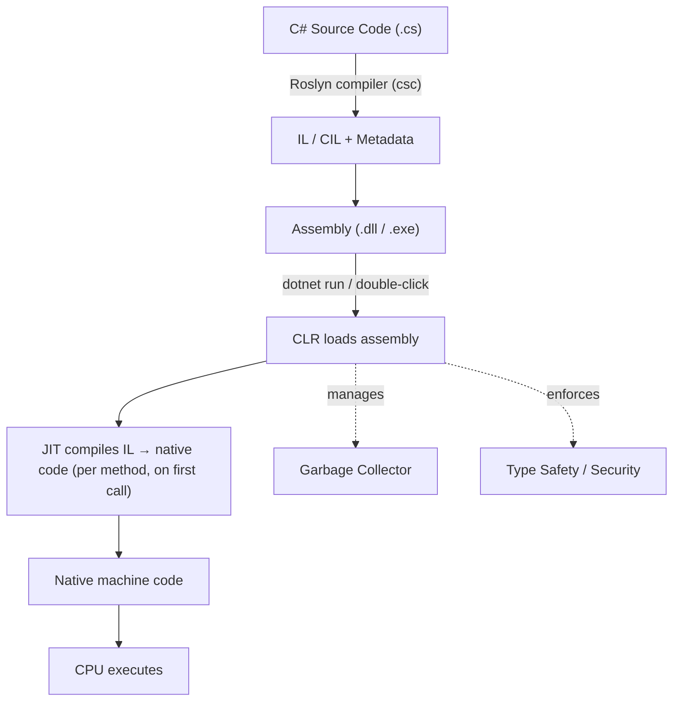
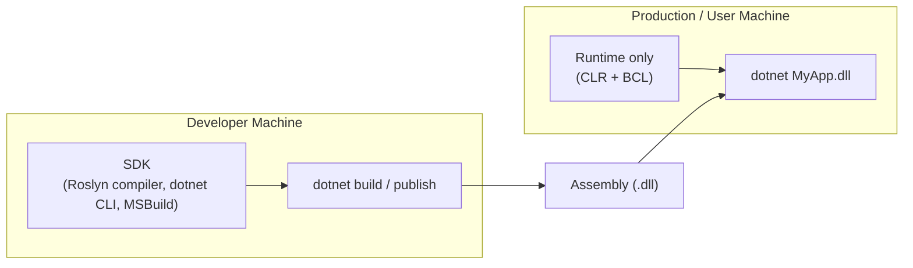

# 01 — C# Fundamentals

## 🎯 Learning Objectives
- Explain the difference between C#, .NET, the CLR, and the runtime.
- Trace a program from source code to CPU execution.
- Understand SDK vs Runtime, and Framework vs modern .NET.
- Know what an assembly, namespace, project, and solution actually are.

## 🤔 What is it?

**C#** is a statically-typed, object-oriented, general-purpose programming *language* designed by Microsoft. It has no runtime behavior of its own — a `.cs` file cannot execute anything by itself.

**.NET** is the *platform*: a runtime (the CLR), a set of libraries (the BCL/FCL), and tooling (the SDK) that compiles, runs, and manages C# (and F#, VB.NET) programs.

> C# is the language you write. .NET is the machine that runs it.

## ❓ Why do we need it?

Before managed platforms like .NET and Java, developers using C/C++ had to manually manage memory, handle platform-specific binary formats, and had no unified way to run the same compiled code across different CPUs/OSes. .NET solves this by compiling to an intermediate, platform-neutral format (IL) and letting a runtime (the CLR) translate that to real machine code *on the target machine*, while also handling memory management (garbage collection), type safety, and security.

## 🌍 Real-World Analogy

Think of C# source code as a **recipe written in English**. The recipe itself doesn't cook anything. The **CLR is the kitchen** — it has the equipment (JIT compiler, garbage collector, type system) that takes the recipe (translated first into a universal cooking notation — IL) and actually produces the dish (running machine code) using whatever stove you have (Windows, Linux, macOS, ARM, x64).

## 🧠 Core Concept

| Term | What it actually is |
|---|---|
| **C#** | The language: syntax and grammar rules. |
| **.NET** | The platform: runtime + libraries + SDK. |
| **CLR** (Common Language Runtime) | The virtual machine that executes IL: JIT, GC, type-checking, exception handling. |
| **CTS** (Common Type System) | The specification defining how types are declared and used, so C#, F#, and VB.NET types are compatible with each other. |
| **CLS** (Common Language Specification) | A subset of CTS rules that guarantees cross-language interoperability (e.g. don't expose unsigned ints in a public API meant to be CLS-compliant). |
| **BCL/FCL** | Base Class Library — `System.*` namespaces: collections, I/O, threading, etc. |
| **SDK** | Everything needed to **build** .NET apps: compiler (Roslyn), CLI (`dotnet`), MSBuild, templates. |
| **Runtime** | Everything needed to **run** a built .NET app: CLR + BCL. You can ship an app with just the runtime installed on the target machine. |
| **Managed code** | Code executed by the CLR — memory and type safety are managed for you (GC, bounds checking). |
| **Unmanaged code** | Native code (e.g. C++) that runs directly on the CPU with no CLR oversight — you manage memory yourself. |
| **IL / CIL** | Common Intermediate Language — the platform-neutral bytecode the C# compiler produces. |
| **JIT** (Just-In-Time compiler) | Converts IL into native machine code *at run time*, method by method, the first time each method is called. |
| **Assembly** | A compiled unit of deployment — a `.dll` or `.exe` — containing IL, metadata, and a manifest. |
| **Namespace** | A logical grouping of types to avoid name collisions (`System.Collections.Generic`). Purely a compile-time/organizational construct — has no runtime existence. |
| **Project** | A `.csproj` file plus its source files — the unit MSBuild compiles into one assembly. |
| **Solution** | A `.sln` file grouping multiple related projects. |

### .NET Framework vs .NET Core vs modern .NET

- **.NET Framework** (2002–2019, ends at 4.8): Windows-only, tightly coupled to the OS, no longer receiving new features.
- **.NET Core** (2016–2020, up to 3.1): cross-platform, open-source rewrite, faster release cadence.
- **.NET 5+** (2020 onward, now just called "**.NET**", e.g. .NET 8, .NET 9): the unification of .NET Core, Xamarin/Mono, and .NET Framework's API surface into one platform going forward. When someone today says ".NET" without qualification, they mean this line.

## 🎨 Visual Explanation

### Compilation & execution pipeline



### SDK vs Runtime



## 💻 Basic Example

```csharp
// Program.cs
using System;

namespace CSharpFundamentals
{
    class Program
    {
        static void Main(string[] args)
        {
            Console.WriteLine("Hello, .NET!");
        }
    }
}
```

Build and run it, then inspect what actually got produced:

```bash
dotnet new console -n CSharpFundamentals
cd CSharpFundamentals
dotnet build          # produces bin/Debug/net8.0/CSharpFundamentals.dll (IL, not native code)
dotnet run             # CLR loads the DLL, JIT compiles Main(), executes it
```

## 🔍 Code Walkthrough

- `using System;` — imports the `System` namespace so `Console` can be referenced without its full name (`System.Console`). Purely a compile-time convenience.
- `namespace CSharpFundamentals` — organizes this type under a named scope; prevents collisions with another `Program` class elsewhere.
- `class Program` — a reference type; this is the entry-point container.
- `static void Main(string[] args)` — the CLR looks specifically for a method matching this signature (or its `Task`/`int`-returning variants) as the entry point recorded in the assembly's manifest.
- `Console.WriteLine(...)` — a BCL method; internally it eventually calls into the OS to write to stdout.

## ⚙️ How It Works Internally

1. **`dotnet build`** invokes the Roslyn compiler (`csc`), which performs lexing, parsing, semantic analysis, and emits **IL** — a stack-based, platform-neutral instruction set — plus **metadata** describing every type, method, and their signatures.
2. This IL + metadata is packaged into an **assembly** (`.dll`) with a manifest (version, culture, referenced assemblies).
3. When you run it, the **CLR host** (`dotnet.exe` or `apphost`) loads the CLR, which loads the assembly.
4. The CLR does **not** interpret IL line-by-line. The **JIT compiler** compiles each method to native machine code the *first time it is called*, then caches that native code for the lifetime of the process — this is why the very first call to a method is often slightly slower ("JIT warm-up").
5. There is also **ReadyToRun (R2R)** and **Ahead-of-Time (AOT)** compilation, which pre-compile some or all IL to native code at publish time to reduce startup latency — used heavily in modern .NET for faster cold starts (e.g. Azure Functions, containers).
6. Throughout execution, the CLR's **Garbage Collector** manages heap memory, and the **type system** enforces that you can't, say, treat an `int` as a `string` without an explicit, defined conversion.

## 🏢 Real-World Example

A company ships a Web API as a single assembly, `Orders.Api.dll`. In development, engineers have the full **SDK** installed to build and debug it. In production, the container image only needs the **ASP.NET Core runtime** image (`mcr.microsoft.com/dotnet/aspnet:8.0`), not the SDK — this keeps the image smaller and reduces attack surface, because production never needs to *compile* anything, only *run* already-compiled IL.

## 🚀 Production-Ready Example

`Dockerfile` demonstrating the SDK/runtime split described above (multi-stage build — covered fully in [37-Docker](../37-Docker)):

```dockerfile
FROM mcr.microsoft.com/dotnet/sdk:8.0 AS build
WORKDIR /src
COPY . .
RUN dotnet publish -c Release -o /app

FROM mcr.microsoft.com/dotnet/aspnet:8.0 AS runtime
WORKDIR /app
COPY --from=build /app .
ENTRYPOINT ["dotnet", "Orders.Api.dll"]
```

## ⚠️ Common Mistakes

- Saying "C# is slow/fast" — performance is a property of the CLR/JIT and your code, not the language grammar itself.
- Believing `.dll` files always contain native machine code — a managed `.dll` contains IL until JIT-compiled at runtime.
- Confusing **.NET Framework** (legacy, Windows-only) with **.NET** (current, cross-platform) when reading older tutorials.
- Assuming you need the full SDK installed on a production server just to *run* an app.

## ❌ What NOT To Do

- Don't install the full SDK on production servers/containers when only the runtime is needed — larger surface area, larger image, no benefit.
- Don't target `.NET Framework` for new projects in 2024+ unless a specific legacy dependency requires it (e.g. old COM interop, WCF server hosting).

## ✅ Best Practices

- Target the latest **LTS** (Long-Term Support) release of .NET for production services unless you need the newest STS features.
- Keep the SDK version pinned via a `global.json` in team projects so builds are reproducible.
- Understand which of your assemblies are "yours" (your project output) vs framework/NuGet assemblies — helps when debugging `MissingMethodException` or version conflicts.

## ⚡ Performance Considerations

- JIT warm-up means the very first invocation of a method is slower; long-running services amortize this cost, but short-lived processes (CLI tools, serverless functions) feel it more — this is why **ReadyToRun** and **Native AOT** exist, trading longer build times for near-instant cold starts.
- Native AOT (introduced heavily from .NET 7/8) skips JIT entirely at runtime by compiling straight to native code at publish time — smaller, faster-starting, but with restrictions (no runtime reflection-based dynamic code generation).

## 🔄 Related Concepts
- [03 — Value vs Reference Types](../03-Value-vs-Reference-Types) (memory managed by the CLR)
- [13 — Memory & GC](../13-Memory-GC)
- [15 — .NET Fundamentals](../15-DotNet-Fundamentals)
- [37 — Docker](../37-Docker)

## 🎤 Interview Questions

**Junior:** "What's the difference between C# and .NET?"
*Expected answer:* C# is a language; .NET is the platform (runtime + libraries) that executes it.
*Trap:* Answering as if they're interchangeable/synonyms.

**Mid-level:** "What happens when you run `dotnet run`?"
*Expected answer:* Should walk through: compile to IL → CLR loads assembly → JIT compiles methods on first call → native code executes, GC/type-safety enforced throughout.
*Trap:* Saying C# is "interpreted" — it isn't; only the JIT/interpretation of IL happens, and it's compiled to native code, not interpreted line-by-line like Python.

**Senior:** "Why would you choose Native AOT over the default JIT model, and what do you give up?"
*Expected answer:* Faster startup and lower memory footprint (good for containers/serverless with many cold starts) at the cost of losing runtime reflection-heavy features (some DI containers, dynamic proxy libraries), larger/less portable binaries per-RID, and longer build times.
*Trap:* Treating AOT as a free performance upgrade with no trade-offs.

## 🧪 Practice Exercises

**Easy**
1. Create a new console app with `dotnet new console` and identify the generated `.csproj`'s `<TargetFramework>`.
2. Run `dotnet build` then locate the produced `.dll` in `bin/Debug`.
3. Explain in your own words the difference between a project and a solution.
4. List three namespaces from the BCL you've already used.
5. What CLI command shows your installed SDKs? (`dotnet --list-sdks`)

**Medium**
1. Install only the ASP.NET Core *runtime* (not SDK) in a Docker container and try running a published app.
2. Use `ildasm` or `ILSpy` to open a compiled `.dll` and view its IL.
3. Explain why a `.dll` compiled for .NET 8 might fail to load on a machine with only the .NET 6 runtime installed.
4. Create a `global.json` pinning a specific SDK version and observe the build fail on a mismatched SDK.
5. Compare the output assembly size of a normal build vs a Native AOT publish.

**Hard**
1. Explain, with a diagram, why the *first* call to a method in a cold-started Azure Function is slower than the second.
2. Research and explain what "tiered compilation" is and how it changes the simple JIT model described above.
3. Explain CLS-compliance and why a public library method returning `uint` could break interoperability with another .NET language.

**Real-world scenario:** Your team's serverless functions have unacceptably slow cold starts. Propose two independent solutions grounded in what you've learned in this module and explain the trade-off of each.

## 📌 Key Takeaways
- C# is a language; .NET is a platform (runtime + libraries + SDK).
- Source → IL (via Roslyn) → Assembly → CLR loads it → JIT compiles to native code → CPU executes.
- SDK is for building; Runtime is for running — production only needs the latter.
- "Modern .NET" (.NET 5+) unifies what used to be .NET Framework and .NET Core.
