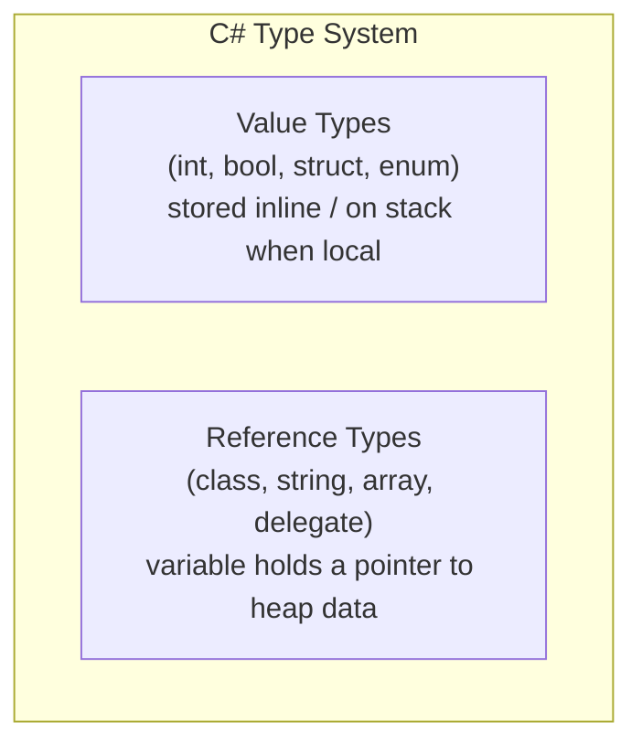

# 02 — Variables & Data Types

## 🎯 Learning Objectives
- Choose the correct built-in type for a given problem (money, dates, unique IDs, flags).
- Understand `var` vs `dynamic` vs `object` and when each is appropriate.
- Understand constants (`const` vs `readonly`).

## 🤔 What is it?
A **variable** is a named storage location with a type. A **type** determines what values are legal and what operations are allowed. C# is **statically typed**: the type of every variable is known at compile time.

## ❓ Why do we need it?
Types let the compiler catch entire classes of bugs before the program ever runs (e.g. adding a string to a date), and they let the runtime lay out memory efficiently because it knows exact sizes in advance.

## 🌍 Real-World Analogy
A type is like a labeled container size at a warehouse — a "5kg box" slot physically cannot hold a 50kg pallet. The label (type) constrains what can go in the slot before you even try.

## 🧠 Core Concept

### Primitive / numeric types

| Type | Size | Range / Use |
|---|---|---|
| `byte` / `sbyte` | 1 byte | 0–255 / -128–127 |
| `short` / `ushort` | 2 bytes | small counters |
| `int` / `uint` | 4 bytes | default integer type |
| `long` / `ulong` | 8 bytes | large counts, IDs |
| `float` | 4 bytes | approximate, fast, rarely used in business code |
| `double` | 8 bytes | default floating point |
| `decimal` | 16 bytes | **money and financial calculations** — base-10, avoids binary rounding error |
| `bool` | 1 byte | true/false |
| `char` | 2 bytes | single UTF-16 code unit |
| `string` | reference type | immutable sequence of `char` |

### Special types
- `DateTime` — a point in time with no inherent timezone awareness (ambiguous across systems).
- `DateTimeOffset` — a point in time **plus** an offset from UTC — **prefer this for anything crossing timezones or persisted to a database**, e.g. audit timestamps.
- `Guid` — a 128-bit globally unique identifier, used for IDs that must be unique without a central authority (e.g. generated client-side, or across distributed services).
- `object` — the root of the type hierarchy; anything can be assigned to it, but you lose compile-time type safety and value types get boxed (see [03](../03-Value-vs-Reference-Types)).
- `dynamic` — bypasses compile-time type checking entirely; resolved at runtime (used for COM interop, dynamic JSON, scripting scenarios). Errors that would normally be compile errors become runtime `RuntimeBinderException`s.
- `var` — **not** a type; it's compiler-inferred static typing. `var x = 5;` is exactly as strongly-typed as `int x = 5;` — the compiler just figured out the type for you. This is fundamentally different from `dynamic`.

### `const` vs `readonly`

| | `const` | `readonly` |
|---|---|---|
| Value known | Compile time | Can be runtime (e.g. in constructor) |
| Storage | Baked into IL at every call site | Stored per-instance/per-type field |
| Can be static implicitly | Yes (implicitly static) | No, must declare `static readonly` explicitly |
| Use case | Truly fixed values (`Math.PI`) | Values fixed after construction (e.g. injected config) |

## 🎨 Visual Explanation



## 💻 Basic Example

```csharp
int age = 30;              // value type, stored directly
string name = "John";      // reference type, variable holds a reference to heap data
decimal price = 19.99m;    // 'm' suffix required for decimal literals
DateTimeOffset createdAt = DateTimeOffset.UtcNow;
Guid orderId = Guid.NewGuid();
const double Pi = 3.14159; // compile-time constant
```

## 🔍 Code Walkthrough
- `decimal price = 19.99m;` — without the `m` suffix, `19.99` is inferred as `double`, and assigning a `double` to a `decimal` requires an explicit cast; the compiler enforces this specifically because silently truncating financial precision is a real-world bug source.
- `Guid.NewGuid()` — generates a new 128-bit value using a cryptographically-strong RNG algorithm variant (Version 4 UUID), astronomically unlikely to collide.
- `DateTimeOffset.UtcNow` — captures the current instant plus a `+00:00` offset, so it's unambiguous no matter what timezone the server or the reader is in.

## ⚙️ How It Works Internally
Value type locals (like `int age`) are typically allocated directly on the **stack frame** of the method (or inline within a containing object on the heap, if the value type is a field of a class). Reference type variables (like `string name`) hold a **pointer/reference** to an object allocated on the **managed heap**; the variable itself (the pointer) may live on the stack. `decimal` internally stores value as an integer significand plus a scale factor, giving exact base-10 arithmetic instead of the binary floating-point approximation `double`/`float` use — this is why `0.1m + 0.2m == 0.3m` is exactly true, while `0.1 + 0.2 == 0.3` (with doubles) is `false`.

## 🏢 Real-World Example
An e-commerce order total **must** use `decimal`, never `double` — a `double` accumulating thousands of transactions can drift by cents due to binary rounding, which is unacceptable in financial reporting and can fail audits.

## 🚀 Production-Ready Example

```csharp
public sealed record Money(decimal Amount, string CurrencyCode)
{
    public static Money Zero(string currency) => new(0m, currency);
}

public sealed class Order
{
    public Guid Id { get; init; } = Guid.NewGuid();
    public DateTimeOffset PlacedAtUtc { get; init; } = DateTimeOffset.UtcNow;
    public Money Total { get; set; } = Money.Zero("USD");
}
```

## ⚠️ Common Mistakes
- Using `double` for money.
- Using `DateTime.Now` (local server time, ambiguous) instead of `DateTimeOffset.UtcNow` for stored timestamps.
- Overusing `dynamic` where a normal type or `object` with pattern matching would keep compile-time safety.
- Thinking `var` makes C# "loosely typed" like JavaScript.

## ❌ What NOT To Do
```csharp
double total = 0;
total += 19.99;
total += 0.10;
// total might not be exactly 20.09 due to binary floating point representation
```

## ✅ Best Practices
- Default to `decimal` for anything involving money.
- Default to `DateTimeOffset` (or UTC `DateTime` with explicit `Kind`) for timestamps that leave a single process/timezone.
- Use `var` when the right-hand side already makes the type obvious (`var list = new List<Order>();`); use an explicit type when it improves readability (`int result = ComputeScore();`).

## ⚡ Performance Considerations
- `decimal` arithmetic is slower than `double`/`float` (it's not natively supported by most CPU FPUs) — irrelevant for business logic, but avoid it in tight numerical/scientific loops where `double` precision is acceptable.
- Boxing a value type into `object`/`dynamic` allocates on the heap — see [03 — Value vs Reference Types](../03-Value-vs-Reference-Types).

## 🔄 Related Concepts
- [03 — Value vs Reference Types](../03-Value-vs-Reference-Types)
- [14 — Modern C#](../14-Modern-CSharp) (records)

## 🎤 Interview Questions

**Junior:** "Why shouldn't you use `double` for currency?"
*Expected:* Binary floating point can't represent many decimal fractions exactly, causing rounding drift; `decimal` is base-10 and exact for the values used in business math.

**Mid-level:** "What's the actual difference between `var` and `dynamic`?"
*Expected:* `var` is resolved to a concrete static type at compile time — full IntelliSense and compile errors apply. `dynamic` defers type resolution to runtime — no compile-time checking, errors surface as exceptions at runtime.
*Trap:* Saying `var` is "untyped."

**Senior:** "When would `DateTime` still be an acceptable choice over `DateTimeOffset`?"
*Expected:* When you fully control both write and read paths within a single timezone/process and have an explicit convention (e.g. everything stored as `DateTime` with `Kind = Utc`) — but `DateTimeOffset` is the safer default for anything crossing service or timezone boundaries because the offset travels with the value.

## 🧪 Practice Exercises

**Easy**
1. Declare a `decimal` price and print it with currency formatting (`ToString("C")`).
2. Create a `Guid` and print it in "N" format (no dashes).
3. Show that `0.1 + 0.2 != 0.3` for `double` but `==` for `decimal`.
4. Declare a `const` and a `static readonly` and explain the difference to a peer.
5. Convert a `DateTime` to a `DateTimeOffset` explicitly.

**Medium**
1. Write a method that takes `dynamic` input and show a runtime failure that a compile-time type would have caught.
2. Store an order's `PlacedAt` as UTC and correctly render it in the user's local timezone at the presentation layer only.
3. Explain what happens if you `readonly` a mutable reference type field — can its contents still change?

**Hard**
1. Implement a simple `Money` value object that throws when adding two different currencies.
2. Research `decimal`'s internal representation (sign, scale, integer) and explain why it has a smaller range than `double` despite being larger in bytes.

**Real-world scenario:** A financial report shows totals off by a few cents after thousands of transactions. Diagnose the likely root cause and the fix, given what you now know about `double` vs `decimal`.

## 📌 Key Takeaways
- Use `decimal` for money, `DateTimeOffset` for timestamps, `Guid` for distributed unique IDs.
- `var` is static typing with inference; `dynamic` defers all type checking to runtime.
- `const` is a compile-time literal baked into IL; `readonly` is a runtime-assignable, per-instance/type immutable field.
