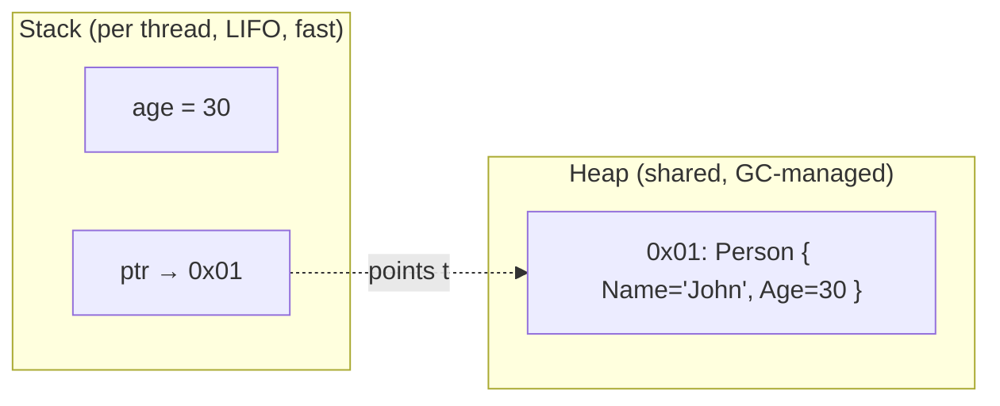
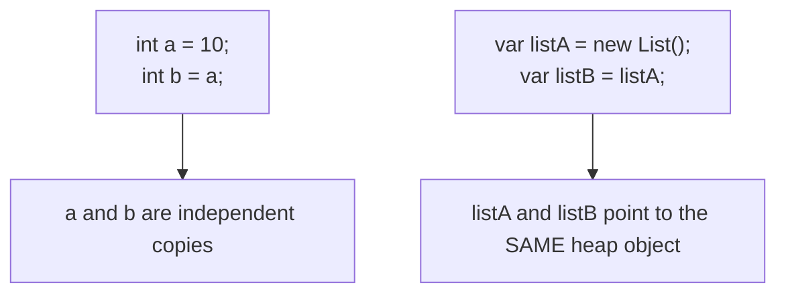

# 03 — Value Types vs Reference Types

## 🎯 Learning Objectives
- Explain stack vs heap conceptually and where the real nuance lies.
- Explain boxing/unboxing and why it costs performance.
- Choose between `class`, `struct`, `record`, and `record struct`.

## 🤔 What is it?
Every C# type is either a **value type** (`struct`, `enum`, and all primitives like `int`/`bool`) or a **reference type** (`class`, `string`, arrays, delegates, interfaces). A variable of a value type **contains** its data directly. A variable of a reference type **contains a reference (pointer)** to data stored elsewhere (the heap).

## ❓ Why do we need it?
Some data is small and copied cheaply (coordinates, a date, a decimal) — treating it as a value avoids heap allocation and GC pressure. Other data is large, shared, or naturally has identity (a `Customer`, a `Connection`) — treating it as a reference means multiple parts of the program can refer to and mutate the *same* object without copying it around.

## 🌍 Real-World Analogy
A **value type** is like handing someone a photocopy of a document — they can scribble on it without affecting your original. A **reference type** is like handing someone the address of a shared filing cabinet — anyone with the address can open the drawer and change the same document everyone else sees.

## 🧠 Core Concept

### Stack vs Heap (conceptual model — see caveat below)



> ⚠️ **Important caveat:** "value types go on the stack, reference types go on the heap" is a simplification used for teaching. The *actual* rule is: **local variables and method parameters live on the stack** (regardless of type — for a reference type, it's the *pointer* that's on the stack, not the object); **any value type that is a field of a class, or a captured closure variable, or boxed, lives on the heap** because it's embedded inside a heap-allocated object. The stack/heap distinction is really about *storage duration and ownership*, not the type category itself.

### Boxing and unboxing

**Boxing**: wrapping a value type in an `object` (or interface) reference, which allocates a new object on the heap and copies the value into it.
**Unboxing**: extracting the value type back out of the boxed object, with an explicit cast, which copies the data back.

```csharp
int number = 42;
object boxed = number;        // boxing: heap allocation happens here
int unboxed = (int)boxed;     // unboxing: copy back out, with a runtime type check
```

### `struct` vs `class` vs `record` vs `record struct`

| | `class` | `struct` | `record` (class) | `record struct` |
|---|---|---|---|---|
| Category | Reference type | Value type | Reference type | Value type |
| Default equality | Reference (identity) | Value (field-by-field) | **Value** (field-by-field) | **Value** (field-by-field) |
| Mutability convention | Mutable by default | Mutable by default (avoid!) | Immutable by default (`init`) | Immutable by default (`init`) |
| Inheritance | Full support | No inheritance (only interfaces) | Supports inheritance (from other records) | No inheritance |
| Typical use | Entities with identity, behavior-rich objects | Small, immutable, short-lived data (`Point`, `Money`) | DTOs, domain value objects, immutable data with structural equality | Same as record, but stack-allocated when local |

## 🎨 Visual Explanation



## 💻 Basic Example

```csharp
// Value type copy semantics
int a = 10;
int b = a;
b = 20;
Console.WriteLine(a); // 10 — unaffected, b was a copy

// Reference type sharing semantics
var listA = new List<int> { 1, 2, 3 };
var listB = listA;
listB.Add(4);
Console.WriteLine(listA.Count); // 4 — same underlying object
```

## 🔍 Code Walkthrough
- `int b = a;` copies the 4-byte value; `a` and `b` are now completely independent.
- `var listB = listA;` copies only the **reference** (a pointer-sized value); both variables refer to the exact same `List<int>` object on the heap, so mutating through either name is visible through the other.

## ⚙️ How It Works Internally
The CLR's type-loading and JIT machinery treat value types and reference types very differently: value types are laid out inline wherever they're stored (stack frame, or embedded in a containing object), with no allocation header; reference types always carry a heap allocation with an object header (sync block index + type handle) used for locking and virtual dispatch. Boxing specifically allocates a new heap block, copies the header + value in, and returns a reference to it — every boxing operation is a real GC-visible allocation.

## 🏢 Real-World Example
A `Point` struct (X, Y) used millions of times per frame in a graphics/game loop should be a `struct` — no heap allocation, no GC pressure, cheap to copy. A `Customer` used throughout an order-processing system should be a `class` — it has identity (two `Customer` objects with the same name are still different customers), it's referenced from many places, and copying it by value would be semantically wrong and expensive if it grows large.

## 🚀 Production-Ready Example

```csharp
// Value object: correctly a record struct — small, immutable, compared by value
public readonly record struct Coordinates(double Latitude, double Longitude);

// Entity: correctly a class — has identity via Id, mutable state, referenced widely
public class Customer
{
    public Guid Id { get; init; }
    public string Name { get; set; } = string.Empty;
    public Coordinates? LastKnownLocation { get; set; }
}
```

## ⚠️ Common Mistakes
- Making structs mutable — `struct Point { public int X; public int Y; }` with public setters causes surprising bugs when a struct is copied unexpectedly (e.g. returned from a property) and the mutation is silently lost.
- Assuming `record`'s default `==` behaves like `class`'s reference equality — records override `Equals`/`GetHashCode` to compare by value, which is a common source of confusion when migrating existing classes to records.
- Boxing accidentally, e.g. passing an `int` to a method expecting `object` inside a hot loop (this is exactly what old non-generic `ArrayList` did on every `Add(int)` call — one reason generic collections replaced it).

## ❌ What NOT To Do
```csharp
public struct MutablePoint
{
    public int X;
    public int Y;
    public void MoveRight() => X++;
}

var points = new List<MutablePoint> { new MutablePoint { X = 0, Y = 0 } };
// points[0].MoveRight();  // COMPILE ERROR in a List<T> indexer — this exact trap is why the compiler blocks it
```

## ✅ Best Practices
- Prefer `record`/`record struct` for immutable data-carrying types (DTOs, value objects).
- Keep `struct`s small (rule of thumb: ≤ 16 bytes) and immutable.
- Use `class` for anything with identity, inheritance, or that is naturally large/mutable/shared.
- Avoid `object`/non-generic collections for value types — use generics (`List<int>` not `ArrayList`) to avoid boxing entirely.

## ⚡ Performance Considerations
- Passing a large `struct` by value to methods copies the whole thing on every call — use `in` parameters (see [05 — Methods](../05-Methods)) to pass by reference without allowing mutation, once a struct is bigger than a few fields.
- Boxing/unboxing in hot paths (loops handling thousands/millions of items) is a measurable GC and CPU cost — this is one of the top things application profilers flag.

## 🔄 Related Concepts
- [02 — Data Types](../02-Data-Types)
- [08 — Advanced C#](../08-Advanced-CSharp) (generics avoid boxing)
- [13 — Memory & GC](../13-Memory-GC)
- [14 — Modern C#](../14-Modern-CSharp) (records)

## 🎤 Interview Questions

**Junior:** "What's the difference between a value type and a reference type?"
*Expected:* Value types hold data directly and are copied on assignment; reference types hold a pointer to shared heap data, so assignment copies the pointer, not the data.

**Mid-level:** "What is boxing and why is it expensive?"
*Expected:* Wrapping a value type as `object`/interface, which allocates heap memory and copies the value in; expensive because it's an allocation (GC pressure) in a place developers often don't expect (e.g. calling a non-generic API, string interpolation of a value type in some older APIs).

**Senior:** "When would you deliberately choose a mutable struct despite the general advice against it?"
*Expected:* Extremely hot paths where avoiding heap allocation matters more than the ergonomic risk, combined with careful, contained usage (e.g. accumulator structs inside a single method, SIMD/vector math) — and acknowledging you must never expose it through a property getter or `foreach` variable where copy-of-copy mutation bugs can silently occur.
*Trap:* Saying "never" without qualification — there are legitimate, narrow performance cases.

## 🧪 Practice Exercises

**Easy**
1. Show that copying an `int` doesn't affect the original, but copying a `List<T>` reference does.
2. Box an `int` into `object` and unbox it back.
3. Declare a `record` and show two instances with identical values are `==`.
4. Convert a mutable class into an immutable `record`.
5. Explain why `string` is a reference type but behaves like a value type for equality (`==`).

**Medium**
1. Write a method taking a large `struct` by `in` and show (conceptually) why this avoids the copy.
2. Demonstrate the mutable-struct-in-a-list trap and explain the compiler error.
3. Convert an existing DTO class to a `record` and identify what behavior changes (equality, `ToString`).

**Hard**
1. Benchmark (using `BenchmarkDotNet`, conceptually) boxing 1 million `int`s into `List<object>` vs `List<int>`.
2. Explain why arrays of structs are more cache-friendly than arrays of class references.

**Real-world scenario:** A performance review flags high Gen0 GC pressure in a hot loop that processes millions of coordinate pairs currently modeled as a `class Point`. Propose and justify a fix.

## 📌 Key Takeaways
- Value types copy their data; reference types copy a pointer to shared data.
- "Stack vs heap" is a simplification — the real driver is storage duration/ownership, not type category alone.
- Boxing a value type is a real, GC-visible heap allocation.
- Prefer immutable `record`/`record struct` for data; `class` for identity-bearing, behavior-rich entities.
