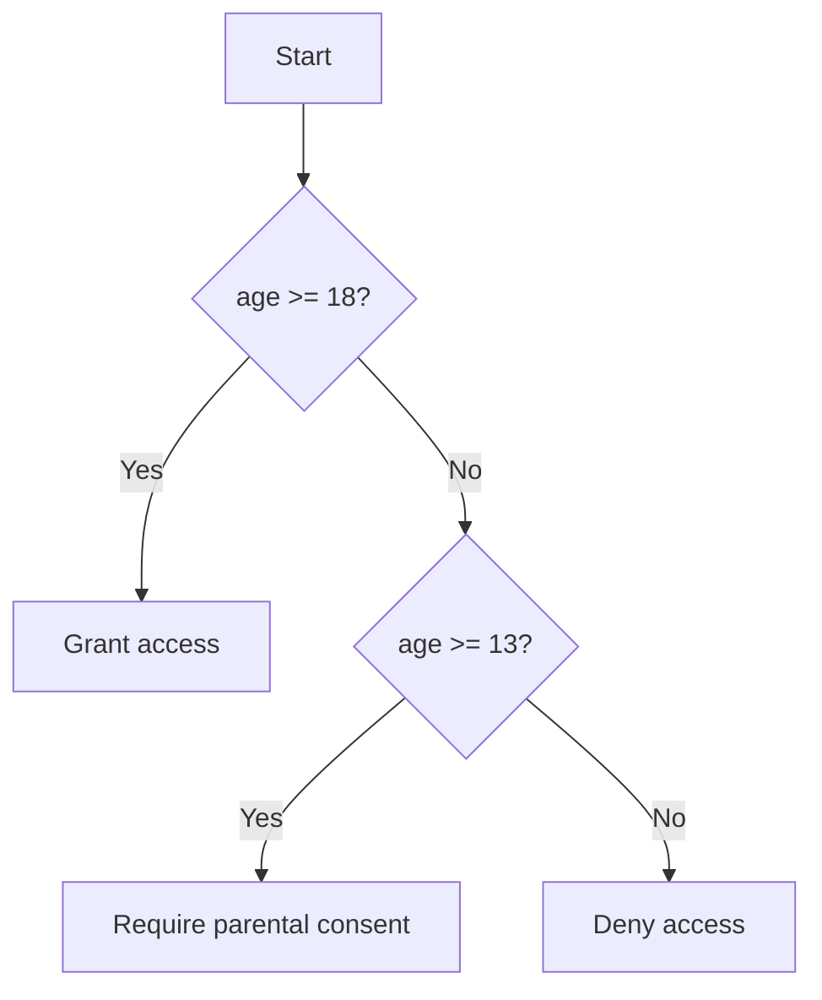

# 04 — Operators & Control Flow

## 🎯 Learning Objectives
- Use all operator categories correctly, including null-conditional/coalescing operators.
- Choose between `if/else`, `switch` statements, and `switch` expressions.
- Use modern pattern matching to write more declarative branching logic.

## 🤔 What is it?
Operators transform or compare values. Control flow statements decide **which code runs, and how many times**.

## ❓ Why do we need it?
Without branching and looping, a program is a single straight-line sequence — real programs must react to data (branching) and repeat work over collections (looping).

## 🌍 Real-World Analogy
Control flow is a flowchart at a customs checkpoint: "if passport is valid → proceed; else → secondary screening." A loop is the same checkpoint process repeated for every person in the line.

## 🧠 Core Concept

### Operator categories
- **Arithmetic:** `+ - * / % ++ --`
- **Comparison:** `== != < > <= >=`
- **Logical:** `&& || !` (short-circuiting) vs `& | ` (non-short-circuiting, rarely needed except bitwise)
- **Assignment:** `= += -= *= /= %= ??=`
- **Null-handling:**
  - `??` — null-coalescing: `var name = input ?? "default";`
  - `?.` — null-conditional: `var len = customer?.Name?.Length;`
  - `??=` — null-coalescing assignment: `list ??= new List<int>();`
- **Ternary:** `condition ? whenTrue : whenFalse`

### Branching
```csharp
if (age >= 18) { /* ... */ }
else if (age >= 13) { /* ... */ }
else { /* ... */ }

switch (status)
{
    case OrderStatus.Pending:
        Ship();
        break;
    case OrderStatus.Cancelled:
    case OrderStatus.Refunded:
        Archive();
        break;
    default:
        throw new InvalidOperationException();
}

// switch EXPRESSION (C# 8+) — returns a value, more declarative
string label = status switch
{
    OrderStatus.Pending => "Pending",
    OrderStatus.Cancelled or OrderStatus.Refunded => "Closed",
    _ => throw new InvalidOperationException()
};
```

### Loops
```csharp
for (int i = 0; i < 10; i++) { }
foreach (var item in collection) { }
while (condition) { }
do { } while (condition);
```
`break` exits a loop entirely; `continue` skips to the next iteration.

### Pattern matching (C# 7+)
```csharp
if (shape is Circle { Radius: > 0 } circle)
{
    Console.WriteLine(circle.Radius);
}

object value = 42;
string description = value switch
{
    int n when n < 0 => "negative",
    int n when n == 0 => "zero",
    int n => "positive",
    string => "a string",
    null => "nothing",
    _ => "unknown"
};
```

## 🎨 Visual Explanation



## 🔍 Code Walkthrough
- `customer?.Name?.Length` — evaluates left to right, short-circuiting to `null` the moment any link in the chain is `null`, instead of throwing `NullReferenceException`.
- `list ??= new List<int>();` — only assigns if `list` is currently `null`; equivalent to `if (list == null) list = new List<int>();` but atomic in intent and more concise.
- `case OrderStatus.Cancelled or OrderStatus.Refunded =>` — pattern combinators (`or`, `and`, `not`) let you express compound conditions directly in a pattern.

## ⚙️ How It Works Internally
`switch` **expressions** compile down to a similar jump-table/decision-tree IL as `switch` **statements** for simple value patterns, but the compiler generates sequential type checks and `when`-clause evaluation for pattern-based arms since these can't always become an O(1) jump table. `&&`/`||` compile to conditional branches that skip evaluating the right operand entirely when the result is already determined (short-circuit) — this is why `obj != null && obj.Value > 0` is safe but `obj != null & obj.Value > 0` (single `&`) is not.

## 🏢 Real-World Example
Order status transitions in an e-commerce system are a textbook `switch` expression: map an enum to the next allowed action, with the compiler's exhaustiveness warnings helping you catch a forgotten case when a new status is added later.

## 🚀 Production-Ready Example

```csharp
public static class OrderStatusExtensions
{
    public static string ToDisplayLabel(this OrderStatus status) => status switch
    {
        OrderStatus.Pending => "Awaiting fulfillment",
        OrderStatus.Shipped => "On its way",
        OrderStatus.Delivered => "Delivered",
        OrderStatus.Cancelled or OrderStatus.Refunded => "Closed",
        _ => throw new ArgumentOutOfRangeException(nameof(status), status, "Unhandled order status")
    };
}
```

## ⚠️ Common Mistakes
- Forgetting `break` in older-style `switch` statements causing unintended fall-through (C# actually disallows implicit fall-through between non-empty cases, unlike C/C++ — but it's still a common point of confusion for developers coming from those languages).
- Using `==` to compare reference types expecting value comparison (see [03](../03-Value-vs-Reference-Types)) — e.g. comparing two `string` works due to operator overloading, but two custom classes without overridden `Equals`/`==` compare by reference.
- Chaining too many `?.` without realizing the *entire expression* becomes nullable, requiring a final `??` for a non-null default.

## ❌ What NOT To Do
```csharp
// Deeply nested if/else pyramid instead of pattern matching / early returns
if (order != null)
{
    if (order.Status == OrderStatus.Pending)
    {
        if (order.Total > 0)
        {
            Ship(order);
        }
    }
}
```

## ✅ Best Practices
- Prefer `switch` expressions over `switch` statements when you're producing a value.
- Use early returns / guard clauses instead of deep nesting.
- Let the compiler's exhaustiveness check help you: adding `_ => throw new ArgumentOutOfRangeException(...)` as a default arm turns a missed enum case into a loud runtime error instead of silent wrong behavior.

## ⚡ Performance Considerations
- A `switch` over a dense set of integer/string constants compiles to a jump table or hash lookup — effectively O(1), much faster than an equivalent `if/else if` chain which is O(n) in the worst case.

## 🔄 Related Concepts
- [06 — OOP](../06-OOP) (pattern matching on types)
- [14 — Modern C#](../14-Modern-CSharp) (advanced pattern matching)

## 🎤 Interview Questions

**Junior:** "What's the difference between `==` and `.Equals()`?"
*Expected:* `==` can be operator-overloaded per type (value semantics for `string`, reference semantics by default for `class`); `.Equals()` is the virtual method that `==` often delegates to, and can be overridden independently.

**Mid-level:** "What's the difference between a `switch` statement and a `switch` expression?"
*Expected:* The statement executes code per case (needs `break`); the expression evaluates to and returns a value, is more concise, and the compiler warns on non-exhaustive matches.

**Senior:** "Why prefer guard clauses over nested `if`s in production code?"
*Expected:* Reduces cyclomatic complexity, keeps the "happy path" unindented and readable, and makes it obvious which preconditions must hold before the main logic runs — directly affects maintainability and code review speed.

## 🧪 Practice Exercises

**Easy**
1. Rewrite a nested `if/else` as a `switch` expression.
2. Use `??=` to lazily initialize a list field.
3. Chain two `?.` operators safely on a nullable object graph.
4. Use pattern matching to check if an `object` is a positive `int`.
5. Convert a `for` loop to a `foreach` loop where index isn't needed.

**Medium**
1. Implement `OrderStatusExtensions.ToDisplayLabel` above and add a new enum value, observing the compiler warning.
2. Use `when` clauses in a `switch` expression to bucket numbers into "negative/zero/small/large."
3. Refactor a deeply nested validation method into guard clauses.

**Hard**
1. Implement recursive pattern matching over a small class hierarchy (e.g. shapes) without using `is`/type-casting chains.
2. Explain (and demonstrate) a case where `&` vs `&&` produces different observable behavior due to side effects.

**Real-world scenario:** A `switch` statement handling payment provider webhooks is missing a `break` in a merged PR, causing double-processing. Explain why C# actually prevents this specific bug and where the analogous risk still exists.

## 📌 Key Takeaways
- Null-conditional (`?.`) and null-coalescing (`??`, `??=`) operators eliminate a large class of `NullReferenceException`s.
- `switch` expressions are more declarative and exhaustiveness-checked than `switch` statements.
- Pattern matching lets you express "what shape is this data" directly instead of manual casting and `if` chains.
