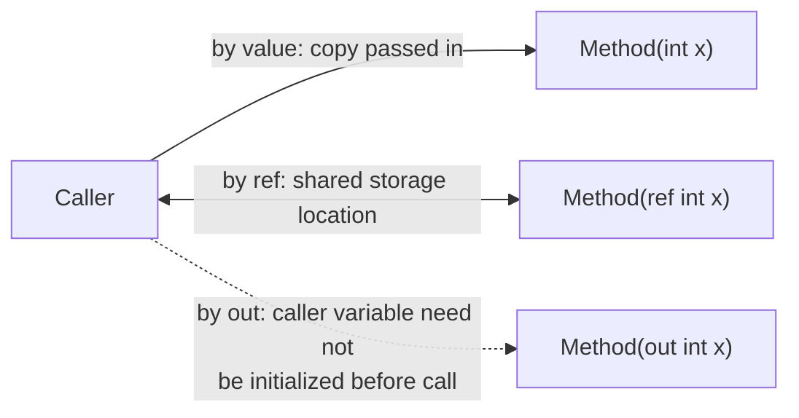

# 05 — Methods

## 🎯 Learning Objectives
- Choose correctly between `ref`, `out`, `in`, and normal parameter passing.
- Use `params`, optional parameters, and named arguments idiomatically.
- Understand method overloading resolution and expression-bodied members.

## 🤔 What is it?
A method is a named, reusable block of code that takes inputs (parameters) and optionally returns an output.

## ❓ Why do we need it?
Methods are the basic unit of decomposition — without them, all logic would be inline, unreusable, and untestable in isolation.

## 🌍 Real-World Analogy
A method is a vending machine: you insert defined inputs (coins, a selection code), and it deterministically returns a defined output (a snack), hiding the internal mechanism.

## 🧠 Core Concept

### Parameter passing modifiers

| Modifier | Direction | Must be assigned before call? | Must be assigned inside method? |
|---|---|---|---|
| (none) | in, by value (or by reference-copy for reference types) | Yes | N/A |
| `ref` | in AND out | Yes | No, but recommended |
| `out` | out only | No | **Yes, mandatory** |
| `in` | in only, by reference (read-only) | Yes | Cannot assign |

```csharp
void Increment(ref int x) => x++;

bool TryParse(string s, out int result) { result = int.Parse(s); return true; }

void Process(in LargeStruct data) { /* data cannot be mutated here */ }
```

- Use `out` for "TryX" patterns returning multiple values without allocating a tuple/wrapper.
- Use `ref` when a method needs to both read and mutate the caller's variable.
- Use `in` to pass a large `struct` by reference **without allowing mutation** — avoids the copy cost of pass-by-value while keeping the safety of pass-by-value semantics.

### params, optional parameters, named arguments

```csharp
int Sum(params int[] numbers) => numbers.Sum();
Sum(1, 2, 3);              // params

void Log(string message, LogLevel level = LogLevel.Info) { }
Log("started");                       // uses default
Log("failed", level: LogLevel.Error); // named argument, order-independent
```

### Overloading, expression-bodied methods, local functions

```csharp
int Add(int a, int b) => a + b;                 // expression-bodied
int Add(int a, int b, int c) => a + b + c;       // overload — resolved by signature

int Factorial(int n)
{
    return n <= 1 ? 1 : Local(n);

    int Local(int x) => x * Factorial(x - 1);    // local function, scoped to Factorial
}
```

## 🎨 Visual Explanation



## 🔍 Code Walkthrough
- `void Increment(ref int x) => x++;` — `x` inside the method is an alias for the caller's variable; mutating it mutates the caller's storage directly, no copy involved.
- `bool TryParse(string s, out int result)` — the compiler enforces `result` is assigned on every code path before the method returns; the caller's variable doesn't need a value beforehand, unlike `ref`.
- `void Process(in LargeStruct data)` — passed by reference (avoiding the copy of a large struct) but the compiler prevents any mutation of `data` inside the method, preserving value-type "looks copied" semantics for the caller.

## ⚙️ How It Works Internally
`ref`/`out`/`in` all compile to the same underlying IL construct — a **managed pointer** to the variable's storage location — the distinctions (`out` requiring definite assignment, `in` forbidding mutation) are enforced entirely by the **C# compiler**, not the CLR; at the IL level they're interchangeable-looking byref parameters. Method overload resolution happens entirely at **compile time** based on the static types of arguments — this is why overloading behaves differently from polymorphism (see [06 — OOP](../06-OOP)), which resolves at runtime via virtual dispatch.

## 🏢 Real-World Example
`int.TryParse(string, out int)` is the canonical `out` usage in the BCL — it lets you attempt a parse and get both a success flag and a result without throwing an exception for the (very common, not truly "exceptional") case of invalid input.

## 🚀 Production-Ready Example

```csharp
public static class SafeConverter
{
    public static bool TryParseOrderId(string input, out Guid orderId)
    {
        if (Guid.TryParse(input, out orderId))
        {
            return true;
        }

        orderId = Guid.Empty;
        return false;
    }
}

// Usage — no exception-driven control flow for a routine validation failure
if (SafeConverter.TryParseOrderId(request.Id, out var id))
{
    return await _repository.GetAsync(id);
}
return BadRequest("Invalid order id.");
```

## ⚠️ Common Mistakes
- Using exceptions for expected, routine failures instead of a `TryX`/`out` pattern (see [11 — Exception Handling](../11-Exception-Handling)).
- Overusing `ref`/`out` where returning a tuple or a small result object would be clearer.
- Forgetting that default parameter values are baked into the **caller's** call site at compile time — changing a default value in a library requires recompiling all callers to take effect, which is a real versioning hazard for public APIs.

## ❌ What NOT To Do
```csharp
// Overload ambiguity smell — too many optional params, unclear at call site
void CreateUser(string name, string email = null, bool sendWelcome = true, bool isAdmin = false, string locale = "en-US") { }
CreateUser("Sam", null, false, true); // what do these positional bools even mean at a glance?
```
Prefer named arguments or a dedicated options/builder object once a method has more than 2–3 optional parameters.

## ✅ Best Practices
- Keep methods small and single-purpose (aligns with SRP, see [25 — SOLID](../25-SOLID)).
- Use named arguments for boolean/ambiguous parameters at the call site.
- Prefer returning a result (tuple, record) over `out` params in new APIs unless matching an established `TryX` convention.

## ⚡ Performance Considerations
- `in` parameters avoid struct copies for large structs but can introduce **defensive copies** internally if the compiler can't prove the struct won't be mutated through an interface call — profile before assuming `in` is always a free win on very small structs (it isn't; the byref indirection can even be marginally slower than a plain small-value copy).

## 🔄 Related Concepts
- [03 — Value vs Reference Types](../03-Value-vs-Reference-Types)
- [06 — OOP](../06-OOP) (overload resolution vs overriding)

## 🎤 Interview Questions

**Junior:** "What's the difference between `ref` and `out`?"
*Expected:* `ref` requires the variable to be initialized before the call and can be read/written inside; `out` doesn't require prior initialization but must be assigned inside the method before it returns.

**Mid-level:** "Why would you use `in` instead of just passing a struct normally?"
*Expected:* To avoid copying a large struct on every call while still preventing the callee from mutating the caller's data — a compile-time-enforced safety/performance trade-off.

**Senior:** "Why is overload resolution a compile-time concept while method overriding is runtime?"
*Expected:* Overloads are chosen based on the *static/declared* type of the arguments at the call site, resolved once during compilation; overriding is resolved via the object's *actual runtime type* through a virtual method table (vtable) lookup at each call — this is the core distinction between compile-time and runtime polymorphism (see [06 — OOP](../06-OOP)).

## 🧪 Practice Exercises

**Easy**
1. Write a `Swap<T>(ref T a, ref T b)` method.
2. Implement a `TryDivide(int a, int b, out int result)` method.
3. Write an overloaded `Area` method for `Circle` and `Rectangle`.
4. Convert a statement-bodied method to expression-bodied.
5. Write a method using `params` to sum a variable number of doubles.

**Medium**
1. Implement `in` on a large readonly struct and explain, in comments, why mutation is disallowed.
2. Refactor a method with 5 optional boolean parameters into an options record.
3. Write a local function that captures an outer variable (a closure) and explain what's captured.

**Hard**
1. Demonstrate an overload-resolution ambiguity and explain the compiler error.
2. Explain, using IL (via SharpLab or similar), that `ref`, `out`, and `in` all lower to the same byref IL construct.

**Real-world scenario:** A public NuGet library method changes a default parameter value in a minor version bump. Explain why this is a breaking change for compiled consumers, and what alternative would have avoided it.

## 📌 Key Takeaways
- `ref` = in+out by reference; `out` = out-only, must be assigned; `in` = in-only by reference, read-only.
- Overload resolution is a compile-time decision based on static argument types.
- Prefer `TryX`/`out` for expected-failure scenarios instead of throwing exceptions.
