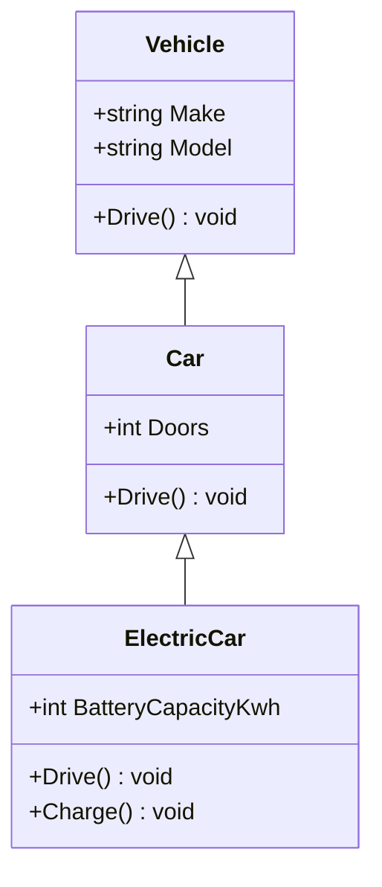

← Back to [06 — OOP overview](./README.md)

# Inheritance

## 🤔 What is it?
Inheritance lets a class (a **subclass**/**derived class**) reuse and specialize the members of another class (its **base class**), expressing an "is-a" relationship.

## ❓ Why do we need it?
It avoids duplicating shared state/behavior across related types, and lets code written against the base type automatically work with any subtype (this is what makes polymorphism, covered in the [next file](./03-Polymorphism.md), possible at all).

## 🌍 Real-World Analogy
A species classification: an `ElectricCar` **is a** `Car`, which **is a** `Vehicle`. Everything true of a `Vehicle` (it has a `Make`/`Model`, it can `Drive()`) is automatically true of every `Car` and `ElectricCar` — you don't redeclare those facts at each level.

## 🎨 The hierarchy



## 💻 Example

```csharp
public class Vehicle
{
    public string Make { get; init; } = string.Empty;
    public string Model { get; init; } = string.Empty;
    public virtual void Drive() => Console.WriteLine($"{Make} {Model} is driving.");
}

public class Car : Vehicle
{
    public int Doors { get; init; }
    public override void Drive() => Console.WriteLine($"{Make} {Model} drives on {Doors} doors' worth of road.");
}

public class ElectricCar : Car
{
    public int BatteryCapacityKwh { get; init; }
    public override void Drive() => Console.WriteLine($"{Make} {Model} silently drives using {BatteryCapacityKwh} kWh.");
}
```
`Car` and `ElectricCar` automatically get `Make`/`Model` from `Vehicle` — no re-declaration needed. (`Drive()`'s `virtual`/`override` mechanics are covered fully in [03 — Polymorphism](./03-Polymorphism.md).)

## ⚠️ Common Mistakes — the fragile base class problem
Deep inheritance chains (4+ levels) become brittle: a seemingly safe change to a base class's *implementation* (not just its signature) can silently break derived classes that depended on the old behavior, because subclasses are coupled to the base class's internals in ways that aren't always visible at the call site. This is called the **fragile base class problem**, and it's the concrete reason behind the advice "favor composition over inheritance."

```csharp
// Base class change that looks safe...
public class Base
{
    public virtual void Process() { Validate(); Save(); }
    protected virtual void Validate() { /* ... */ }
    protected virtual void Save() { /* ... */ }
}

// ...but a subclass relying on Validate() running BEFORE Save() breaks
// if a future refactor of Base.Process() reorders those calls.
public class Derived : Base
{
    protected override void Validate()
    {
        // assumes some Base-internal state that Save() will read — an implicit,
        // undocumented contract that only exists by reading Base's current source
    }
}
```

## ✅ Best Practices — composition over inheritance
Prefer giving a class a reference to another object ("has-a") over inheriting from it ("is-a") unless the relationship is a genuine, stable specialization.

```csharp
// Inheritance (is-a) — appropriate only when ElectricCar truly IS a specialization of Car
public class ElectricCar : Car { }

// Composition (has-a) — often the better choice when you just need to REUSE behavior
public class Car
{
    private readonly IEngine _engine; // Car HAS an engine; it isn't "a kind of" engine
    public Car(IEngine engine) => _engine = engine;
    public void Drive() => _engine.Power();
}
```
Composition lets you swap `IEngine` implementations at runtime (see [24 — Design Patterns](../24-Design-Patterns)'s Strategy pattern) without touching `Car`'s class hierarchy at all — something single inheritance can't do.

## 🎤 Interview Questions

**Mid-level:** "What is the fragile base class problem?"
*Expected:* A subclass can break when a base class's *internal implementation* changes, even if the base class's public contract/signature stays the same, because the subclass implicitly depended on undocumented behavior of the base class — a real risk that grows with inheritance depth.

**Senior:** "When would you choose composition over inheritance?"
*Expected:* When the relationship isn't truly "is-a," when you need to combine multiple independent behaviors (which single inheritance can't express), when you want to swap behavior at runtime, or when a deep hierarchy would create fragile coupling to base class implementation details.

## 🧪 Practice Exercises

**Easy**
1. Build the 3-level `Vehicle → Car → ElectricCar` hierarchy above.
2. Add a new subclass `Motorcycle : Vehicle` and confirm it inherits `Make`/`Model` automatically.

**Medium**
1. Refactor an inheritance hierarchy that violates Liskov Substitution (see [25 — SOLID](../25-SOLID)) into composition.
2. Construct your own concrete example of the fragile base class problem (not the `Process`/`Validate`/`Save` one above) and explain exactly what breaks and why.

**Hard**
1. Take a real 4+ level inheritance hierarchy (yours or a well-known open-source example) and redesign it using composition, listing what got easier and what got harder.

---
Previous: [← 01 — Encapsulation & Abstraction](./01-Encapsulation-and-Abstraction.md) · Next: [03 — Polymorphism →](./03-Polymorphism.md)
