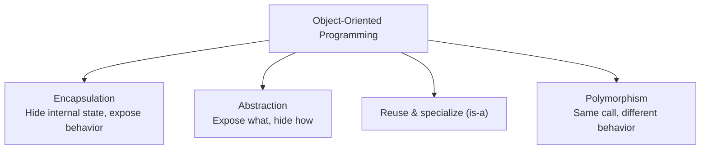

# 06 — Object-Oriented Programming

## 🎯 Learning Objectives
- Explain and demonstrate encapsulation, abstraction, inheritance, and polymorphism.
- Distinguish compile-time (overload) polymorphism from runtime (override) polymorphism.
- Know when `sealed`, `virtual`, `override`, and `static` classes are appropriate.

## 🤔 What is it?
OOP models a program as a set of interacting **objects**, each bundling **state** (fields/properties) with the **behavior** (methods) that operates on it.

## ❓ Why do we need it?
As programs grow, keeping data and the logic that manipulates it together (rather than scattered global functions mutating shared global data) makes systems easier to reason about, test, and change without breaking unrelated code.

## 🌍 Real-World Analogy
A `Vehicle` class hierarchy is like a species classification: a `Car` **is a** `Vehicle` (inheritance); you don't need to know *how* a specific car's engine works to `Drive()` it (abstraction); the engine's internals are hidden (encapsulation); and calling `Drive()` on a `Car` vs an `ElectricCar` produces different actual behavior even though you called it the same way (polymorphism).

## 🧠 The four pillars

This module is split into focused topic files — read them in order the first time through:

1. **[Encapsulation & Abstraction](./01-Encapsulation-and-Abstraction.md)** — hiding state, exposing intent.
2. **[Inheritance](./02-Inheritance.md)** — the `Vehicle → Car → ElectricCar` hierarchy, composition vs inheritance.
3. **[Polymorphism](./03-Polymorphism.md)** — compile-time vs runtime, `virtual`/`override` vs `new`, vtable internals.
4. **[Constructors, `sealed`, and `static`](./04-Constructors-Sealed-Static.md)** — object lifecycle and when NOT to allow inheritance/instantiation.

## 🔄 Related Concepts
- [07 — Interfaces vs Abstract Classes](../07-Interfaces)
- [24 — Design Patterns](../24-Design-Patterns)
- [25 — SOLID](../25-SOLID)

## 🎤 Interview Questions

**Junior:** "What are the four pillars of OOP?"
*Expected:* Encapsulation, abstraction, inheritance, polymorphism — with a one-line definition of each, not just the names.

**Mid-level:** "What's the difference between overriding a method and hiding it with `new`?"
*Expected:* `override` participates in virtual dispatch — the runtime type decides which implementation runs, even through a base-typed reference. `new` hides the base member entirely for that type; which implementation runs depends on the *static* type of the reference used to call it.
*Trap:* Assuming `new` and `override` behave the same when called through a base reference.
→ Full detail in [03 — Polymorphism](./03-Polymorphism.md).

**Senior:** "When would you choose composition over inheritance?"
*Expected:* When the relationship isn't truly "is-a," when you need to combine multiple independent behaviors (which single inheritance can't express), when you want to swap behavior at runtime, or when a deep hierarchy would create fragile coupling to base class implementation details ("fragile base class problem").
→ Full detail in [02 — Inheritance](./02-Inheritance.md).

## 🧪 Practice Exercises
Each sub-file has its own focused exercises. As a capstone for the whole module:

**Real-world scenario:** A junior developer "overrides" a base class method using `new` instead of `virtual`/`override` and can't understand why polymorphic behavior isn't working in a list of mixed subclasses. Diagnose and fix it — see [03 — Polymorphism](./03-Polymorphism.md) for the exact mechanism.

## 📌 Key Takeaways
- Encapsulation + abstraction + inheritance + polymorphism are the four pillars, each solving a distinct design problem.
- `override` uses runtime vtable dispatch; `new` hides based on the static reference type — these are fundamentally different.
- Prefer composition over inheritance unless the relationship is a genuine, stable "is-a."
