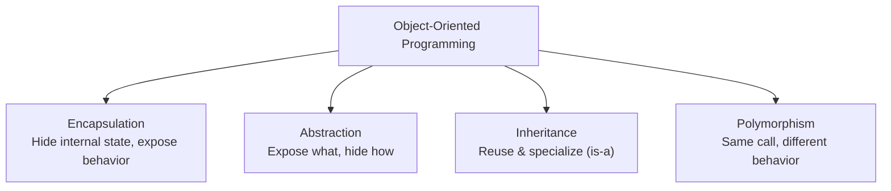
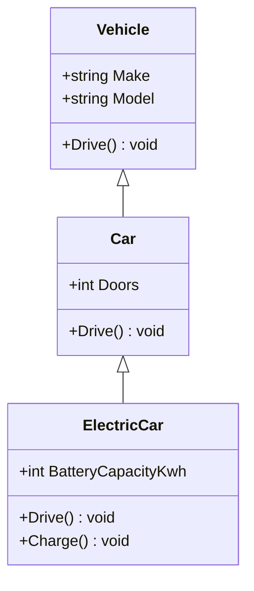

# 06 — Object-Oriented Programming

## 🎯 Learning Objectives
- Explain and demonstrate encapsulation, abstraction, inheritance, and polymorphism.
- Distinguish compile-time (overload) polymorphism from runtime (override) polymorphism.
- Know when `sealed`, `virtual`, `override`, and `static` classes are appropriate.

## 🤔 What is it?
OOP models a program as a set of interacting **objects**, each bundling **state** (fields/properties) with the **behavior** (methods) that operates on it.

## ❓ Why do we need it?
As programs grow, keeping data and the logic that manipulates it together (rather than scattered global functions mutating shared global data) makes systems easier to reason about, test, and change without breaking unrelated code.

## 🌍 Real-World Analogy
A `Vehicle` class hierarchy is like a species classification: a `Car` **is a** `Vehicle` (inheritance); you don't need to know *how* a specific car's engine works to `Drive()` it (abstraction); the engine's internals are hidden (encapsulation); and calling `Drive()` on a `Car` vs an `ElectricCar` produces different actual behavior even though you called it the same way (polymorphism).

## 🧠 Core Concept

### The four pillars



### Inheritance hierarchy



### Compile-time vs runtime polymorphism

| | Compile-time (overloading) | Runtime (overriding) |
|---|---|---|
| Resolved by | Static argument types, at compile time | Actual object type, at runtime via vtable |
| Mechanism | Multiple methods, same name, different signatures | `virtual` base method + `override` in derived |
| Example | `Add(int,int)` vs `Add(double,double)` | `vehicle.Drive()` calling `Car.Drive()` or `ElectricCar.Drive()` depending on the real object |

## 💻 Basic Example

```csharp
public class Vehicle
{
    public string Make { get; init; } = string.Empty;
    public string Model { get; init; } = string.Empty;

    public virtual void Drive() => Console.WriteLine($"{Make} {Model} is driving.");
}

public class Car : Vehicle
{
    public int Doors { get; init; }
    public override void Drive() => Console.WriteLine($"{Make} {Model} drives on {Doors} doors' worth of road.");
}

public class ElectricCar : Car
{
    public int BatteryCapacityKwh { get; init; }
    public override void Drive() => Console.WriteLine($"{Make} {Model} silently drives using {BatteryCapacityKwh} kWh.");
}

Vehicle v = new ElectricCar { Make = "Tesla", Model = "3", Doors = 4, BatteryCapacityKwh = 75 };
v.Drive(); // "Tesla 3 silently drives using 75 kWh." — runtime polymorphism
```

## 🔍 Code Walkthrough
- `Vehicle v = new ElectricCar { ... };` — the *compile-time* (declared) type of `v` is `Vehicle`, but the *runtime* type is `ElectricCar`.
- `v.Drive();` — because `Drive` is `virtual` in the base and `override`n down the chain, the CLR looks up the **actual runtime type's** implementation via a virtual method table (vtable), calling `ElectricCar.Drive()` even though `v` is statically typed as `Vehicle`. This is the essence of runtime polymorphism.
- `init` accessors (see [14 — Modern C#](../14-Modern-CSharp)) allow assignment only during object initialization, giving you encapsulated immutability without a full constructor parameter list.

## ⚙️ How It Works Internally
Every type with at least one `virtual`/`override` method gets a **virtual method table (vtable)** — an array of method pointers built once when the type is loaded. A non-virtual call is resolved directly at compile time (a fixed address); a virtual call instead does one indirection: look up the object's actual type, find that type's vtable, jump to the slot for that method. This indirection is the (tiny, usually negligible) performance cost of polymorphism, and it's exactly how `override` differs mechanically from method hiding via `new`, which does **not** use the vtable and instead resolves by the *static* type — a classic interview trap.

## 🏢 Real-World Example
A payment processing system defines `abstract class PaymentMethod { public abstract Task<PaymentResult> ChargeAsync(decimal amount); }` with `CreditCardPayment`, `PayPalPayment`, `BankTransferPayment` overriding it — the order service calls `paymentMethod.ChargeAsync(total)` without ever knowing which concrete type it's holding, and new payment providers can be added without touching the order service at all (this is the Open/Closed Principle in action — see [25 — SOLID](../25-SOLID)).

## 🚀 Production-Ready Example

```csharp
public abstract class PaymentMethod
{
    public abstract Task<PaymentResult> ChargeAsync(decimal amount, CancellationToken ct);
}

public sealed class CreditCardPayment : PaymentMethod
{
    private readonly ICardGateway _gateway;
    public CreditCardPayment(ICardGateway gateway) => _gateway = gateway;

    public override async Task<PaymentResult> ChargeAsync(decimal amount, CancellationToken ct)
        => await _gateway.ChargeAsync(amount, ct);
}
```
`sealed` on `CreditCardPayment` communicates intent: this type is not meant to be further extended — it prevents fragile inheritance chains and lets the JIT devirtualize calls to it in some cases.

## ⚠️ Common Mistakes
- Using `new` to "override" a non-virtual method — this hides the base method rather than overriding it, and calling through a base-typed reference invokes the **base** implementation, not the derived one — the opposite of what most people expect.
- Deep inheritance hierarchies (4+ levels) that become brittle and hard to reason about — "favor composition over inheritance" exists precisely because of this.
- Making everything `public` instead of encapsulating state behind properties/methods with real invariants.

## ❌ What NOT To Do
```csharp
public class Base { public void Greet() => Console.WriteLine("Base"); }
public class Derived : Base { public new void Greet() => Console.WriteLine("Derived"); }

Base b = new Derived();
b.Greet(); // prints "Base" — NOT "Derived", because `new` hides, it doesn't override
```

## ✅ Best Practices
- Mark classes not designed for extension `sealed`.
- Prefer composition ("has-a") over inheritance ("is-a") when the relationship isn't a genuine specialization.
- Keep base classes' public surface minimal and stable — every `virtual` member is a contract with every possible subclass forever.

## ⚡ Performance Considerations
- Virtual calls are a single pointer indirection — negligible for almost all business logic, but `sealed` classes/methods let the JIT devirtualize and even inline calls in hot paths.
- Deep inheritance chains don't meaningfully slow down virtual dispatch (it's always one vtable lookup regardless of hierarchy depth) but they do increase cognitive/maintenance cost.

## 🔄 Related Concepts
- [07 — Interfaces vs Abstract Classes](../07-Interfaces)
- [24 — Design Patterns](../24-Design-Patterns)
- [25 — SOLID](../25-SOLID)

## 🎤 Interview Questions

**Junior:** "What are the four pillars of OOP?"
*Expected:* Encapsulation, abstraction, inheritance, polymorphism — with a one-line definition of each, not just the names.

**Mid-level:** "What's the difference between overriding a method and hiding it with `new`?"
*Expected:* `override` participates in virtual dispatch — the runtime type decides which implementation runs, even through a base-typed reference. `new` hides the base member entirely for that type; which implementation runs depends on the *static* type of the reference used to call it.
*Trap:* Assuming `new` and `override` behave the same when called through a base reference.

**Senior:** "When would you choose composition over inheritance?"
*Expected:* When the relationship isn't truly "is-a," when you need to combine multiple independent behaviors (which single inheritance can't express), when you want to swap behavior at runtime, or when a deep hierarchy would create fragile coupling to base class implementation details ("fragile base class problem").

## 🧪 Practice Exercises

**Easy**
1. Build a 3-level `Vehicle → Car → ElectricCar` hierarchy with an overridden `Drive()`.
2. Demonstrate the `new` vs `override` trap above yourself and explain the output.
3. Encapsulate a public mutable field behind a property with validation.
4. Create a `sealed` class and explain why you sealed it.
5. Write a `static` utility class and explain why it can't be instantiated.

**Medium**
1. Model `Shape → Circle/Rectangle` with an abstract `Area()` and compute total area of a mixed list polymorphically.
2. Refactor an inheritance hierarchy that violates Liskov Substitution (see [25 — SOLID](../25-SOLID)) into composition.
3. Explain, with a diagram, what happens in memory/vtables when `Drive()` is called on an `ElectricCar` through a `Vehicle` reference.

**Hard**
1. Implement a plugin-style payment system (like the production example) with 3 payment methods and a factory selecting one at runtime.
2. Explain and demonstrate the "fragile base class problem" with a concrete before/after example.

**Real-world scenario:** A junior developer "overrides" a base class method using `new` instead of `virtual`/`override` and can't understand why polymorphic behavior isn't working in a list of mixed subclasses. Diagnose and fix it.

## 📌 Key Takeaways
- Encapsulation + abstraction + inheritance + polymorphism are the four pillars, each solving a distinct design problem.
- `override` uses runtime vtable dispatch; `new` hides based on the static reference type — these are fundamentally different.
- Prefer composition over inheritance unless the relationship is a genuine, stable "is-a."
