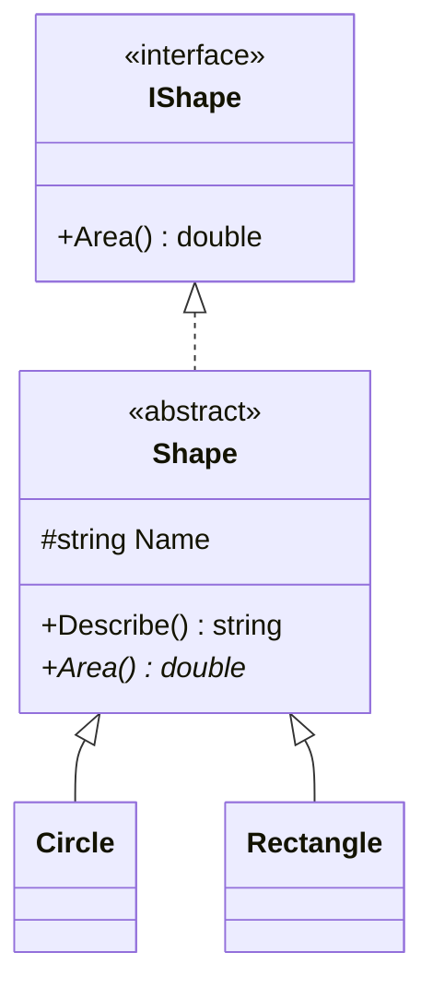

# 07 — Interfaces vs Abstract Classes

## 🎯 Learning Objectives
- Choose correctly between an interface and an abstract class for a given design problem.
- Understand default interface methods (C# 8+) and how they change the classic comparison.

## 🤔 What is it?
An **interface** defines a pure contract — a set of members any implementing type promises to provide — with no state and (traditionally) no implementation. An **abstract class** is a partially-implemented base class that cannot be instantiated directly, mixing concrete shared logic with members its subclasses must implement.

## ❓ Why do we need it?
Interfaces let unrelated types satisfy the same contract (`IComparable`, `IDisposable`) without forcing them into a shared inheritance tree — C# allows a class to implement many interfaces but inherit from only one base class, so interfaces are how you get multiple "is-capable-of" relationships without the multiple-inheritance diamond problem.

## 🌍 Real-World Analogy
An interface is like a **USB port specification** — any device that implements the spec (mouse, keyboard, drive) can plug into any USB port, regardless of what kind of device it is internally. An abstract class is like a **partially-built car chassis** supplied by a manufacturer — some parts (frame, wheels) are already built and shared, but you must still add the specific engine and interior.

## 🧠 Core Concept — Detailed Comparison

| Feature | Interface | Abstract Class |
|---|---|---|
| Multiple implementation | ✅ A class can implement many interfaces | ❌ A class can inherit only one base class |
| State (fields) | ❌ No instance fields allowed | ✅ Can have fields |
| Constructor | ❌ No constructors | ✅ Can have constructors (called by derived classes) |
| Default implementation | ✅ Since C# 8, default interface methods allowed | ✅ Fully supported, including partial implementation |
| Access modifiers on members | Public by default (C# 8+ allows more) | Full access modifier support |
| Versioning | Adding a member breaks all implementers (unless given a default body) | Adding a concrete method doesn't break subclasses |
| Use case | Defining a capability/contract across unrelated types (`IDisposable`, `IComparable`) | Sharing common implementation across a family of closely related types |

## 🎨 Visual Explanation


`Shape` implements the `IShape` contract, provides a shared `Describe()` implementation, but still leaves `Area()` abstract for each concrete shape to define.

## 💻 Basic Example

```csharp
public interface IShape
{
    double Area();
}

public abstract class Shape : IShape
{
    protected string Name { get; }
    protected Shape(string name) => Name = name;

    public string Describe() => $"{Name}: area = {Area():F2}"; // shared, concrete
    public abstract double Area();                              // must be implemented by subclasses
}

public class Circle : Shape
{
    private readonly double _radius;
    public Circle(double radius) : base("Circle") => _radius = radius;
    public override double Area() => Math.PI * _radius * _radius;
}
```

## 🔍 Code Walkthrough
- `IShape` declares only *what* must be provided — no fields, no constructor, no shared behavior.
- `Shape` implements `IShape`, adds shared state (`Name`) and shared logic (`Describe()`), but still forces subclasses to supply `Area()` via `abstract`.
- `Circle : Shape` must call `base("Circle")` because `Shape` has no parameterless constructor — this is only possible because `Shape` is a class, not an interface.

## ⚙️ How It Works Internally
Interface method calls dispatch through an **interface method table** the CLR generates for each type-interface pairing (conceptually similar to, but separate from, a class's own vtable) — this is why calling through an interface reference has a comparable (tiny) dispatch cost to a virtual class method call. Since C# 8, interfaces can carry **default implementations**, stored as ordinary IL method bodies on the interface itself, resolved only when an implementing type doesn't override them — but this was added primarily for **API versioning** (adding a new member to a widely-implemented interface without breaking every existing implementer), not as encouragement to design multiple-inheritance-style interfaces routinely.

## 🏢 Real-World Example
`IDisposable` is the canonical interface: wildly different types (file streams, database connections, HTTP clients) all implement it because they share exactly one capability — "I hold a resource that must be released" — with no other relationship between them. Contrast with a `Repository<T>` abstract base class shared by `OrderRepository`, `CustomerRepository`, etc., which share substantial common EF Core query logic.

## 🚀 Production-Ready Example

```csharp
public interface INotificationSender
{
    Task SendAsync(string recipient, string message, CancellationToken ct);
}

public sealed class EmailNotificationSender : INotificationSender
{
    public Task SendAsync(string recipient, string message, CancellationToken ct) =>
        // SMTP/provider call
        Task.CompletedTask;
}

public sealed class SmsNotificationSender : INotificationSender
{
    public Task SendAsync(string recipient, string message, CancellationToken ct) =>
        // SMS provider call
        Task.CompletedTask;
}

// Consumers depend only on the interface — new senders can be added freely (Open/Closed Principle)
public sealed class OrderNotifier
{
    private readonly IEnumerable<INotificationSender> _senders;
    public OrderNotifier(IEnumerable<INotificationSender> senders) => _senders = senders;

    public Task NotifyAsync(string recipient, string message, CancellationToken ct) =>
        Task.WhenAll(_senders.Select(s => s.SendAsync(recipient, message, ct)));
}
```

## ⚠️ Common Mistakes
- Using an abstract class purely to define a contract when the types don't actually share implementation or state — an interface would decouple them further.
- Adding a new member to a widely-implemented public interface without a default implementation, silently breaking every consumer's build.
- Treating "abstraction" and "interface" as synonyms — abstraction is the *principle* (hide how, expose what); interface is one *mechanism* for achieving it (abstract classes and even well-designed concrete classes also provide abstraction).

## ❌ What NOT To Do
```csharp
// Interface bloat — forces every implementer to support methods irrelevant to it
public interface IWorker
{
    void Work();
    void Eat();
    void Sleep();
}
public class RobotWorker : IWorker
{
    public void Work() { }
    public void Eat() => throw new NotSupportedException();   // violates ISP — see 25-SOLID
    public void Sleep() => throw new NotSupportedException();
}
```

## ✅ Best Practices
- Default to interfaces for defining contracts consumed by dependency injection (see [18 — Dependency Injection](../18-Dependency-Injection)).
- Use abstract classes when subclasses genuinely share non-trivial implementation, not just a method signature.
- Keep interfaces small and focused (Interface Segregation Principle — see [25 — SOLID](../25-SOLID)).

## ⚡ Performance Considerations
- Interface dispatch and virtual dispatch have comparable, small overhead — never a first-order performance concern in business applications; don't avoid interfaces "for performance" without profiling evidence.

## 🔄 Related Concepts
- [06 — OOP](../06-OOP)
- [18 — Dependency Injection](../18-Dependency-Injection)
- [25 — SOLID](../25-SOLID) (Interface Segregation, Dependency Inversion)

## 🎤 Interview Questions

**Junior:** "Can a class implement multiple interfaces but inherit only one class — why?"
*Expected:* Yes; C# deliberately disallows multiple class inheritance to avoid the diamond ambiguity problem (which base implementation wins when two base classes define the same member), while interfaces avoid this because (traditionally) they carried no implementation.

**Mid-level:** "When would you choose an abstract class over an interface?"
*Expected:* When subclasses share real state and/or non-trivial implementation, when you want to enforce a constructor contract, or when the family of types is a genuine "is-a" hierarchy rather than an unrelated set of types sharing one capability.

**Senior:** "How do default interface methods change the traditional interface-vs-abstract-class trade-off, and why were they added?"
*Expected:* They let library authors add new members to widely-implemented public interfaces without breaking binary/source compatibility for existing implementers — primarily a versioning tool. They should not be used as a way to casually add shared "abstract-class-like" behavior to interfaces, since interfaces still can't hold instance state, which limits how much real logic they can usefully share.

## 🧪 Practice Exercises

**Easy**
1. Define `IShape` and implement it directly on two unrelated classes.
2. Build the `Shape` abstract class hierarchy above.
3. Explain why `Shape` needs a constructor but `IShape` cannot have one.
4. List three BCL interfaces you've used without realizing it (`IEnumerable`, `IDisposable`, `IComparable`).
5. Add a default implementation to an interface method and verify existing implementers still compile.

**Medium**
1. Refactor the "interface bloat" anti-pattern above into two smaller, focused interfaces.
2. Design `INotificationSender` with 3 implementations and a consumer that doesn't know which one it's using.
3. Explain what breaks (and for whom) if you add a new member to a public interface without a default body, in a library used by external consumers.

**Hard**
1. Model a scenario requiring both shared abstract-class implementation and an orthogonal interface-based capability on the same class, and justify the design.
2. Research and explain the "diamond problem" and how default interface methods reintroduce a limited version of it (and how C# resolves ambiguity when it occurs).

**Real-world scenario:** Your team needs to add logging capability to 15 unrelated existing classes without changing their inheritance hierarchy. Decide: interface or abstract class, and justify it.

## 📌 Key Takeaways
- Interfaces define pure contracts, enabling multiple "is-capable-of" relationships; abstract classes share real implementation and state within an "is-a" family.
- A class can implement many interfaces but extend only one class.
- Default interface methods exist mainly for API versioning, not as a green light to blur interfaces and abstract classes together.
