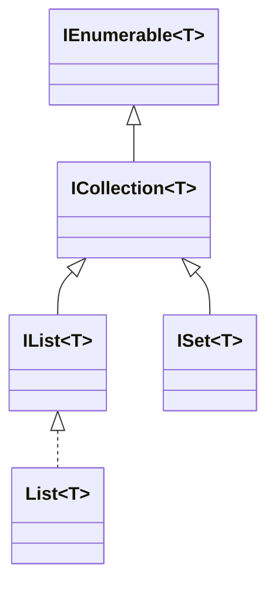

# 08 — Advanced C#: Generics & Collections

## 🎯 Learning Objectives
- Write generic types/methods with appropriate constraints.
- Choose the right collection for a given access pattern, with Big-O in mind.
- Understand `Span<T>`, `Memory<T>`, and `ArrayPool<T>` at a conceptual level for high-performance code.

## 🤔 What is it?
**Generics** let you write a type or method parameterized over a type argument (`List<T>`, `Dictionary<TKey, TValue>`), giving compile-time type safety without duplicating code per type. **Collections** are the standard containers built on top of (and using) generics.

## ❓ Why do we need it?
Before generics (C# 1.0), collections like `ArrayList` stored `object`, requiring casts everywhere and boxing every value type stored in them — both a performance cost and a lost compile-time safety net. Generics solve both at once.

## 🌍 Real-World Analogy
A non-generic `ArrayList` is a storage locker that accepts *anything* — you must remember and manually verify what you put in each slot. A generic `List<Order>` is a locker explicitly labeled "Orders only" — the door physically won't accept anything else.

## 🧠 Core Concept

### Generic constraints

```csharp
public class Repository<T> where T : class, IEntity, new()
{
    public T CreateDefault() => new T();
}
```

| Constraint | Meaning |
|---|---|
| `where T : class` | T must be a reference type |
| `where T : struct` | T must be a value type |
| `where T : new()` | T must have an accessible parameterless constructor |
| `where T : BaseClass` | T must derive from BaseClass |
| `where T : IInterface` | T must implement IInterface |
| `where T : notnull` | T cannot be a nullable type |

### Collections and their complexity

| Collection | Access | Insert (end) | Insert (middle) | Contains | Use case |
|---|---|---|---|---|---|
| `List<T>` | O(1) by index | O(1) amortized | O(n) | O(n) | Default general-purpose ordered list |
| `Dictionary<TKey,TValue>` | O(1) by key | O(1) amortized | N/A | O(1) by key | Fast key-based lookup |
| `HashSet<T>` | N/A | O(1) amortized | N/A | O(1) | Uniqueness checks, set operations |
| `Queue<T>` | Front/back only | O(1) enqueue | N/A | O(n) | FIFO processing |
| `Stack<T>` | Top only | O(1) push | N/A | O(n) | LIFO processing, undo stacks |
| `LinkedList<T>` | O(n) | O(1) at known node | O(1) at known node | O(n) | Frequent mid-list insert/remove with a node reference already in hand |

### Collection interfaces hierarchy

- `IEnumerable<T>` — can only be iterated (`foreach`), forward-only, no count/index.
- `ICollection<T>` — adds `Count`, `Add`, `Remove`, `Contains`.
- `IList<T>` — adds index-based access (`this[int]`).

### Span<T>, Memory<T>, ArrayPool<T>
- **`Span<T>`** — a stack-only (`ref struct`), zero-allocation view over a contiguous block of memory (array, stack-allocated buffer, or a slice of either). Used to slice/process data (e.g. parsing) without copying or allocating.
- **`Memory<T>`** — like `Span<T>` but can be stored on the heap (as a field, or captured in an `async` method) since `Span<T>` cannot cross `await` boundaries.
- **`ArrayPool<T>`** — a pool of reusable arrays you rent and return, avoiding repeated large-array allocations (and the resulting GC pressure) in hot paths like network buffer handling.

## 💻 Basic Example

```csharp
public interface IEntity { Guid Id { get; } }

public class Repository<T> where T : class, IEntity
{
    private readonly List<T> _items = new();
    public void Add(T item) => _items.Add(item);
    public T? Find(Guid id) => _items.FirstOrDefault(x => x.Id == id);
}

// Span<T> avoiding an allocation when parsing a substring
ReadOnlySpan<char> line = "42,John,Active".AsSpan();
int firstComma = line.IndexOf(',');
ReadOnlySpan<char> idPart = line[..firstComma]; // no substring allocation
int id = int.Parse(idPart);
```

## 🔍 Code Walkthrough
- `where T : class, IEntity` — the compiler now guarantees every `T` used with `Repository<T>` is a reference type implementing `IEntity`, so `x.Id` is safely callable without casting.
- `line.AsSpan()` creates a zero-allocation view over the existing string's characters; `line[..firstComma]` slices that view (still zero allocation) rather than calling `Substring`, which would allocate a brand-new string.

## ⚙️ How It Works Internally
For **reference type** generic arguments, the JIT generates and shares **one** compiled implementation of `List<T>` at runtime, since all reference types are pointer-sized — `List<string>` and `List<Order>` share the same native code, differing only in type metadata used for casts. For **value type** arguments, the JIT generates a **separate specialized native implementation per value type** (`List<int>`, `List<double>` each get their own compiled code) — this is what makes generics with value types avoid boxing entirely (unlike Java's type erasure model) while costing slightly more code (JIT "code bloat") in exchange.

## 🏢 Real-World Example
Parsing a high-throughput log file or a binary network protocol with `Span<T>`/`ReadOnlySpan<T>` avoids millions of intermediate string/array allocations that a naive `Substring`-based parser would generate — a very real, measurable difference in server throughput and GC pauses.

## 🚀 Production-Ready Example

```csharp
public sealed class GenericRepository<T> : IRepository<T> where T : class, IEntity
{
    private readonly DbContext _context;
    public GenericRepository(DbContext context) => _context = context;

    public async Task<T?> GetByIdAsync(Guid id, CancellationToken ct) =>
        await _context.Set<T>().FirstOrDefaultAsync(x => x.Id == id, ct);

    public async Task AddAsync(T entity, CancellationToken ct)
    {
        await _context.Set<T>().AddAsync(entity, ct);
        await _context.SaveChangesAsync(ct);
    }
}
```

## ⚠️ Common Mistakes
- Reaching for `ArrayList`/non-generic collections in new code — no reason to do this in modern .NET.
- Using `List<T>.Contains` in a hot loop when a `HashSet<T>` would turn an O(n) scan into an O(1) lookup.
- Trying to store a `Span<T>` as a class field or use it across an `await` — the compiler blocks this because `Span<T>` is a `ref struct` restricted to the stack; use `Memory<T>` instead for those cases.

## ❌ What NOT To Do
```csharp
var lookup = new List<int>();
// ... populated with 100,000 items
bool exists = lookup.Contains(42); // O(n) scan — should be a HashSet<int> for O(1)
```

## ✅ Best Practices
- Default to `List<T>` for ordered sequences, `Dictionary<TKey,TValue>` for key lookups, `HashSet<T>` for uniqueness/membership checks.
- Add generic constraints as tightly as needed (no looser, no tighter) to express real requirements.
- Reach for `Span<T>`/`ArrayPool<T>` only in demonstrably hot paths (parsing, serialization, networking) — they add complexity that isn't worth it in ordinary business logic.

## ⚡ Performance Considerations
- Value-type generics avoid boxing entirely — `List<int>` never boxes its elements, unlike a hypothetical `ArrayList` of ints.
- `Dictionary`/`HashSet` lookups are amortized O(1) via hashing, but a poor `GetHashCode()` implementation on your key type can degrade this toward O(n) due to excessive collisions.

## 🔄 Related Concepts
- [03 — Value vs Reference Types](../03-Value-vs-Reference-Types) (boxing)
- [10 — LINQ](../10-LINQ)
- [36 — Performance](../36-Performance)

## 🎤 Interview Questions

**Junior:** "Why is `List<int>` better than the old `ArrayList` for storing integers?"
*Expected:* Type safety at compile time and no boxing — `ArrayList` stores `object`, so every `int` added is boxed (heap-allocated), and every read requires an unboxing cast.

**Mid-level:** "When would you use a `HashSet<T>` instead of a `List<T>`?"
*Expected:* When you only need to check membership/uniqueness, not maintain insertion order or duplicates — turns O(n) `Contains` into O(1).

**Senior:** "How does the CLR handle generics differently for reference types vs value types, and why does it matter?"
*Expected:* Reference-type instantiations share one JIT-compiled implementation (since all references are pointer-sized); value-type instantiations get their own specialized native code per type, avoiding boxing but increasing the amount of JIT-compiled code generated (a genuine, if usually small, trade-off called "code bloat").

## 🧪 Practice Exercises

**Easy**
1. Write a generic `Stack<T>` class from scratch using an internal array.
2. Constrain a generic method to only accept types implementing `IComparable<T>`.
3. Replace a `List<T>.Contains` hot-path check with `HashSet<T>`.
4. Use `Span<T>` to reverse an array in place with no extra allocation.
5. Explain, for a `Dictionary<string,int>`, what happens on a hash collision.

**Medium**
1. Implement a generic `Repository<T>` with an `IEntity` constraint, backed by an in-memory `List<T>`.
2. Benchmark `List<T>.Contains` vs `HashSet<T>.Contains` for 100,000 elements (conceptually or with BenchmarkDotNet).
3. Parse a CSV line using `ReadOnlySpan<char>` slicing instead of `string.Split`.

**Hard**
1. Rent and return a buffer from `ArrayPool<byte>` in a mock network-read loop, and explain the GC benefit.
2. Explain why `Span<T>` cannot be a field of a class or used inside an `async` method, tying it back to how the CLR/stack works.

**Real-world scenario:** A high-throughput ingestion service is under heavy GC pressure from parsing millions of incoming CSV lines. Propose a `Span<T>`-based rewrite of the hot path and explain the expected win.

## 📌 Key Takeaways
- Generics give compile-time type safety and, for value types, avoid boxing entirely — a real, not just cosmetic, improvement over `object`-based collections.
- Choose collections by access pattern, not habit: `Dictionary`/`HashSet` for lookups, `List` for ordered sequences.
- `Span<T>`/`Memory<T>`/`ArrayPool<T>` are targeted tools for eliminating allocations in hot, high-throughput paths — not everyday tools.
