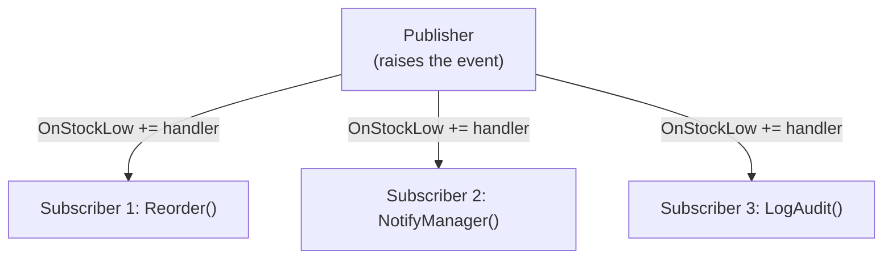

# 09 — Delegates & Events

## 🎯 Learning Objectives
- Explain what a delegate is and how `Func`/`Action`/`Predicate` relate to it.
- Implement the publisher/subscriber pattern using events correctly (including unsubscription).
- Understand why events are a constrained, safer wrapper around delegates.

## 🤔 What is it?
A **delegate** is a type-safe function pointer — a reference to a method (or several, when it's a multicast delegate) that can be passed around, stored in variables, and invoked indirectly. An **event** is a language feature built on top of delegates that restricts how a delegate field can be used from outside its declaring class (only `+=`/`-=`, never direct invocation or reassignment).

## ❓ Why do we need it?
Delegates let you treat "a piece of behavior" as a first-class value — pass a comparison function into a sort, pass a callback into an async operation, or let unrelated components react to something happening without being tightly coupled to each other. Events specifically prevent external code from *hijacking* a notification mechanism (clearing all other subscribers, or invoking it arbitrarily) — only the declaring class can raise the event.

## 🌍 Real-World Analogy
A delegate is like a **restaurant buzzer** given to a specific dish — whoever holds a reference to it can press it (invoke). An event is like a **fire alarm**: many people can register to be notified (subscribe) when it goes off, but only the building's fire system itself is allowed to *trigger* it — a random employee can't just set off the alarm from their desk.

## 🧠 Core Concept

### Delegate → Func/Action/Predicate

| Type | Signature | Use |
|---|---|---|
| `Action` | `void Method()` | Side-effect only, no return |
| `Action<T>` | `void Method(T arg)` | Side-effect with input |
| `Func<TResult>` | `TResult Method()` | Produces a value |
| `Func<T, TResult>` | `TResult Method(T arg)` | Transform input to output |
| `Predicate<T>` | `bool Method(T arg)` | A yes/no test (equivalent to `Func<T,bool>`, used mainly in older APIs like `List<T>.Find`) |

```csharp
Func<int, int, int> add = (a, b) => a + b;
Action<string> log = message => Console.WriteLine(message);
Predicate<int> isEven = n => n % 2 == 0;
```

### Events (publisher/subscriber)



## 💻 Basic Example

```csharp
public class Inventory
{
    public event EventHandler<StockLowEventArgs>? StockLow;

    private int _quantity;
    public int Quantity
    {
        get => _quantity;
        set
        {
            _quantity = value;
            if (_quantity < 10)
            {
                StockLow?.Invoke(this, new StockLowEventArgs(_quantity));
            }
        }
    }
}

public class StockLowEventArgs : EventArgs
{
    public int RemainingQuantity { get; }
    public StockLowEventArgs(int remainingQuantity) => RemainingQuantity = remainingQuantity;
}

// Subscribers
var inventory = new Inventory();
inventory.StockLow += (sender, e) => Console.WriteLine($"Reorder! Only {e.RemainingQuantity} left.");
inventory.StockLow += (sender, e) => Console.WriteLine("Notifying warehouse manager...");
inventory.Quantity = 5; // both handlers fire
```

## 🔍 Code Walkthrough
- `public event EventHandler<StockLowEventArgs>? StockLow;` — declares an event using the standard .NET pattern: `(object? sender, TEventArgs e)`.
- `StockLow?.Invoke(...)` — the null-conditional guards against raising the event when nobody has subscribed (an unsubscribed event field is `null`); this is the idiomatic thread-safe-ish way to raise events (though truly thread-safe raising requires capturing the delegate into a local first to avoid a race between the null-check and the invoke).
- `inventory.StockLow += handler;` — outside the class, `+=`/`-=` are the *only* legal operations on an `event` field; `inventory.StockLow = null;` or `inventory.StockLow.Invoke(...)` from outside `Inventory` are compile errors — this is the encapsulation events add over raw public delegate fields.

## ⚙️ How It Works Internally
A delegate instance is a reference type wrapping a **method pointer** plus (for instance methods) a **target object reference**. A **multicast delegate** (the default in C#) internally maintains an **invocation list** — invoking it calls each wrapped method in sequence; if any handler throws, the remaining handlers in the list are **not** called (the exception propagates immediately) — an important, often-missed detail. `event` compiles to a private backing delegate field plus compiler-generated `add`/`remove` accessor methods, which is exactly what restricts external code to `+=`/`-=`.

## 🏢 Real-World Example
ASP.NET Core's own middleware pipeline and many UI frameworks (WPF, WinForms) are built on events/delegates: a button's `Click` event lets arbitrary, decoupled code react without the button needing any compile-time knowledge of what will handle it.

## 🚀 Production-Ready Example

```csharp
public sealed class OrderProcessor
{
    public event EventHandler<OrderCompletedEventArgs>? OrderCompleted;

    public void Process(Order order)
    {
        // ... processing logic ...

        // Capture to a local to avoid a race between the null-check and invoke
        // if another thread unsubscribes concurrently.
        var handler = OrderCompleted;
        handler?.Invoke(this, new OrderCompletedEventArgs(order.Id));
    }
}
```

## ⚠️ Common Mistakes
- Forgetting to unsubscribe (`-=`) a long-lived object's event handler on a shorter-lived subscriber — this is a classic **memory leak** source, because the publisher (which outlives the subscriber) keeps a reference to the subscriber alive via the delegate's target reference, preventing garbage collection (see [13 — Memory & GC](../13-Memory-GC)).
- Assuming all subscribers run even if one throws — a throwing handler stops the remaining ones in the invocation list from running.
- Using a public delegate field instead of `event` — exposes `Invoke`/reassignment to any external caller, breaking encapsulation.

## ❌ What NOT To Do
```csharp
public class Publisher
{
    public Action? OnSomething; // NOT an event — anyone can call OnSomething?.Invoke() or wipe out all subscribers with '='
}
```

## ✅ Best Practices
- Always declare notification points as `event`, never a raw public delegate field.
- Unsubscribe handlers when the subscriber's lifetime ends (`-=` in `Dispose()`), especially for long-lived publishers (static events are the worst offender).
- Prefer `EventHandler<TEventArgs>` for public APIs to match .NET conventions.

## ⚡ Performance Considerations
- Invoking a multicast delegate with many subscribers iterates its invocation list sequentially — negligible for typical UI/business event counts, but not something to use as a substitute for a real message bus at high volume/fan-out (see [31 — Messaging](../31-Messaging)).

## 🔄 Related Concepts
- [10 — LINQ](../10-LINQ) (`Func`/`Predicate` are everywhere in LINQ)
- [13 — Memory & GC](../13-Memory-GC) (event-related memory leaks)
- [24 — Design Patterns](../24-Design-Patterns) (Observer pattern)

## 🎤 Interview Questions

**Junior:** "What is a delegate?"
*Expected:* A type-safe reference to a method that can be passed around and invoked indirectly.

**Mid-level:** "What's the difference between a delegate field and an event?"
*Expected:* An `event` restricts external code to only `+=`/`-=` — it can't invoke or reassign the delegate — enforced by compiler-generated `add`/`remove` accessors wrapping a private backing field.

**Senior:** "Why do events cause memory leaks, and how do you prevent it?"
*Expected:* A long-lived publisher holding a `+=` subscription to a shorter-lived subscriber keeps that subscriber's reference alive via the delegate's target pointer, preventing GC even after the subscriber should be collectible. Prevented by explicit `-=` unsubscription (e.g. in `IDisposable.Dispose()`), or by using weak event patterns for cases where lifetime coordination is impractical.

## 🧪 Practice Exercises

**Easy**
1. Write a `Func<int,int,int>` for multiplication and invoke it.
2. Declare and raise a simple parameterless `event Action`.
3. Subscribe two lambda handlers to one event and observe both fire.
4. Demonstrate that `event` fields can't be invoked from outside the declaring class (observe the compile error).
5. Use `Predicate<T>` with `List<T>.Find`.

**Medium**
1. Build the `Inventory`/`StockLow` example above end to end.
2. Demonstrate a handler throwing and show that subsequent subscribers don't run.
3. Reproduce an event-based memory leak: a long-lived publisher, a short-lived subscriber that never unsubscribes, and explain (conceptually) why it survives GC.

**Hard**
1. Implement a minimal Observer pattern from scratch without using the `event` keyword, then refactor it to use `event` and compare.
2. Research and explain the weak event pattern and when it's warranted over manual unsubscription.

**Real-world scenario:** A WPF/Blazor page subscribes to a singleton service's event in its constructor but never unsubscribes; users report memory growth over a long session. Diagnose and fix it.

## 📌 Key Takeaways
- Delegates are type-safe function references; `Func`/`Action`/`Predicate` are the BCL's generic, ready-made delegate types.
- Events restrict external code to subscribe/unsubscribe only — encapsulating the right to raise the notification to the declaring class.
- Unmanaged event subscriptions are a genuine, common source of memory leaks in long-lived publishers.
