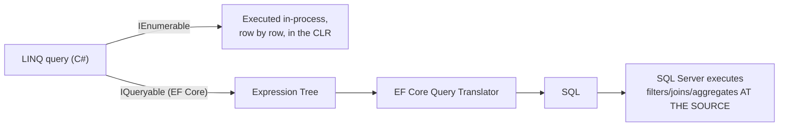

# 10 — LINQ

## 🎯 Learning Objectives
- Use the core LINQ operators fluently (`Where`, `Select`, `GroupBy`, `Join`, aggregates).
- Explain deferred execution and why it matters.
- Explain the difference between `IEnumerable<T>` and `IQueryable<T>`, and how EF Core translates LINQ to SQL.

## 🤔 What is it?
LINQ (Language Integrated Query) is a set of query operators, built as extension methods over `IEnumerable<T>`/`IQueryable<T>`, that let you filter, project, group, sort, and aggregate data using a consistent syntax across in-memory collections, databases, XML, and more.

## ❓ Why do we need it?
Before LINQ, querying an in-memory collection meant hand-written loops; querying a database meant hand-written SQL strings glued together — two entirely different mental models and no compile-time checking of either. LINQ unifies both under one composable, type-checked API.

## 🌍 Real-World Analogy
LINQ is like a **universal remote control**: the same buttons (`Where`, `Select`, `OrderBy`) work whether you're pointing it at an in-memory `List<T>`, a database table (via EF Core), or an XML document — the underlying "device" translates the same commands into whatever it natively understands.

## 🧠 Core Concept

### Core operators

```csharp
var activeCustomerNames = customers
    .Where(c => c.IsActive)                       // filter
    .OrderBy(c => c.LastName)                      // sort
    .ThenBy(c => c.FirstName)
    .Select(c => $"{c.FirstName} {c.LastName}")    // project
    .ToList();                                     // materialize

var totalsByCategory = orders
    .GroupBy(o => o.Category)
    .Select(g => new { Category = g.Key, Total = g.Sum(o => o.Amount) });

var customerOrders = customers
    .Join(orders, c => c.Id, o => o.CustomerId, (c, o) => new { c.Name, o.Total });

bool anyOverdue = orders.Any(o => o.DueDate < DateTime.UtcNow);
Order? first = orders.FirstOrDefault(o => o.Status == OrderStatus.Pending);
decimal total = orders.Sum(o => o.Amount);
```

| Method | Purpose |
|---|---|
| `Where` | Filter |
| `Select` / `SelectMany` | Project (flatten nested collections with `SelectMany`) |
| `OrderBy`/`ThenBy` | Sort (ascending, then tie-break) |
| `GroupBy` | Bucket elements by a key |
| `Join` / `GroupJoin` | Relational-style joins |
| `Any` / `All` / `Contains` | Boolean tests |
| `First`/`FirstOrDefault` vs `Single`/`SingleOrDefault` | First expects ≥1 match; Single **throws** if more than one matches — use Single when exactly-one is a business invariant |
| `Count`/`Sum`/`Average`/`Min`/`Max`/`Aggregate` | Aggregation |
| `Distinct` | Remove duplicates |
| `ToLookup`/`ToDictionary` | Materialize into a keyed structure |

### IEnumerable vs IQueryable

| | `IEnumerable<T>` | `IQueryable<T>` |
|---|---|---|
| Represents | An in-memory sequence, iterated method-by-method in the CLR | An **expression tree** describing a query, not yet executed |
| Where it runs | Entirely in application memory | Translated (e.g. by EF Core) into the target's native query language (SQL) and run **there** |
| Filtering location | Loads all data first, then filters in memory | Filters at the source (`WHERE` in SQL) before data even crosses the wire |
| Typical source | `List<T>`, arrays | `DbSet<T>` (EF Core) |

```csharp
// DANGEROUS: casting to IEnumerable early forces ALL rows into memory,
// then filters client-side — a classic, costly EF Core mistake.
IEnumerable<Order> orders = dbContext.Orders; // still IQueryable under the hood until enumerated differently
var expensive = ((IEnumerable<Order>)dbContext.Orders).Where(o => o.Total > 1000); // filters IN MEMORY after loading everything

// CORRECT: stay in IQueryable — the WHERE is translated to SQL and runs in the database
var expensive2 = dbContext.Orders.Where(o => o.Total > 1000).ToList();
```

### Deferred execution

```csharp
var query = numbers.Where(n => n > 5); // NOTHING has executed yet — query just describes intent
numbers.Add(10);
foreach (var n in query) { /* runs NOW, sees the 10 too */ }
```
LINQ queries (except methods that force immediate execution: `ToList()`, `ToArray()`, `Count()`, `First()`, etc.) build up a description of work and only execute when enumerated — this enables efficient composition but also causes a well-known bug class: re-enumerating a deferred query re-runs the whole pipeline (and, for `IQueryable`, re-hits the database) every single time.

## 🎨 Visual Explanation



## 🔍 Code Walkthrough
- `dbContext.Orders.Where(o => o.Total > 1000).ToList();` — `Where` here operates on `IQueryable<Order>`, so the lambda is captured as an **expression tree**, translated by EF Core's query provider into a SQL `WHERE Total > 1000`, and only the matching rows are fetched — `.ToList()` is what actually triggers execution.
- Casting to `IEnumerable<Order>` before filtering forces **immediate, full materialization** of the table into memory (or short-circuits translation), after which the `Where` runs as ordinary CLR code — the database does none of the filtering.

## ⚙️ How It Works Internally
`IEnumerable<T>` LINQ methods are implemented via C# **iterators** (`yield return` under the hood in the BCL's implementation) — each operator wraps the previous one in a new iterator object, and nothing runs until something calls `MoveNext()` (directly or via `foreach`). `IQueryable<T>` methods instead build an **`Expression<TDelegate>` tree** — a data structure representing the *code itself* (as data) rather than compiled IL — which a **query provider** (EF Core's SQL provider) walks and translates into the target query language at the point of enumeration.

## 🏢 Real-World Example
A reporting endpoint aggregating "total sales per region for last quarter" should build the whole `GroupBy`/`Sum`/date filter as one `IQueryable` chain and call `ToListAsync()` once at the end — letting SQL Server do the grouping and summing at the source — rather than pulling every order row into the API process and grouping in C#.

## 🚀 Production-Ready Example

```csharp
public async Task<List<RegionSalesDto>> GetQuarterlySalesAsync(int year, int quarter, CancellationToken ct)
{
    var (start, end) = QuarterRange(year, quarter);

    return await _dbContext.Orders
        .Where(o => o.PlacedAtUtc >= start && o.PlacedAtUtc < end)
        .GroupBy(o => o.Region)
        .Select(g => new RegionSalesDto(g.Key, g.Sum(o => o.Total)))
        .AsNoTracking()
        .ToListAsync(ct); // ONE round trip; grouping/summing happens in SQL Server
}
```

## ⚠️ Common Mistakes
- Materializing an `IQueryable` too early (`.ToList()` before filtering), losing all database-side optimization.
- Using `Single`/`SingleOrDefault` where `First`/`FirstOrDefault` was intended, causing unexpected exceptions when more than one row matches.
- Re-enumerating a deferred `IEnumerable` query multiple times, re-running (potentially expensive) work each time — sometimes silently causing multiple database round-trips for `IQueryable`.
- Calling a C# method LINQ-to-SQL can't translate (e.g. a custom static helper) inside a `Where` clause on `IQueryable`, causing a runtime `InvalidOperationException` (or in older EF versions, silent client-side evaluation).

## ❌ What NOT To Do
```csharp
// Loads the ENTIRE Orders table into memory, then filters/groups client-side
var orders = dbContext.Orders.ToList();
var totals = orders
    .Where(o => o.PlacedAtUtc >= start)
    .GroupBy(o => o.Region)
    .Select(g => new { g.Key, Total = g.Sum(o => o.Total) });
```

## ✅ Best Practices
- Keep the entire query as `IQueryable` until the final `ToList()`/`ToListAsync()`/`FirstOrDefaultAsync()`.
- Use `AsNoTracking()` for read-only EF Core queries (see [21 — EF Core](../21-Entity-Framework-Core)).
- Use `Any()` instead of `Count() > 0` for existence checks — `Any()` can short-circuit on the first match; `Count()` must potentially scan everything.

## ⚡ Performance Considerations
- `IQueryable` pushes filtering/aggregation to the database, reducing both network transfer and memory use dramatically for large tables.
- Deferred execution means a LINQ query stored in a variable and used in a loop can silently re-execute (and re-query the DB) on every iteration unless materialized once with `.ToList()`.

## 🔄 Related Concepts
- [08 — Advanced C#](../08-Advanced-CSharp) (collections underlying LINQ)
- [21 — Entity Framework Core](../21-Entity-Framework-Core)

## 🎤 Interview Questions

**Junior:** "What's the difference between `First` and `FirstOrDefault`?"
*Expected:* `First` throws `InvalidOperationException` if no element matches; `FirstOrDefault` returns the type's default (`null` for reference types) instead.

**Mid-level:** "What is deferred execution, and why can it be dangerous?"
*Expected:* A LINQ query isn't run until enumerated; storing and reusing a query variable can cause it to re-run (and, for a database-backed `IQueryable`, re-query) every time it's enumerated, sometimes unexpectedly picking up data changes made in between.

**Senior:** "Explain, mechanically, how EF Core turns a C# `Where` lambda into a SQL `WHERE` clause."
*Expected:* On `IQueryable<T>`, the lambda passed to `Where` is captured by the compiler as an `Expression<Func<T,bool>>` — a tree data structure describing the code, not executable IL. EF Core's LINQ provider walks that expression tree at query execution time and translates recognized patterns into equivalent SQL; anything it can't translate either throws or (in old versions) falls back to client evaluation.

## 🧪 Practice Exercises

**Easy**
1. Filter and project a `List<Order>` with `Where`+`Select`.
2. Use `GroupBy` to bucket a list of employees by department.
3. Compare `Single` vs `First` behavior when 2 elements match.
4. Use `Any()` vs `Count() > 0` and explain which is preferable and why.
5. Chain `OrderBy`+`ThenBy` on two fields.

**Medium**
1. Write a `Join` between two in-memory lists (customers, orders).
2. Demonstrate deferred execution: build a query, mutate the source collection, then enumerate and observe the mutation is reflected.
3. Rewrite an EF Core query that materializes early (`.ToList()` then filters) to filter at the database instead.

**Hard**
1. Explain, with an example, a LINQ expression EF Core cannot translate to SQL, and what error/behavior results.
2. Implement your own minimal `Where`/`Select` extension methods using `yield return` to understand how the BCL's `IEnumerable` LINQ operators work internally.

**Real-world scenario:** A reporting page is timing out. You find the code does `dbContext.Orders.ToList()` followed by several LINQ `Where`/`GroupBy` calls in C#. Explain exactly why this is slow and rewrite it correctly.

## 📌 Key Takeaways
- `IEnumerable` = in-memory, executed in the CLR; `IQueryable` = expression tree, translated and executed at the data source.
- LINQ queries are lazily (deferred) evaluated until materialized (`ToList`, `First`, `Count`, etc.).
- Keep queries as `IQueryable` as long as possible when working with EF Core, to let the database do filtering/aggregation.
