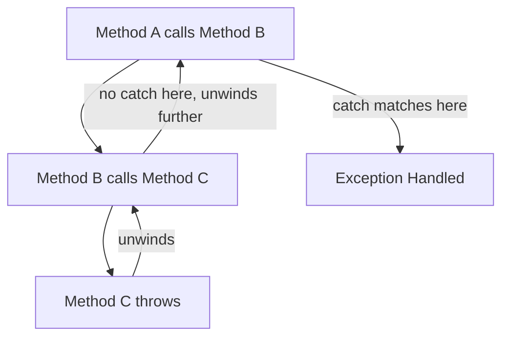

# 11 — Exception Handling

## 🎯 Learning Objectives
- Use `try`/`catch`/`finally` correctly, including exception filters.
- Explain why `throw;` is different from `throw ex;`.
- Design custom exceptions and a global exception-handling strategy for a Web API.

## 🤔 What is it?
An exception is an object representing an error condition that disrupts normal control flow, propagating up the call stack until a `catch` block handles it (or the process terminates if none does).

## ❓ Why do we need it?
Exceptions separate error-handling code from the normal logic path, and — critically — they **cannot be silently ignored** the way a return-code-based error system can (nobody forgets to check a return code that throws instead).

## 🌍 Real-World Analogy
An exception is like pulling a fire alarm: it immediately stops the normal flow of activity on that floor and escalates upward through the building until someone (a `catch` block) is equipped and positioned to respond; if nobody is, it reaches the top and the whole building evacuates (the process crashes).

## 🧠 Core Concept

```csharp
try
{
    ProcessOrder(order);
}
catch (ValidationException ex) when (ex.Field == "Email")
{
    // exception FILTER — this catch block only runs for this specific condition
    LogInvalidEmail(order, ex);
}
catch (ValidationException ex)
{
    LogValidationFailure(order, ex);
}
catch (Exception ex)
{
    LogUnexpected(ex);
    throw; // re-throw preserving the ORIGINAL stack trace
}
finally
{
    ReleaseLock(order);
}
```

### `throw;` vs `throw ex;`

```csharp
catch (Exception ex)
{
    throw;      // preserves the original stack trace — you see WHERE it actually happened
    throw ex;   // resets the stack trace to THIS line — you lose the original throw location
}
```
This is one of the most consequential, easy-to-get-wrong details in C# exception handling: `throw ex;` makes debugging production incidents significantly harder because the stack trace now points at your `catch` block, not the original failure site.

## 🎨 Visual Explanation



## 💻 Basic Example

```csharp
public class InsufficientStockException : Exception
{
    public string Sku { get; }
    public int Requested { get; }
    public int Available { get; }

    public InsufficientStockException(string sku, int requested, int available)
        : base($"Insufficient stock for {sku}: requested {requested}, available {available}.")
    {
        Sku = sku;
        Requested = requested;
        Available = available;
    }
}

public void ReserveStock(string sku, int quantity)
{
    var available = GetAvailable(sku);
    if (available < quantity)
    {
        throw new InsufficientStockException(sku, quantity, available);
    }
    // ... reserve ...
}
```

## 🔍 Code Walkthrough
- Custom exceptions should derive from `Exception` (not `ApplicationException`, which Microsoft itself recommends against using as a base) and carry **structured data** (`Sku`, `Requested`, `Available`) rather than only a formatted message string — this lets calling code and logging systems inspect the failure programmatically, not just display text.
- Calling `base(message)` populates the standard `.Message` property while still exposing the extra fields for callers that catch this specific type.

## ⚙️ How It Works Internally
Throwing an exception is relatively expensive compared to normal control flow — the CLR must capture a stack trace, walk up the call stack frame by frame looking for a matching `catch` (matching by type, and evaluating any `when` filter), and run `finally` blocks along the way *before* the exception object even reaches its handler. This is why exceptions should represent **truly exceptional** conditions, not routine, expected outcomes (see [05 — Methods](../05-Methods) for the `TryX`/`out` alternative for expected failures).

## 🏢 Real-World Example
A Web API needs one consistent, global place to translate exceptions into HTTP responses (so every controller doesn't need its own try/catch for the same cross-cutting concerns) — this is the **global exception handling middleware** pattern.

## 🚀 Production-Ready Example

```csharp
public class GlobalExceptionMiddleware
{
    private readonly RequestDelegate _next;
    private readonly ILogger<GlobalExceptionMiddleware> _logger;

    public GlobalExceptionMiddleware(RequestDelegate next, ILogger<GlobalExceptionMiddleware> logger)
    {
        _next = next;
        _logger = logger;
    }

    public async Task InvokeAsync(HttpContext context)
    {
        try
        {
            await _next(context);
        }
        catch (InsufficientStockException ex)
        {
            _logger.LogWarning(ex, "Insufficient stock for {Sku}", ex.Sku);
            await WriteProblemAsync(context, StatusCodes.Status409Conflict, ex.Message);
        }
        catch (ValidationException ex)
        {
            await WriteProblemAsync(context, StatusCodes.Status400BadRequest, ex.Message);
        }
        catch (Exception ex)
        {
            _logger.LogError(ex, "Unhandled exception");
            await WriteProblemAsync(context, StatusCodes.Status500InternalServerError, "An unexpected error occurred.");
        }
    }

    private static Task WriteProblemAsync(HttpContext context, int statusCode, string detail)
    {
        context.Response.StatusCode = statusCode;
        return context.Response.WriteAsJsonAsync(new ProblemDetails { Status = statusCode, Detail = detail });
    }
}
```
(In modern ASP.NET Core, `IExceptionHandler` — see [17 — Middleware](../17-Middleware) — is the newer, more composable way to express this same idea.)

## ⚠️ Common Mistakes
- `catch (Exception) { }` — swallowing all exceptions silently, hiding real bugs.
- `throw ex;` instead of `throw;`, destroying the original stack trace.
- Using exceptions for expected control flow (e.g. throwing to signal "not found" instead of returning `null`/a result type) inside hot paths.
- Catching an exception you don't actually know how to handle, "just in case."

## ❌ What NOT To Do
```csharp
try
{
    DoWork();
}
catch (Exception)
{
    // silently swallowed — the failure vanishes, and whoever debugs this later has nothing to go on
}
```

## ✅ Best Practices
- Catch the **most specific** exception type you can meaningfully react to; let everything else propagate to a global handler.
- Always use `throw;` to re-throw, never `throw ex;`.
- Include actionable, structured context on custom exceptions.
- Use exception filters (`when`) to avoid catching-then-immediately-rethrowing based on a condition.
- Never use exceptions to control routine, expected branching logic.

## ⚡ Performance Considerations
- Throwing/catching is measurably slower than a normal `if`/return path — avoid using exceptions in tight loops or for validating routine, expected user input (use `TryX` patterns or a validation/result type instead).

## 🔄 Related Concepts
- [05 — Methods](../05-Methods) (`TryX`/`out` as the alternative to exceptions for expected failure)
- [17 — Middleware](../17-Middleware) (global exception handling)
- [19 — Web API](../19-Web-API) (`ProblemDetails`)

## 🎤 Interview Questions

**Junior:** "What's the difference between `throw;` and `throw ex;`?"
*Expected:* `throw;` re-throws preserving the original stack trace; `throw ex;` resets the stack trace to the current location, hiding where the exception actually originated.

**Mid-level:** "When should you create a custom exception type vs. reuse a built-in one?"
*Expected:* When callers need to programmatically distinguish and react to a specific failure mode (catch it specifically) or when you need to attach structured, domain-specific data beyond a message string.

**Senior:** "Why are exceptions considered expensive, and how does that inform your exception-handling strategy in a high-throughput service?"
*Expected:* Stack trace capture and stack unwinding cost real CPU time; in a high-throughput service, routine/expected failures (validation, "not found") should use result objects or `TryX` patterns, reserving exceptions for genuinely unexpected failures (infrastructure errors, bugs, violated invariants) — plus a global handler at the boundary to avoid scattering try/catch everywhere.

## 🧪 Practice Exercises

**Easy**
1. Write a `try/catch/finally` and verify `finally` runs even when an exception is thrown.
2. Reproduce the `throw;` vs `throw ex;` stack trace difference and print both.
3. Create a custom exception with two extra structured properties.
4. Add an exception filter (`when`) to a `catch` block.
5. Explain why `catch (Exception) { }` (empty) is dangerous.

**Medium**
1. Implement the `InsufficientStockException` example and a caller that catches it specifically.
2. Build a minimal global exception-handling middleware mapping 3 exception types to 3 different HTTP status codes.
3. Refactor a method using exceptions for routine "not found" logic into a `TryGetX`/nullable-return pattern.

**Hard**
1. Benchmark (conceptually or with BenchmarkDotNet) throwing exceptions in a loop vs. an equivalent `TryX` pattern.
2. Design an exception hierarchy for a payments domain (e.g. `PaymentException` base, `CardDeclinedException`, `GatewayTimeoutException`) and explain what each layer of a system should catch.

**Real-world scenario:** Production logs show a spike of generic `Exception` entries with stack traces all pointing to the same `catch` block rather than the real failure site. Diagnose the likely cause and the fix.

## 📌 Key Takeaways
- `throw;` preserves the original stack trace; `throw ex;` does not — always prefer `throw;`.
- Reserve exceptions for truly exceptional conditions; use `TryX`/result types for expected, routine failures.
- Centralize cross-cutting exception-to-response mapping in one place (middleware) rather than scattering try/catch across every controller.
