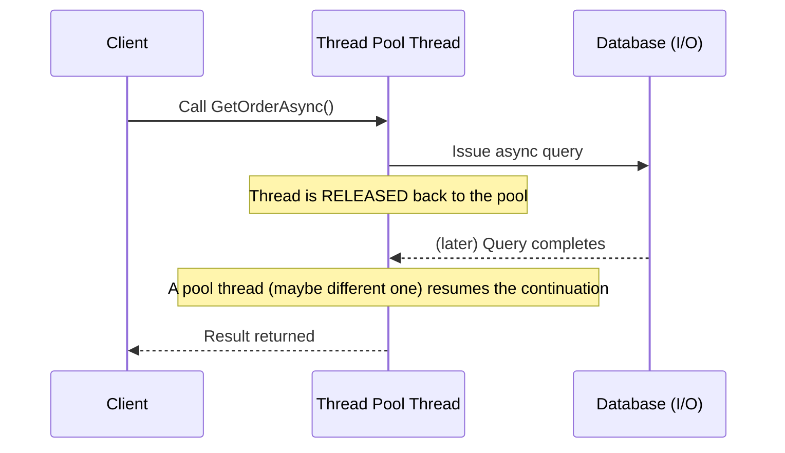

← Back to [12 — Async/Await overview](./README.md)

# Async Fundamentals

## async does NOT mean multithreading
This is the single most common misconception. `await`ing an I/O-bound operation (HTTP call, DB query, file read) doesn't spin up a new thread — it releases the current thread back to the thread pool while the OS handles the I/O in the background (via I/O completion ports on Windows, epoll/kqueue-backed mechanisms on Linux), and a thread pool thread (possibly, but not necessarily, a different one) resumes your code when the result is ready.

## CPU-bound vs I/O-bound

| | CPU-bound | I/O-bound |
|---|---|---|
| Bottleneck | Processor doing computation | Waiting on external system (disk, network, DB) |
| Right tool | `Task.Run` to offload to a thread pool thread, or `Parallel`/PLINQ for parallelism | `async`/`await` with the operation's native async API (`HttpClient.GetAsync`, `DbContext.ToListAsync`) |
| Thread usage | Actively occupies a thread the whole time | Frees the thread while waiting |

```csharp
// I/O-bound — correct use of async: no thread is blocked while waiting for the network
public async Task<Order> GetOrderAsync(Guid id) =>
    await _httpClient.GetFromJsonAsync<Order>($"/orders/{id}");

// CPU-bound — async provides NO benefit here by itself; the thread is busy the whole time either way
public async Task<int> ComputeHashAsync(byte[] data) =>
    await Task.Run(() => ExpensiveHash(data)); // offloads to thread pool so the CALLER'S thread (e.g. a UI thread) isn't blocked
```

## Visualizing the mechanism



## ⚠️ Common Mistakes
- Believing `async` automatically makes CPU-bound code faster — it doesn't parallelize computation, only frees threads during I/O waits.
- Using `Task.Run` around an I/O-bound call — this just occupies a thread-pool thread waiting synchronously inside the `Task.Run`, throwing away the entire benefit; call the operation's native async API directly instead.

## 🎤 Interview Questions

**Junior:** "Does `async` mean the code runs on a separate thread?"
*Expected:* No — `await`ing I/O-bound work releases the current thread back to the pool while waiting; no dedicated second thread is spun up for the wait itself. (`Task.Run` for CPU-bound work is the case that actually involves a distinct thread pool thread doing active work.)

## 🧪 Practice Exercises

**Easy**
1. Convert a synchronous method calling `HttpClient.GetString` (blocking) to `async`/`await`.
2. Explain in your own words why `await` doesn't create a thread.

**Medium**
1. Write a CPU-bound method (e.g. computing a hash of a large array) and correctly wrap it with `Task.Run` for use from a UI-like caller; explain why `async`/`await` alone wouldn't have helped without it.

---
Next: [02 — Task, ValueTask & CancellationToken →](./02-Task-ValueTask-CancellationToken.md)
