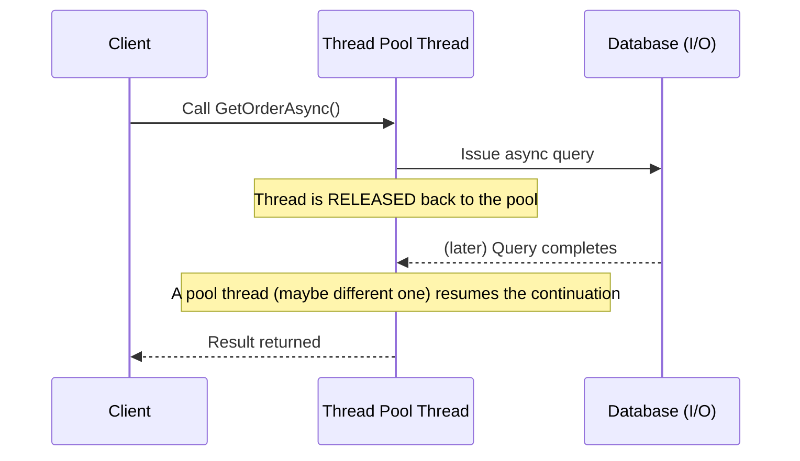

# 12 — Async / Await

## 🎯 Learning Objectives
- Explain what `async`/`await` actually compiles to and why it doesn't mean "runs on another thread."
- Distinguish CPU-bound from I/O-bound work and pick the right tool for each.
- Use `Task`, `Task<T>`, `ValueTask<T>`, `CancellationToken`, `ConfigureAwait`, `Task.WhenAll/WhenAny`, and `SemaphoreSlim` correctly.

## 🤔 What is it?
`async`/`await` is C# syntax for writing asynchronous code that *reads* like sequential, synchronous code, while the compiler transforms it into a state machine that can pause at each `await` and resume later — typically when an I/O operation completes — **without blocking the calling thread**.

## ❓ Why do we need it?
A thread blocked waiting on a database call, HTTP request, or disk read is a thread doing nothing but occupying a valuable, limited OS resource (thread pool threads are expensive to create and limited in number). Async I/O lets a server handle thousands of concurrent in-flight requests with a small thread pool, because threads are only occupied during actual CPU work, not while waiting on external systems.

## 🌍 Real-World Analogy
A synchronous, blocking call is like a chef who starts the oven, then **stands in front of it doing nothing** until the food is done, unable to help anyone else. An `async` call is a chef who starts the oven, walks away to help other customers, and comes back to check the food only when a timer goes off — the same chef (thread) serves many more customers this way. Notice this analogy does **not** involve a second chef — that's the key insight most learners get wrong.

## 🧠 Core Concept

### async does NOT mean multithreading
This is the single most common misconception. `await`ing an I/O-bound operation (HTTP call, DB query, file read) doesn't spin up a new thread — it releases the current thread back to the thread pool while the OS handles the I/O in the background (via I/O completion ports on Windows, epoll/kqueue-backed mechanisms on Linux), and a thread pool thread (possibly, but not necessarily, a different one) resumes your code when the result is ready.

### CPU-bound vs I/O-bound

| | CPU-bound | I/O-bound |
|---|---|---|
| Bottleneck | Processor doing computation | Waiting on external system (disk, network, DB) |
| Right tool | `Task.Run` to offload to a thread pool thread, or `Parallel`/PLINQ for parallelism | `async`/`await` with the operation's native async API (`HttpClient.GetAsync`, `DbContext.ToListAsync`) |
| Thread usage | Actively occupies a thread the whole time | Frees the thread while waiting |

```csharp
// I/O-bound — correct use of async: no thread is blocked while waiting for the network
public async Task<Order> GetOrderAsync(Guid id) =>
    await _httpClient.GetFromJsonAsync<Order>($"/orders/{id}");

// CPU-bound — async provides NO benefit here by itself; the thread is busy the whole time either way
public async Task<int> ComputeHashAsync(byte[] data) =>
    await Task.Run(() => ExpensiveHash(data)); // offloads to thread pool so the CALLER'S thread (e.g. a UI thread) isn't blocked
```

### Visualizing the mechanism



### Task, Task<T>, ValueTask<T>

- **`Task`** — represents an in-progress or completed operation with no return value.
- **`Task<T>`** — same, but with a result of type `T`.
- **`ValueTask<T>`** — a struct-based alternative to `Task<T>` that avoids a heap allocation when the result is **already available synchronously** (e.g. served from a cache) — a targeted optimization for hot paths with frequent synchronous completion; don't reach for it by default, since misuse (awaiting it twice, storing it) has real pitfalls `Task<T>` doesn't.

### CancellationToken

```csharp
public async Task<List<Order>> GetOrdersAsync(CancellationToken cancellationToken)
{
    return await _dbContext.Orders.ToListAsync(cancellationToken);
}
```
Every async method that can take meaningful time should accept and propagate a `CancellationToken` — ASP.NET Core automatically supplies one tied to the client's request lifetime, so a client disconnecting cancels the whole downstream chain of work, freeing server resources immediately instead of finishing pointless work.

### ConfigureAwait(false)

```csharp
var data = await SomeLibraryCallAsync().ConfigureAwait(false);
```
Tells the awaiter not to try to resume on the original synchronization context (relevant for UI apps with a UI thread context, and legacy ASP.NET (Framework) with `HttpContext`-bound context). **In modern ASP.NET Core there is no such synchronization context**, so `ConfigureAwait(false)` is largely unnecessary in application code there — but it remains a best practice in general-purpose **library** code that might be consumed by UI applications, to avoid forcing an unnecessary context-capturing continuation.

### Task.WhenAll / Task.WhenAny

```csharp
var ordersTask = GetOrdersAsync(ct);
var inventoryTask = GetInventoryAsync(ct);
await Task.WhenAll(ordersTask, inventoryTask); // run concurrently, wait for both

var winner = await Task.WhenAny(primaryProviderTask, backupProviderTask); // first to finish wins
```
`Task.WhenAll` runs independent async operations **concurrently** rather than sequentially awaiting each one — a very common, very impactful optimization.

### SemaphoreSlim
Used to limit concurrent access to a resource in async code (a `lock` statement cannot be used across an `await`):
```csharp
private static readonly SemaphoreSlim _semaphore = new(maxConcurrency: 3);

public async Task CallExternalApiAsync()
{
    await _semaphore.WaitAsync();
    try { await _httpClient.GetAsync("..."); }
    finally { _semaphore.Release(); }
}
```

## 💻 Basic Example

```csharp
public async Task<OrderSummary> BuildSummaryAsync(Guid orderId, CancellationToken ct)
{
    var orderTask = _orderRepository.GetByIdAsync(orderId, ct);
    var customerTask = _customerRepository.GetByOrderIdAsync(orderId, ct);

    await Task.WhenAll(orderTask, customerTask); // both run concurrently

    return new OrderSummary(orderTask.Result, customerTask.Result);
}
```

## 🔍 Code Walkthrough
- Starting both `orderTask` and `customerTask` **before** awaiting either kicks off both operations concurrently; awaiting them one at a time (`await orderTask; await customerTask;`) would serialize them unnecessarily, doubling the wall-clock latency for no reason.
- `Task.WhenAll` completes once both underlying tasks complete; accessing `.Result` afterward is safe here specifically because we already know both are complete (accessing `.Result` on an incomplete task would **block** the thread — a classic deadlock risk in UI/legacy ASP.NET contexts, discussed below).

## ⚙️ How It Works Internally

The compiler transforms an `async` method into a **compiler-generated state machine** (a struct or class implementing `IAsyncStateMachine`):

```
Compiler
   ↓
Generates a state machine class/struct
   ↓
Each `await` becomes a state transition point
   ↓
The state machine registers a continuation with the awaited Task's awaiter
   ↓
Method returns a Task immediately to its caller (does NOT block)
   ↓
When the awaited operation completes, the continuation resumes the state machine
   ↓
Execution continues from right after the `await`, on whatever thread the continuation is scheduled on
```

Critically: **`await` does not create a new thread.** It registers a callback and returns control to the caller. The "magic" is entirely in *who* invokes that callback later — typically the I/O completion mechanism handing it back to a thread pool thread.

### The classic deadlock

```csharp
// DEADLOCK RISK (classic ASP.NET / UI app pattern — avoid entirely)
public void Button_Click(object sender, EventArgs e)
{
    var result = GetDataAsync().Result; // blocks the UI thread waiting for a continuation
                                          // that needs... the UI thread's synchronization context to resume on
}
```
This deadlocks specifically in environments with a capturing `SynchronizationContext` (WinForms/WPF UI thread, classic ASP.NET's request context) because the continuation is scheduled to resume on that same context, but the context's one thread is stuck blocking on `.Result`. **This is why `async` should be "async all the way down"** — never block on async code with `.Result`/`.Wait()`.

## 🏢 Real-World Example
A Web API endpoint fetching order details, customer details, and inventory status from three separate downstream services should issue all three calls concurrently with `Task.WhenAll`, cutting total latency to roughly the slowest single call instead of the sum of all three.

## 🚀 Production-Ready Example

```csharp
[HttpGet("{id:guid}")]
public async Task<ActionResult<OrderDetailsDto>> GetOrderDetails(Guid id, CancellationToken cancellationToken)
{
    var orderTask = _orderService.GetOrderAsync(id, cancellationToken);
    var customerTask = _customerService.GetCustomerForOrderAsync(id, cancellationToken);
    var inventoryTask = _inventoryService.GetStatusAsync(id, cancellationToken);

    try
    {
        await Task.WhenAll(orderTask, customerTask, inventoryTask);
    }
    catch when (cancellationToken.IsCancellationRequested)
    {
        return StatusCode(StatusCodes.Status499ClientClosedRequest);
    }

    return Ok(new OrderDetailsDto(orderTask.Result, customerTask.Result, inventoryTask.Result));
}
```

## ⚠️ Common Mistakes
- Blocking on async code with `.Result` or `.Wait()` — risks deadlocks and defeats the entire purpose of async.
- `async void` methods (except event handlers) — exceptions thrown inside them **cannot be caught by the caller** and crash the process instead; always use `async Task`.
- Sequentially `await`ing independent operations that could run concurrently via `Task.WhenAll`.
- Believing `async` automatically makes CPU-bound code faster — it doesn't parallelize computation, only frees threads during I/O waits.
- Forgetting to pass/propagate `CancellationToken` through the whole async call chain.

## ❌ What NOT To Do
```csharp
public async void ProcessOrder(Order order) // async void — avoid outside event handlers
{
    await _repository.SaveAsync(order); // if this throws, the exception is unhandleable by the caller
}
```

## ✅ Best Practices
- Return `Task`/`Task<T>` from async methods, never `async void` (except UI event handlers).
- Start independent async operations before awaiting any of them, then `Task.WhenAll`.
- Propagate `CancellationToken` end to end.
- Use `ConfigureAwait(false)` in library code that isn't ASP.NET Core-specific.
- Suffix async methods with `Async` by convention.

## ⚡ Performance Considerations
- `async`/`await` dramatically improves **throughput and scalability** (requests handled per second under load) by freeing threads during I/O waits — it does **not** make a single request individually faster in latency terms, and can add small overhead (state machine allocation) for trivial, already-fast operations.
- `ValueTask<T>` avoids an allocation for hot paths that frequently complete synchronously (e.g. cache hits) — measure before adopting it, since it complicates usage rules.

## 🔄 Related Concepts
- [11 — Exception Handling](../11-Exception-Handling) (exceptions in `async void`)
- [30 — Background Services](../30-Background-Services)
- [33 — Resilience](../33-Resilience)

## 🎤 Interview Questions

**Junior:** "Does `async` mean the code runs on a separate thread?"
*Expected:* No — `await`ing I/O-bound work releases the current thread back to the pool while waiting; no dedicated second thread is spun up for the wait itself. (`Task.Run` for CPU-bound work is the case that actually involves a distinct thread pool thread doing active work.)

**Mid-level:** "Why does calling `.Result` on a `Task` sometimes deadlock?"
*Expected:* In environments with a capturing synchronization context (UI apps, classic ASP.NET), the awaited task's continuation is scheduled to resume on that same context/thread; blocking that thread with `.Result` while it's also needed to run the continuation creates a deadlock. ASP.NET Core has no such context by default, reducing (but not eliminating as a bad practice) this specific risk.

**Senior:** "Walk me through exactly what the compiler generates for an `async` method, and why that design avoids blocking threads."
*Expected:* A state machine implementing `IAsyncStateMachine` with a `MoveNext()` method; each `await` is a state boundary where the method registers a continuation with the awaiter and returns control (and a `Task` handle) to the caller immediately, rather than blocking; when the awaited operation signals completion (often via I/O completion ports), the scheduler invokes the continuation, which resumes `MoveNext()` from the saved state.

## 🧪 Practice Exercises

**Easy**
1. Convert a synchronous method calling `HttpClient.GetString` (blocking) to `async`/`await`.
2. Write two independent async calls sequentially, then rewrite using `Task.WhenAll`, and reason about the latency difference.
3. Demonstrate why `async void` swallows exceptions with a small reproducible example.
4. Add a `CancellationToken` parameter to an existing async method and thread it through to an EF Core call.
5. Explain in your own words why `await` doesn't create a thread.

**Medium**
1. Reproduce the classic UI-thread `.Result` deadlock in a small console/WinForms repro (or explain precisely why it would occur).
2. Use `SemaphoreSlim` to limit concurrent calls to an external API to 3 at a time.
3. Use `Task.WhenAny` to implement a simple timeout pattern around a slow operation.

**Hard**
1. Explain tiered/ahead-of-time considerations aside, benchmark `ValueTask<T>` vs `Task<T>` for a method that completes synchronously 90% of the time.
2. Implement a small async producer/consumer pipeline using `Channel<T>` (BCL) and explain how it relates to what you've learned about async I/O.

**Real-world scenario:** A Web API endpoint that calls three independent downstream services sequentially with `await` takes 900ms total (300ms each). Rewrite it to reduce latency and explain the expected new total.

## 📌 Key Takeaways
- `async`/`await` frees threads during I/O waits; it does not itself create parallelism for CPU-bound work.
- Never block on async code with `.Result`/`.Wait()` — it risks deadlocks and defeats the purpose.
- Start independent async operations concurrently and `Task.WhenAll` them instead of awaiting sequentially.
- Propagate `CancellationToken` through the entire async call chain.
