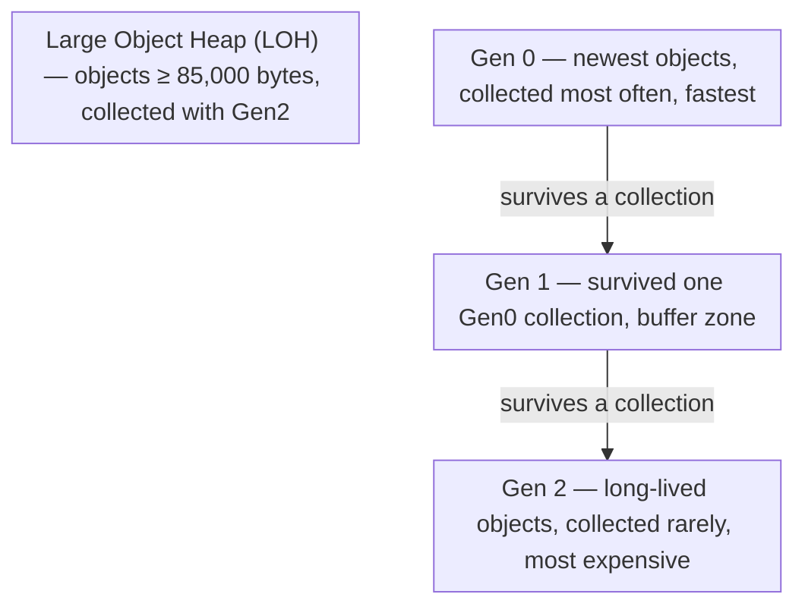
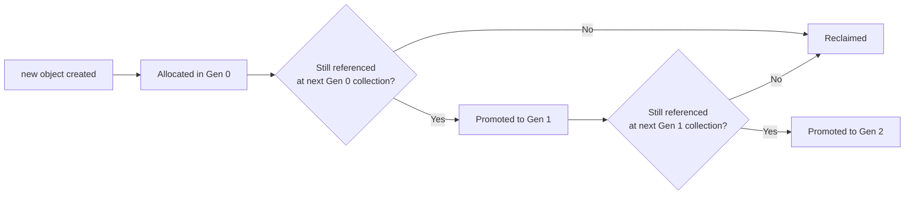

# 13 — Memory Management & Garbage Collection

## 🎯 Learning Objectives
- Explain the generational garbage collector model and why it exists.
- Implement `IDisposable` correctly (including the full dispose pattern with finalizers).
- Explain how a *managed* language can still leak memory.

## 🤔 What is it?
The .NET **Garbage Collector (GC)** automatically reclaims heap memory occupied by objects no longer reachable from any live root (local variables, static fields, CPU registers, etc.), so developers don't manually `free()` every allocation.

## ❓ Why do we need it?
Manual memory management (as in C/C++) is a major source of bugs: use-after-free, double-free, and memory leaks from forgotten frees. A tracing GC removes an entire class of these bugs by determining reachability automatically — at the cost of some unpredictability in *when* memory is reclaimed and non-zero collection overhead.

## 🌍 Real-World Analogy
The GC is like a **library that periodically walks every shelf**, checking which books (objects) still have an active reader (a reachable reference) and pulling any book nobody is holding onto anymore, so a bookshelf never runs out of space. But if a reader is still gripping a book they've forgotten about (an unintended reference kept alive, e.g. via a static collection or an unremoved event handler), the library will never reclaim it — this is exactly how a managed language still leaks memory.

## 🧠 Core Concept

### Generational GC



- **Generational hypothesis**: most objects die young (short-lived temporaries, local method state), so the GC optimizes for this by collecting the newest generation (Gen 0) most frequently and cheaply, only promoting and scanning older generations less often.
- **Gen 0** — collected very frequently, very fast (often sub-millisecond); most garbage is caught here.
- **Gen 1** — a buffer between short-lived and long-lived objects.
- **Gen 2** — long-lived objects (caches, singletons); collecting it is the most expensive because it may need to scan/compact a large portion of the heap.
- **LOH (Large Object Heap)** — objects 85KB or larger (large arrays, big strings) are allocated here directly, skipping Gen 0/1, because copying large objects during compaction is expensive; the LOH is historically not compacted by default (fragmentation risk), though modern .NET can compact it on demand.

### IDisposable and `using`

```csharp
public class FileProcessor : IDisposable
{
    private readonly FileStream _stream;
    private bool _disposed;

    public FileProcessor(string path) => _stream = File.OpenRead(path);

    public void Dispose()
    {
        if (_disposed) return;
        _stream.Dispose();
        _disposed = true;
        GC.SuppressFinalize(this);
    }
}

using (var processor = new FileProcessor("data.csv")) { /* ... */ } // Dispose() called automatically, even on exception

using var processor2 = new FileProcessor("data.csv"); // C# 8+ using DECLARATION — disposed at end of enclosing scope
```

`IDisposable` exists for **deterministic** cleanup of **unmanaged resources** (file handles, network sockets, database connections, OS handles) that the GC does not know how to release on its own — the GC only knows about managed memory, not external OS resources held by a managed wrapper object.

### Full Dispose pattern (with a finalizer, for types directly holding unmanaged handles)

```csharp
public class NativeResourceHolder : IDisposable
{
    private IntPtr _handle;
    private bool _disposed;

    public NativeResourceHolder() => _handle = AllocateNativeHandle();

    protected virtual void Dispose(bool disposing)
    {
        if (_disposed) return;
        if (disposing)
        {
            // dispose managed resources here (other IDisposables you own)
        }
        ReleaseNativeHandle(_handle); // unmanaged cleanup always runs, even if Dispose() was never called
        _disposed = true;
    }

    public void Dispose()
    {
        Dispose(true);
        GC.SuppressFinalize(this); // finalizer no longer needed — we already cleaned up
    }

    ~NativeResourceHolder() => Dispose(false); // safety net if Dispose() was never called
}
```

### WeakReference
Lets you reference an object **without** keeping it alive for GC purposes — useful for caches where you want entries to be reclaimable under memory pressure:
```csharp
var weak = new WeakReference<Order>(order);
if (weak.TryGetTarget(out var target)) { /* still alive */ }
```

## 🎨 Visual Explanation



## 🔍 Code Walkthrough
- `GC.SuppressFinalize(this);` inside `Dispose()` tells the GC not to bother calling the finalizer, since cleanup already happened deterministically — without this, the object survives an *extra* GC generation just to run a now-pointless finalizer, delaying reclamation.
- The finalizer (`~NativeResourceHolder()`) is a safety net **only** — relying on it as your primary cleanup mechanism is wrong, because finalizers run at an unpredictable, GC-determined time (or possibly never during process shutdown), so unmanaged handles could stay held far longer than necessary.

## ⚙️ How It Works Internally
The GC is a **tracing** collector: starting from a set of **roots** (static fields, local variables/registers on all thread stacks, GC handles), it recursively marks every reachable object, then reclaims everything unmarked. Gen 0/1 collections use a **copying collector** (surviving objects are copied to a new compacted region, which is why they're extremely fast — dead objects are simply not copied, no per-object work needed for them). Gen 2 collections are more expensive because the heap is larger and a full mark-and-possibly-compact pass costs more. **Why managed code can still leak:** the GC only frees what's truly *unreachable*; a growing `static List<T>` you keep adding to and never clear, an event subscription that keeps a subscriber alive (see [09 — Delegates & Events](../09-Delegates-Events)), or a cache with no eviction policy are all textbook "managed memory leaks" — the objects are technically still reachable, so the GC correctly (by its contract) never reclaims them.

## 🏢 Real-World Example
A long-running Web API process holds a `static Dictionary<string, CachedResult>` that's never evicted — after weeks of uptime, memory grows unbounded even though every individual object is perfectly valid, reachable, non-leaked-in-the-C++-sense memory; the GC is doing its job correctly, but the *design* has a leak.

## 🚀 Production-Ready Example

```csharp
services.AddMemoryCache(options =>
{
    options.SizeLimit = 1024; // enforce a bound so the cache can't grow unbounded
});

public async Task<Product> GetProductAsync(Guid id)
{
    return await _cache.GetOrCreateAsync($"product:{id}", async entry =>
    {
        entry.SlidingExpiration = TimeSpan.FromMinutes(10); // ensures eviction — prevents the "managed leak" pattern
        entry.Size = 1;
        return await _repository.GetByIdAsync(id);
    });
}
```

## ⚠️ Common Mistakes
- Not implementing `IDisposable` on a type that wraps `IDisposable` fields (e.g. a repository holding a `SqlConnection` without disposing it).
- Relying on finalizers for timely cleanup — they run on the GC's schedule, not yours, and add real overhead.
- Unbounded caches or static collections that grow forever.
- Forgetting `GC.SuppressFinalize(this)` in `Dispose()` when a finalizer is present, needlessly delaying collection.

## ❌ What NOT To Do
```csharp
public class ReportGenerator
{
    private readonly SqlConnection _connection = new(connectionString);
    // No IDisposable implementation — the connection is never explicitly closed,
    // relying entirely on eventual, non-deterministic finalization.
}
```

## ✅ Best Practices
- Implement `IDisposable` on any type that owns `IDisposable` resources; use `using`/`using` declarations at every call site.
- Only add a finalizer if your type directly holds an unmanaged handle (rare in typical application code — most disposables just wrap another `IDisposable`, and don't need their own finalizer).
- Bound caches and long-lived collections with eviction policies.
- Unsubscribe from events in `Dispose()` for objects with a shorter lifetime than their publisher.

## ⚡ Performance Considerations
- Gen 0 collections are extremely cheap (often microseconds); Gen 2 collections can cause noticeable pauses in high-allocation applications — minimizing allocations in hot paths (see [08 — Advanced C#](../08-Advanced-CSharp), [36 — Performance](../36-Performance)) reduces GC frequency and pause impact.
- Large object allocations (≥85KB) go straight to the LOH, which historically fragments more easily — avoid frequent large temporary array allocations in hot paths; consider `ArrayPool<T>`.

## 🔄 Related Concepts
- [03 — Value vs Reference Types](../03-Value-vs-Reference-Types)
- [09 — Delegates & Events](../09-Delegates-Events) (event-based leaks)
- [29 — Caching](../29-Caching)
- [36 — Performance](../36-Performance)

## 🎤 Interview Questions

**Junior:** "What is the purpose of `IDisposable`?"
*Expected:* Deterministic release of unmanaged/external resources (file handles, connections, sockets) that the GC doesn't automatically know how to clean up, since it only tracks managed memory.

**Mid-level:** "How can a garbage-collected language still have memory leaks?"
*Expected:* The GC only reclaims *unreachable* objects; a "leak" in managed code means objects are unintentionally kept *reachable* forever (static collections that grow, unremoved event subscriptions, unbounded caches) — the GC is behaving correctly by its contract, but the reference graph is wrong.

**Senior:** "Why does the generational hypothesis make Gen 0 collections so cheap, and what's the trade-off with Gen 2?"
*Expected:* Most objects die young, so Gen 0 collections only need to examine a small, recently-allocated region and copy the few survivors elsewhere — proportional to *live* data, not total heap size. Gen 2 collections must consider a much larger, longer-lived portion of the heap and are proportionally more expensive, which is why minimizing promotion (reducing unnecessary long-lived allocations) is a real performance lever.

## 🧪 Practice Exercises

**Easy**
1. Implement `IDisposable` on a class wrapping a `StreamWriter`.
2. Use a `using` declaration and verify `Dispose()` runs even when an exception is thrown inside the block.
3. Explain the difference between `Dispose()` and a finalizer in your own words.
4. Create a `WeakReference<T>` and demonstrate that its target can become unavailable.
5. Identify which of a `class`'s fields require it to implement `IDisposable`.

**Medium**
1. Implement the full Dispose pattern (with `Dispose(bool)` and a finalizer) for a type simulating an unmanaged handle.
2. Reproduce an event-subscription memory leak (see [09](../09-Delegates-Events)) and fix it with proper unsubscription.
3. Configure `IMemoryCache` with a size limit and eviction policy and demonstrate entries being evicted.

**Hard**
1. Explain, with a diagram, why LOH fragmentation happens and one mitigation strategy.
2. Using a memory profiler (conceptually), diagnose a growing `static` collection as the root cause of unbounded memory growth in a long-running service.

**Real-world scenario:** A production API's memory usage climbs steadily over several days until an OOM restart. dotnet-gcdump analysis shows thousands of retained `EventHandler` delegate instances. Explain the likely root cause and the fix.

## 📌 Key Takeaways
- The GC is generational: most objects die young, so Gen 0 is cheap and frequent; Gen 2 is rare and expensive.
- `IDisposable`/`using` provide deterministic cleanup for unmanaged/external resources the GC can't handle on its own.
- Managed languages can still leak: reachable-but-unintended references (static collections, un-unsubscribed events, unbounded caches) keep objects alive forever, correctly, by the GC's own rules.
