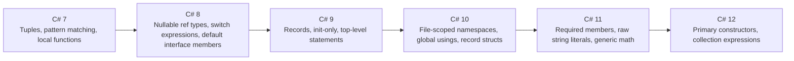

# 14 — Modern C# Features

## 🎯 Learning Objectives
- Use records, pattern matching, and nullable reference types to write safer, more concise code.
- Know which C# version introduced each modern feature (so you can reason about compatibility).

## 🤔 What is it?
A collection of language features added from C# 7 through the latest version that reduce boilerplate and let the compiler catch more mistakes (especially around nullability) at compile time.

## ❓ Why do we need it?
Each feature targets a specific, well-known pain point: verbose immutable data classes, unsafe null handling, ceremony-heavy DTOs, and awkward multi-value returns.

## 🧠 Core Concept — Feature by feature

### Records (C# 9+)
```csharp
public record Point(double X, double Y);

var p1 = new Point(1, 2);
var p2 = new Point(1, 2);
Console.WriteLine(p1 == p2); // True — value-based equality, unlike a plain class
var p3 = p1 with { X = 5 }; // non-destructive mutation — copies p1, changing only X
```
Records get compiler-generated value-based `Equals`/`GetHashCode`/`ToString`, and the `with` expression for non-destructive updates.

### Nullable reference types (C# 8+)
```csharp
#nullable enable
public class Customer
{
    public string Name { get; set; } = string.Empty; // non-nullable — compiler warns if you don't initialize it
    public string? MiddleName { get; set; }           // explicitly nullable — must be null-checked before dereferencing
}
```
This doesn't change runtime behavior (a `string` can still technically be `null` since it's a reference type) — it's a **compile-time annotation and warning system** that makes your intent explicit and catches likely `NullReferenceException`s during code review/build instead of at 3am in production.

### Init-only setters & required members (C# 9 / C# 11)
```csharp
public class Order
{
    public required Guid Id { get; init; }   // MUST be set at construction (object initializer), enforced by the compiler
    public DateTimeOffset CreatedAt { get; init; } = DateTimeOffset.UtcNow; // settable only during initialization
}

var order = new Order { Id = Guid.NewGuid() }; // compiles
// var bad = new Order(); // COMPILE ERROR — Id is required
```

### Primary constructors (C# 12)
```csharp
public class OrderService(IOrderRepository repository, ILogger<OrderService> logger)
{
    public async Task<Order?> GetAsync(Guid id) => await repository.GetByIdAsync(id);
    // 'repository' and 'logger' are captured directly, no manual field + constructor boilerplate
}
```

### File-scoped namespaces (C# 10) & global usings (C# 10)
```csharp
namespace MyApp.Services; // one line, no braces, applies to the entire file

// GlobalUsings.cs, applies project-wide:
global using System;
global using System.Linq;
```

### Raw string literals (C# 11)
```csharp
string json = """
{
    "name": "John",
    "age": 30
}
"""; // no escaping needed for quotes inside
```

### Collection expressions (C# 12)
```csharp
int[] numbers = [1, 2, 3];
List<string> names = ["Alice", "Bob"];
int[] combined = [.. numbers, 4, 5]; // spread operator
```

### Tuples & deconstruction
```csharp
(string Name, int Age) person = ("Sam", 30);
var (name, age) = person; // deconstruction

(int Min, int Max) FindRange(IEnumerable<int> values) => (values.Min(), values.Max());
var (min, max) = FindRange(numbers);
```

### Expression-bodied members
```csharp
public double Area => Math.PI * Radius * Radius; // property
public override string ToString() => $"({X}, {Y})"; // method
```

### Switch expressions & advanced pattern matching (C# 8+)
```csharp
string category = age switch
{
    < 13 => "Child",
    >= 13 and < 20 => "Teen",
    >= 20 => "Adult",
};

if (shape is Rectangle { Width: var w, Height: var h } && w == h)
{
    Console.WriteLine("It's a square!");
}
```

## 🎨 Visual Explanation



## 🏢 Real-World Example
A DTO layer for a Web API is a natural fit for `record` types — immutable, value-equal, concise:
```csharp
public record CreateOrderRequest(Guid CustomerId, List<OrderLineRequest> Lines);
public record OrderLineRequest(string Sku, int Quantity);
```

## 🚀 Production-Ready Example

```csharp
#nullable enable

public sealed record OrderDto
{
    public required Guid Id { get; init; }
    public required string CustomerName { get; init; }
    public string? Notes { get; init; }
    public required DateTimeOffset PlacedAtUtc { get; init; }
}

public sealed class OrderMapper
{
    public static OrderDto ToDto(Order order) => new()
    {
        Id = order.Id,
        CustomerName = order.Customer.Name,
        Notes = order.Notes,
        PlacedAtUtc = order.PlacedAtUtc
    };
}
```

## ⚠️ Common Mistakes
- Treating nullable reference type warnings as "just noise" and suppressing them with `!` (the null-forgiving operator) everywhere instead of fixing the actual nullability design.
- Using records for entities with identity/mutable state managed by EF Core, where the value-equality semantics conflict with EF's identity tracking (use plain classes for tracked entities — see [21 — EF Core](../21-Entity-Framework-Core)).
- Overusing primary constructors for classes with complex initialization logic that doesn't fit the terse capture pattern.

## ❌ What NOT To Do
```csharp
#nullable enable
public string GetName(Customer? customer)
{
    return customer!.Name; // '!' silences the warning but doesn't prevent the NullReferenceException at runtime
}
```

## ✅ Best Practices
- Enable nullable reference types (`<Nullable>enable</Nullable>`) project-wide for new projects; treat warnings as real bugs to fix, not suppress.
- Use `record`/`record struct` for DTOs and value objects; keep `class` for EF Core-tracked entities and objects with real identity/mutable lifecycle.
- Use primary constructors for simple, mostly-DI-injection classes; keep traditional constructors when there's real initialization logic to express.

## ⚡ Performance Considerations
- Records generate extra compiler machinery (`Equals`, `GetHashCode`, `Clone`) — negligible cost for typical DTO sizes, but be mindful for very large records compared with hand-rolled equality.
- Collection expressions compile to efficient underlying code (often avoiding intermediate allocations the naive equivalent would incur).

## 🔄 Related Concepts
- [03 — Value vs Reference Types](../03-Value-vs-Reference-Types) (record vs record struct)
- [04 — Control Flow](../04-Control-Flow) (pattern matching, switch expressions)
- [19 — Web API](../19-Web-API) (DTOs as records)

## 🎤 Interview Questions

**Junior:** "What does `record` give you that `class` doesn't, by default?"
*Expected:* Value-based equality (`Equals`/`GetHashCode`/`==` compare field values, not references), a generated `ToString()`, and the `with` expression for non-destructive copies.

**Mid-level:** "Does enabling nullable reference types prevent `NullReferenceException` at runtime?"
*Expected:* No — it's a compile-time static analysis/warning system layered on top of the existing runtime type system; a `null-forgiving` (`!`) operator or a warning-suppressed path can still throw at runtime. It dramatically reduces the *likelihood* by surfacing intent and unsafe dereferences during development.

**Senior:** "When would you avoid using a `record` for a type that's otherwise a good conceptual fit?"
*Expected:* When the type is an EF Core-tracked entity whose identity (not structural value) should define equality, or when you need mutable reference semantics that many collaborators mutate in place over the object's lifetime rather than passing around immutable copies.

## 🧪 Practice Exercises

**Easy**
1. Convert a plain class DTO into a `record`.
2. Use the `with` expression to create a modified copy of a record.
3. Enable nullable reference types on a small project and fix the resulting warnings.
4. Use collection expressions to initialize an array and a list.
5. Write a method returning a tuple and deconstruct it at the call site.

**Medium**
1. Refactor a class with a large constructor into a primary-constructor class.
2. Use `required` members to enforce mandatory initialization on a DTO.
3. Write a raw string literal containing embedded JSON with quotes, comparing it to the escaped equivalent.

**Hard**
1. Design a small object graph using records and demonstrate a subtle bug from assuming reference equality where value equality actually applies (or vice versa).
2. Explain why EF Core entities are generally kept as mutable classes rather than records, tying it to change tracking (see [21 — EF Core](../21-Entity-Framework-Core)).

**Real-world scenario:** A team enables nullable reference types on a large legacy codebase and gets thousands of warnings. Propose a pragmatic, incremental rollout strategy.

## 📌 Key Takeaways
- Records give free value-based equality and immutability-friendly patterns (`with`) — ideal for DTOs/value objects.
- Nullable reference types are a compile-time safety net, not a runtime guarantee — don't suppress warnings with `!` without genuinely reasoning about nullability.
- Primary constructors, collection expressions, and raw string literals mainly reduce boilerplate — use them where they improve clarity, not everywhere reflexively.
