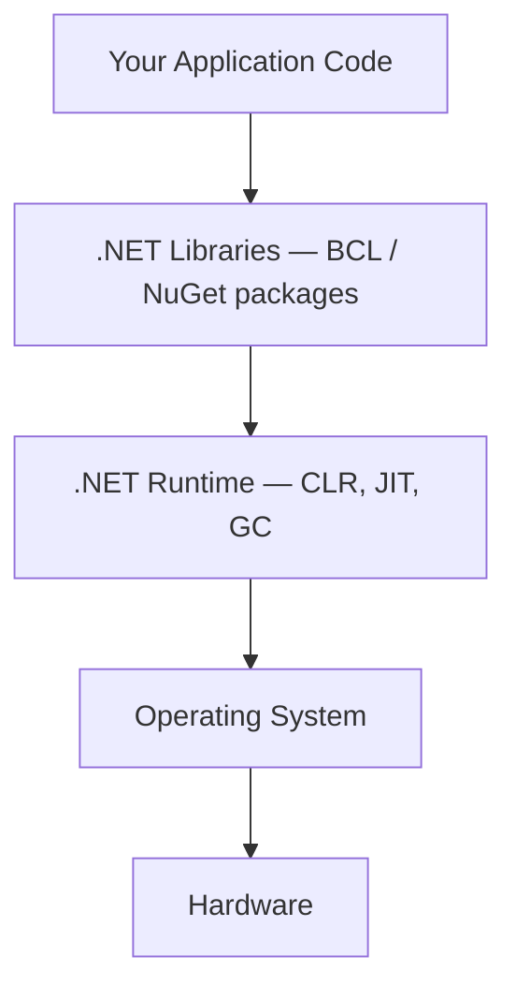

# 15 — .NET Fundamentals

## 🎯 Learning Objectives
- Understand the layered architecture from application code down to hardware.
- Understand `csproj`, NuGet, and configuration/environment variables.

## 🤔 What is it?
The pieces that sit beneath your application code: the Base Class Library (BCL), the CLR runtime, the SDK/tooling, and the project/package system (`csproj`, NuGet) that ties it all together.

## 🧠 Core Concept



### csproj — the project file
```xml
<Project Sdk="Microsoft.NET.Sdk.Web">
  <PropertyGroup>
    <TargetFramework>net8.0</TargetFramework>
    <Nullable>enable</Nullable>
    <ImplicitUsings>enable</ImplicitUsings>
  </PropertyGroup>
  <ItemGroup>
    <PackageReference Include="Microsoft.EntityFrameworkCore.SqlServer" Version="8.0.0" />
  </ItemGroup>
</Project>
```
- `Sdk="Microsoft.NET.Sdk.Web"` selects the SDK flavor (Web, Worker, plain console) that determines default behaviors/references.
- `<TargetFramework>` picks the runtime/API surface to compile against.
- `<PackageReference>` pulls a NuGet package — resolved via `obj/project.assets.json` at restore time.

### NuGet
NuGet is .NET's package manager: `dotnet add package X`, `dotnet restore` resolve a dependency graph (including transitive dependencies) and download packages into a local cache (`~/.nuget/packages`), then reference their assemblies at build time.

### Configuration & environment
`appsettings.json` + `appsettings.{Environment}.json` + environment variables + command-line args are layered, later sources overriding earlier ones, into `IConfiguration`:
```csharp
var builder = WebApplication.CreateBuilder(args);
var connectionString = builder.Configuration.GetConnectionString("Default");
var isFeatureEnabled = builder.Configuration.GetValue<bool>("Features:NewCheckout");
```
`ASPNETCORE_ENVIRONMENT=Production` (an environment variable) determines which `appsettings.{Environment}.json` overlay loads — this is how the same compiled binary behaves differently in Dev/Staging/Production without a rebuild.

## 🏢 Real-World Example
A team keeps secrets (connection strings, API keys) out of `appsettings.json` (which is committed to source control) and instead injects them via environment variables or a secret store (Azure Key Vault, `dotnet user-secrets` locally) — the configuration system transparently merges all these sources.

## 🚀 Production-Ready Example

```csharp
var builder = WebApplication.CreateBuilder(args);

builder.Configuration
    .AddJsonFile("appsettings.json", optional: false)
    .AddJsonFile($"appsettings.{builder.Environment.EnvironmentName}.json", optional: true)
    .AddEnvironmentVariables()
    .AddUserSecrets<Program>(optional: true); // local dev only

builder.Services.Configure<PaymentOptions>(builder.Configuration.GetSection("Payments"));
```

## ⚠️ Common Mistakes
- Committing real secrets into `appsettings.json`.
- Pinning NuGet package versions inconsistently across projects in the same solution, causing subtle runtime mismatches.
- Assuming `appsettings.Development.json` values apply in production — they only load when `ASPNETCORE_ENVIRONMENT=Development`.

## ✅ Best Practices
- Use `dotnet user-secrets` for local development secrets, environment variables or a vault for deployed environments.
- Use `Directory.Build.props`/central package management for consistent versions across multi-project solutions.
- Bind configuration sections to strongly-typed options classes (`IOptions<T>`) rather than reading raw strings scattered through the codebase.

## 🔄 Related Concepts
- [01 — C# Fundamentals](../01-CSharp-Fundamentals)
- [16 — ASP.NET Core](../16-ASPNet-Core)
- [39 — Azure](../39-Azure) (Key Vault)

## 🎤 Interview Questions

**Junior:** "What's the purpose of `appsettings.{Environment}.json` files?"
*Expected:* They let the same compiled application load different configuration depending on the `ASPNETCORE_ENVIRONMENT` value, without recompiling.

**Mid-level:** "How does `dotnet restore` resolve transitive dependencies, and why can two projects end up with different versions of the same package?"
*Expected:* NuGet builds a dependency graph from each project's direct references and their own dependencies, then resolves version conflicts (typically "nearest wins" or explicit pinning); different projects with different direct references can legitimately resolve to different transitive versions unless centrally managed.

**Senior:** "How would you structure configuration and secrets across local dev, CI, and production for a multi-service solution?"
*Expected:* Layered configuration (`appsettings.json` for defaults/non-secrets, environment-specific overlays for environment differences, `user-secrets` for local-only secrets never committed, environment variables or a managed vault like Azure Key Vault for deployed secrets), plus strongly-typed `IOptions<T>` binding and validation at startup to fail fast on missing/invalid config.

## 🧪 Practice Exercises

**Easy**
1. Inspect a generated `csproj` and identify the SDK, target framework, and any package references.
2. Add a `appsettings.Development.json` override and observe it apply only in the Development environment.
3. Use `dotnet user-secrets init` and store a fake connection string locally.

**Medium**
1. Bind a configuration section to a strongly-typed `IOptions<T>` class and inject it into a service.
2. Reproduce a NuGet version conflict across two projects in one solution and resolve it with central package management.

**Hard**
1. Design a configuration strategy (with a diagram) for an app deployed to Dev/Staging/Prod plus local development, specifying where each secret and setting lives.

**Real-world scenario:** A connection string was accidentally committed to `appsettings.json` in a public repo. Describe the full remediation (not just "remove and re-commit").

## 📌 Key Takeaways
- The platform is layered: your code → BCL/NuGet packages → CLR/runtime → OS → hardware.
- `csproj` declares the SDK, target framework, and package references; NuGet resolves the full dependency graph.
- Configuration is layered and environment-aware; keep secrets out of source control.
