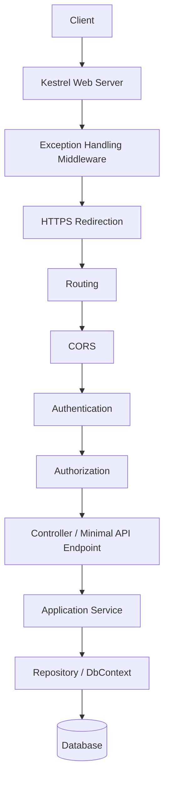

# 16 — ASP.NET Core

## 🎯 Learning Objectives
- Trace a request through the full ASP.NET Core pipeline from socket to response.
- Understand Kestrel's role and why a reverse proxy is typically placed in front of it.
- Choose between Controllers and Minimal APIs.

## 🤔 What is it?
ASP.NET Core is Microsoft's cross-platform web framework for building HTTP APIs, MVC web apps, and real-time apps (SignalR), built on top of a lightweight, high-performance web server (**Kestrel**) and a configurable middleware pipeline.

## 🧠 Core Concept

### The full request pipeline



- **Kestrel** — a cross-platform, managed-code web server built into ASP.NET Core; fast, but typically deployed **behind a reverse proxy** (IIS, Nginx, YARP, or a cloud load balancer) which handles things like TLS termination at scale, request buffering against slow clients, and serving multiple apps on one machine/port 443.
- **Middleware** — components that each get a chance to inspect/short-circuit/modify the request and response (see [17 — Middleware](../17-Middleware)).
- **Routing** — maps the incoming URL + HTTP method to a specific controller action or Minimal API endpoint.
- **Model binding** — automatically maps route values, query string, and request body JSON into method parameters/DTOs.
- **Filters** — attribute-based hooks (`[Authorize]`, custom `IActionFilter`) that run at defined points around action execution, specific to MVC controllers.

### Controllers vs Minimal APIs

```csharp
// Controller-based
[ApiController]
[Route("api/[controller]")]
public class OrdersController : ControllerBase
{
    [HttpGet("{id:guid}")]
    public async Task<ActionResult<OrderDto>> Get(Guid id, CancellationToken ct)
    {
        var order = await _orderService.GetAsync(id, ct);
        return order is null ? NotFound() : Ok(order);
    }
}

// Minimal API
app.MapGet("/api/orders/{id:guid}", async (Guid id, IOrderService service, CancellationToken ct) =>
{
    var order = await service.GetAsync(id, ct);
    return order is null ? Results.NotFound() : Results.Ok(order);
});
```
Minimal APIs reduce ceremony for small/simple services and have a lower startup/allocation overhead; Controllers offer more built-in structure (filters, model binding conventions, `[ApiController]` behaviors) that scale better for large, convention-heavy APIs.

## 🔍 Code Walkthrough
- `[ApiController]` enables automatic model validation (returns 400 automatically on invalid `ModelState`), binding source inference, and problem-details-based error responses.
- `CancellationToken ct` as an action parameter is automatically bound by ASP.NET Core to a token tied to the client's connection — canceled when the client disconnects.

## ⚙️ How It Works Internally
Kestrel listens on a socket, parses raw HTTP into an `HttpContext`, and hands it to the configured middleware pipeline — a chain of `RequestDelegate`s, each wrapping the next (see [17 — Middleware](../17-Middleware) for the exact mechanism). Routing matches the request to an **endpoint** (a controller action or minimal API delegate) using a route template trie/tree structure for efficient matching even with many routes. Model binding then reflects over the target method's parameters, pulling values from route data, query string, headers, and/or deserializing the JSON body, before invoking the target code.

## 🏢 Real-World Example
A production deployment places ASP.NET Core/Kestrel behind Nginx or a cloud load balancer doing TLS termination, and ASP.NET Core's own middleware pipeline still separately handles authentication, authorization, and routing for the app's own concerns.

## 🚀 Production-Ready Example

```csharp
var builder = WebApplication.CreateBuilder(args);

builder.Services.AddControllers();
builder.Services.AddEndpointsApiExplorer();
builder.Services.AddSwaggerGen();
builder.Services.AddAuthentication(/* JWT config */);
builder.Services.AddAuthorization();

var app = builder.Build();

if (app.Environment.IsDevelopment())
{
    app.UseSwagger();
    app.UseSwaggerUI();
}

app.UseExceptionHandler("/error");
app.UseHttpsRedirection();
app.UseRouting();
app.UseCors();
app.UseAuthentication();
app.UseAuthorization();
app.MapControllers();

app.Run();
```

## ⚠️ Common Mistakes
- Wrong middleware order (e.g. `UseAuthorization()` before `UseAuthentication()`) — see [17 — Middleware](../17-Middleware) for why order is load-bearing.
- Exposing Kestrel directly to the internet without a reverse proxy in production (missing hardening Kestrel doesn't provide by default).
- Putting business logic directly in controllers instead of delegating to an application/service layer (see [26 — Clean Architecture](../26-Clean-Architecture)).

## ✅ Best Practices
- Keep controllers/endpoints thin — validate input, call a service, map the result.
- Use `[ApiController]` for consistent automatic validation behavior in controller-based APIs.
- Choose Minimal APIs for small services/microservices; Controllers for larger, convention-heavy APIs with many cross-cutting filters.

## ⚡ Performance Considerations
- Minimal APIs have measurably lower per-request overhead (less reflection, fewer allocations) than MVC controllers — meaningful at very high request volumes, negligible for most line-of-business APIs.
- Routing uses a tree-based matcher, so the number of routes has sub-linear impact on match time.

## 🔄 Related Concepts
- [17 — Middleware](../17-Middleware)
- [18 — Dependency Injection](../18-Dependency-Injection)
- [19 — Web API](../19-Web-API)

## 🎤 Interview Questions

**Junior:** "What is Kestrel?"
*Expected:* ASP.NET Core's built-in, cross-platform web server; typically run behind a reverse proxy in production.

**Mid-level:** "What's the practical difference between Controllers and Minimal APIs?"
*Expected:* Minimal APIs are lighter-weight, faster to start, less ceremony, best for small/simple services; Controllers provide richer conventions (filters, `[ApiController]` auto-validation, structured routing attributes) that scale better for large APIs with many cross-cutting concerns.

**Senior:** "Why is Kestrel usually deployed behind a reverse proxy in production instead of exposed directly?"
*Expected:* A reverse proxy (Nginx, YARP, cloud load balancer) commonly handles TLS termination and certificate management at scale, protects against slow/malformed-request attacks with more mature hardening, enables multiplexing many apps on one IP/port 443, and adds a layer of operational flexibility (blue/green deploys, WAF rules) independent of the app process.

## 🧪 Practice Exercises

**Easy**
1. Create a Minimal API with one `GET` endpoint and run it.
2. Create the equivalent Controller-based endpoint and compare code volume.
3. Draw the request pipeline diagram from memory.

**Medium**
1. Add Swagger/OpenAPI to a Minimal API project.
2. Deliberately misorder `UseAuthentication`/`UseAuthorization` and observe the resulting authorization failures.
3. Add a route constraint (`{id:guid}`) and test with an invalid id.

**Hard**
1. Benchmark request throughput between an equivalent Controller and Minimal API endpoint.
2. Configure Kestrel behind a local Nginx reverse proxy for TLS termination and explain each configuration piece.

**Real-world scenario:** Your team is starting a new lightweight microservice with 5 endpoints total, versus your existing 200-endpoint monolith API. Justify which approach (Controllers vs Minimal APIs) fits each.

## 📌 Key Takeaways
- Requests flow: Kestrel → middleware pipeline → routing → auth → endpoint → service → repository → database.
- Kestrel is typically fronted by a reverse proxy in production.
- Minimal APIs trade some structure for lower overhead; Controllers trade some overhead for richer conventions at scale.
