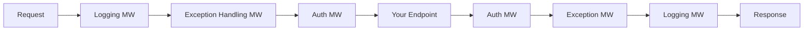

# 17 — Middleware

## 🎯 Learning Objectives
- Write custom middleware using both the delegate and convention-based class forms.
- Explain exactly why middleware ordering matters, with a concrete example.

## 🤔 What is it?
Middleware are components chained together into a pipeline; each one can inspect/modify the `HttpContext`, call the next middleware in the chain (`await next(context)`), and/or inspect/modify the response on the way back out, or short-circuit the pipeline entirely.

## ❓ Why do we need it?
Cross-cutting concerns (logging, exception handling, authentication, CORS) need to apply consistently to *every* request without duplicating that logic in every endpoint — middleware centralizes it in one configurable, ordered chain.

## 🧠 Core Concept


Each middleware wraps the next like nested function calls (an "onion" model) — code before `await next()` runs on the way **in**; code after `await next()` runs on the way **out**.

### Order matters — a concrete example

```csharp
// WRONG ORDER — authorization runs before authentication has identified the user
app.UseAuthorization();
app.UseAuthentication();

// CORRECT ORDER
app.UseAuthentication(); // first: who is this?
app.UseAuthorization();  // then: are they allowed to do this?
```
If `UseAuthorization()` runs first, `HttpContext.User` hasn't been populated yet by `UseAuthentication()`, so every authorization check sees an anonymous/unauthenticated user — everything gets rejected (or worse, misconfigured policies could pass unauthenticated users through, depending on setup).

### Writing custom middleware

**Inline (delegate) form:**
```csharp
app.Use(async (context, next) =>
{
    var sw = Stopwatch.StartNew();
    await next(context);
    sw.Stop();
    context.Response.Headers["X-Response-Time-Ms"] = sw.ElapsedMilliseconds.ToString();
});
```

**Convention-based class form:**
```csharp
public class RequestTimingMiddleware
{
    private readonly RequestDelegate _next;
    private readonly ILogger<RequestTimingMiddleware> _logger;

    public RequestTimingMiddleware(RequestDelegate next, ILogger<RequestTimingMiddleware> logger)
    {
        _next = next;
        _logger = logger;
    }

    public async Task InvokeAsync(HttpContext context)
    {
        var sw = Stopwatch.StartNew();
        await _next(context);
        sw.Stop();
        _logger.LogInformation("{Method} {Path} took {ElapsedMs}ms",
            context.Request.Method, context.Request.Path, sw.ElapsedMilliseconds);
    }
}

// Registration
app.UseMiddleware<RequestTimingMiddleware>();
```

## 🔍 Code Walkthrough
- The class form is constructed **once** at startup with the `RequestDelegate _next` representing "the rest of the pipeline" — this is why middleware constructors should only take **singleton**-lifetime dependencies (see [18 — Dependency Injection](../18-Dependency-Injection)); per-request dependencies must be injected into `InvokeAsync` as method parameters instead, resolved fresh each request.
- `await _next(context);` invokes the next middleware; everything after that line runs on the way back out, after the rest of the pipeline (including your actual endpoint) has completed.

## ⚙️ How It Works Internally
`IApplicationBuilder.Use(...)` calls compose a chain of `Func<RequestDelegate, RequestDelegate>` — each registered middleware is a factory that, given "the next delegate," produces "the delegate representing this middleware plus everything after it." At startup, ASP.NET Core folds this into a single nested `RequestDelegate` (conceptually: `mw1(mw2(mw3(terminalHandler)))`), which is what actually executes per request — the ordering you see in `Program.cs` becomes the literal nesting order.

## 🏢 Real-World Example
A `CorrelationIdMiddleware` placed near the very start of the pipeline generates or reads an `X-Correlation-Id` header and stores it in `HttpContext.Items`, so every downstream middleware, controller, and logging call in that request can tag its output with the same ID — essential for tracing a single request across distributed logs (see [35 — Observability](../35-Observability)).

## 🚀 Production-Ready Example

```csharp
app.Use(async (context, next) =>
{
    var correlationId = context.Request.Headers.TryGetValue("X-Correlation-Id", out var existing)
        ? existing.ToString()
        : Guid.NewGuid().ToString();

    context.Items["CorrelationId"] = correlationId;
    context.Response.Headers["X-Correlation-Id"] = correlationId;

    using (LogContext.PushProperty("CorrelationId", correlationId)) // Serilog example
    {
        await next(context);
    }
});

app.UseExceptionHandler("/error");
app.UseHttpsRedirection();
app.UseRateLimiter();
app.UseRouting();
app.UseCors("DefaultPolicy");
app.UseAuthentication();
app.UseAuthorization();
app.MapControllers();
```

## ⚠️ Common Mistakes
- Registering middleware in the wrong order (auth before authn, exception handling too late to catch errors from earlier middleware).
- Injecting a **scoped** service into a middleware's **constructor** (constructed once at app startup as effectively a singleton) instead of into `InvokeAsync` — causes captive dependency bugs (see [18 — Dependency Injection](../18-Dependency-Injection)).
- Forgetting to call `await next(context)` at all, silently short-circuiting every request that reaches that middleware.

## ❌ What NOT To Do
```csharp
public class BadMiddleware
{
    private readonly RequestDelegate _next;
    private readonly AppDbContext _dbContext; // Scoped service injected into a singleton-lifetime constructor — BUG

    public BadMiddleware(RequestDelegate next, AppDbContext dbContext)
    {
        _next = next;
        _dbContext = dbContext; // captures ONE instance for the whole app's lifetime
    }
    public Task InvokeAsync(HttpContext context) => _next(context);
}
```

## ✅ Best Practices
- Keep the canonical order: exception handling → HTTPS redirection → routing → CORS → authentication → authorization → endpoints.
- Inject per-request (scoped) dependencies into `InvokeAsync`, not the constructor.
- Keep each middleware focused on one cross-cutting concern.

## ⚡ Performance Considerations
- Every middleware in the pipeline runs on every matching request — keep the pipeline lean; put cheap short-circuiting checks (e.g. health check endpoint bypass) as early as reasonably possible.

## 🔄 Related Concepts
- [16 — ASP.NET Core](../16-ASPNet-Core)
- [18 — Dependency Injection](../18-Dependency-Injection)
- [11 — Exception Handling](../11-Exception-Handling)

## 🎤 Interview Questions

**Junior:** "What does middleware do in ASP.NET Core?"
*Expected:* Each component in the pipeline can inspect/modify the request and response, call the next component, or short-circuit — used for cross-cutting concerns like logging, auth, exception handling.

**Mid-level:** "Why does `UseAuthentication()` have to come before `UseAuthorization()`?"
*Expected:* Authentication populates `HttpContext.User`; authorization checks depend on that being already set — reversing the order means every authorization check runs against an unauthenticated context.

**Senior:** "Why can't you safely inject a scoped EF Core `DbContext` into a middleware's constructor?"
*Expected:* Middleware classes are instantiated once at app startup (effectively singleton lifetime) via the `RequestDelegate` factory pattern; a scoped service captured there becomes a single instance shared (and never properly disposed/refreshed) across all requests — a "captive dependency" bug. Correct approach: accept it as a parameter on `InvokeAsync`, which is resolved from the current request's DI scope each time.

## 🧪 Practice Exercises

**Easy**
1. Write an inline middleware that adds a custom response header.
2. Write a convention-based middleware class and register it with `UseMiddleware<T>()`.
3. Reproduce the auth/authz ordering bug and observe the failure.

**Medium**
1. Implement a correlation ID middleware and thread it through structured logging.
2. Implement a request-timing middleware logging slow requests (>500ms) at a higher log level.
3. Demonstrate the captive-dependency bug by injecting a scoped service into a middleware constructor.

**Hard**
1. Implement a simple rate-limiting middleware from scratch (before reading [33 — Resilience](../33-Resilience)) using an in-memory counter per client IP.
2. Explain, with the nested-delegate model, exactly what code executes and in what order for a 3-middleware pipeline where the second one short-circuits.

**Real-world scenario:** After adding a new "feature flag" middleware, all requests suddenly return 401 Unauthorized. Diagnose likely causes related to middleware ordering.

## 📌 Key Takeaways
- Middleware forms a nested, ordered pipeline — order is not cosmetic, it's semantically load-bearing.
- Authentication must precede authorization.
- Inject scoped dependencies into `InvokeAsync`, never into a middleware's constructor.
