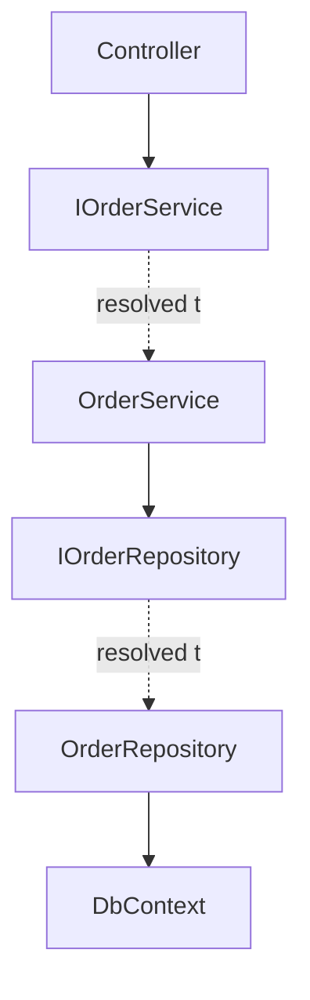

# 18 — Dependency Injection

## 🎯 Learning Objectives
- Explain the difference between Dependency Injection (a pattern) and Dependency Inversion (a principle).
- Choose correctly between Singleton, Scoped, and Transient lifetimes.
- Diagnose and fix captive dependency bugs.

## 🤔 What is it?
Dependency Injection (DI) is a pattern where a class receives its dependencies from the outside (typically via constructor parameters) rather than creating them itself, with a container (the **IoC container** / `IServiceProvider`) responsible for constructing the full object graph.

## ❓ Why do we need it?
Without DI, classes construct their own dependencies directly (`new SqlOrderRepository()`), tightly coupling them to concrete implementations — impossible to substitute a fake/mock in tests, and hard to change implementations without touching every call site. DI inverts this: classes depend only on **abstractions** (interfaces), and the container decides which concrete implementation to supply and how long it should live.

## 🌍 Real-World Analogy
Without DI, a restaurant kitchen would have every dish's recipe hardcode which specific farm its vegetables come from. With DI, the kitchen just says "I need vegetables" (depends on an abstraction), and a supply manager (the container) decides which supplier to use — swappable without rewriting any recipe.

## 🧠 Core Concept

### Dependency Injection ≠ Dependency Inversion
- **Dependency Inversion Principle (DIP)** — a *design principle* (part of SOLID, see [25 — SOLID](../25-SOLID)): high-level modules should depend on abstractions, not concrete low-level modules.
- **Dependency Injection (DI)** — a *pattern/technique* for supplying those abstractions' concrete implementations from outside the class, often (but not necessarily) via a container.

You can follow DIP without any DI container (manually passing dependencies in); DI containers are simply the common, automated way of wiring up a system that already follows DIP at scale.

### Service lifetimes


| Lifetime | Created | Typical use |
|---|---|---|
| **Singleton** | Once, for the app's whole lifetime | Stateless services, caches, configuration, `IHttpClientFactory`-managed clients |
| **Scoped** | Once per request (web) or per explicitly created scope | `DbContext`, per-request unit-of-work-style services |
| **Transient** | Every time it's resolved | Lightweight, stateless, cheap-to-construct services |

```csharp
builder.Services.AddSingleton<ICacheService, MemoryCacheService>();
builder.Services.AddScoped<IOrderRepository, OrderRepository>();
builder.Services.AddTransient<IEmailFormatter, EmailFormatter>();
```

### Constructor injection

```csharp
public class OrderService : IOrderService
{
    private readonly IOrderRepository _repository;
    private readonly ILogger<OrderService> _logger;

    public OrderService(IOrderRepository repository, ILogger<OrderService> logger)
    {
        _repository = repository;
        _logger = logger;
    }
}
```

### The captive dependency problem

```csharp
// BUG: a Singleton holding a reference to a Scoped service
public class ReportCache // registered as Singleton
{
    private readonly AppDbContext _dbContext; // registered as Scoped
    public ReportCache(AppDbContext dbContext) => _dbContext = dbContext;
    // _dbContext is now effectively captured for the SINGLETON's entire lifetime —
    // the "scoped" DbContext never gets disposed/recreated per request, causing
    // stale data, thread-safety issues (DbContext isn't thread-safe), and
    // eventually disposed-object exceptions.
}
```
The DI container in ASP.NET Core will actually **throw a validation exception at startup** for this exact case if scope validation is enabled (`ValidateScopes = true`, on by default in Development) — a good example of "fail fast" design.

## 🎨 Visual Explanation



## ⚙️ How It Works Internally
1. **Service registration** — `builder.Services.Add{Lifetime}<TInterface, TImplementation>()` adds an entry to a `ServiceCollection` (just a list of descriptors: service type, implementation type, lifetime).
2. **Building the provider** — `builder.Build()` compiles this into an `IServiceProvider`.
3. **Dependency resolution** — when a controller/service is requested, the provider inspects its constructor via reflection, recursively resolves each parameter type, and constructs the object graph bottom-up.
4. **Lifetime management** — the provider tracks Scoped instances per `IServiceScope` (one per HTTP request in ASP.NET Core) and Singleton instances for the provider's entire lifetime, disposing Scoped/Transient `IDisposable` instances at the end of their scope automatically.

## 🏢 Real-World Example
`AppDbContext` is registered `Scoped` specifically because EF Core's change tracker accumulates state across operations within a single request/unit-of-work, and `DbContext` is not thread-safe — a new instance per request avoids state bleeding between unrelated requests and avoids concurrent-use bugs.

## 🚀 Production-Ready Example

```csharp
public static class ServiceCollectionExtensions
{
    public static IServiceCollection AddApplicationServices(this IServiceCollection services, IConfiguration config)
    {
        services.AddDbContext<AppDbContext>(options =>
            options.UseSqlServer(config.GetConnectionString("Default")));

        services.AddScoped<IOrderRepository, OrderRepository>();
        services.AddScoped<IOrderService, OrderService>();
        services.AddSingleton<IClock, SystemClock>();
        services.AddHttpClient<IPaymentGatewayClient, PaymentGatewayClient>();

        return services;
    }
}

// Program.cs
builder.Services.AddApplicationServices(builder.Configuration);
```

## ⚠️ Common Mistakes
- Injecting a Scoped/Transient service into a Singleton's constructor (captive dependency).
- Using the **Service Locator anti-pattern** (`IServiceProvider.GetService<T>()` called deep inside business logic) instead of proper constructor injection — hides real dependencies and defeats the container's lifetime/validation guarantees.
- Registering the same interface multiple times without realizing only the **last** registration wins for single-instance resolution (though `IEnumerable<T>` resolves *all* registrations — useful for the strategy/plugin pattern).
- Assuming Singleton means "thread-safe" — it only means "one instance"; you must still handle concurrency yourself if the singleton has mutable state.

## ❌ What NOT To Do
```csharp
public class OrderController : ControllerBase
{
    private readonly IServiceProvider _provider;
    public OrderController(IServiceProvider provider) => _provider = provider; // Service Locator anti-pattern

    public IActionResult Get(Guid id)
    {
        var service = _provider.GetService<IOrderService>(); // hides the real dependency, breaks testability
        return Ok(service.Get(id));
    }
}
```

## ✅ Best Practices
- Prefer constructor injection; avoid the service locator pattern.
- Register `DbContext` and anything wrapping it as Scoped.
- Enable and heed DI scope validation in Development (`ValidateScopes = true`, `ValidateOnBuild = true`) to catch captive dependencies at startup, not in production under load.
- Keep constructors free of logic beyond simple assignment — DI should never trigger expensive work at construction time.

## ⚡ Performance Considerations
- Resolving deeply nested object graphs has real (if usually tiny) reflection-based construction cost — negligible per-request in almost all cases, but avoid excessively deep DI graphs purely for their own sake.
- Singleton services amortize construction cost across the app's whole lifetime — appropriate for expensive-to-build, stateless or thread-safe-by-design services.

## 🔄 Related Concepts
- [07 — Interfaces](../07-Interfaces)
- [17 — Middleware](../17-Middleware) (captive dependency risk in middleware constructors)
- [25 — SOLID](../25-SOLID) (Dependency Inversion Principle)

## 🎤 Interview Questions

**Junior:** "What's the difference between Dependency Injection and Dependency Inversion?"
*Expected:* DIP is a design principle (depend on abstractions, not concretions); DI is a technique/pattern for supplying those abstractions' implementations from outside a class, commonly automated by a container.

**Mid-level:** "Why would you choose Scoped instead of Singleton for a service using EF Core's `DbContext`?"
*Expected:* `DbContext` isn't thread-safe and accumulates per-unit-of-work change-tracking state; Scoped ensures a fresh, isolated instance per request, avoiding data corruption and concurrency bugs a Singleton `DbContext` shared across all simultaneous requests would cause.

**Senior:** "How would you detect and prevent captive dependency bugs across a large team?"
*Expected:* Enable DI scope validation (`ValidateScopes`/`ValidateOnBuild`) so the container throws at startup rather than silently misbehaving in production; establish code review conventions and possibly custom Roslyn analyzers checking that Singleton-registered types don't take Scoped/Transient constructor dependencies; document the lifetime of each registered service clearly.

## 🧪 Practice Exercises

**Easy**
1. Register a service with each of the three lifetimes and print an instance ID to observe reuse vs recreation.
2. Refactor a class using `new` to construct its dependency into constructor-injected form.
3. Explain the captive dependency example above in your own words to a peer.

**Medium**
1. Reproduce a captive dependency bug and observe the ASP.NET Core startup validation exception.
2. Register multiple implementations of one interface and resolve them all via `IEnumerable<T>` (strategy pattern).
3. Refactor a service-locator-based controller into proper constructor injection.

**Hard**
1. Implement a custom `IServiceProviderFactory` or explore a third-party container (e.g., conceptually) and compare its lifetime model to the built-in one.
2. Design a DI registration strategy for a modular monolith where each module registers its own services via an extension method.

**Real-world scenario:** A production incident traces back to intermittent, hard-to-reproduce data corruption. Investigation reveals a Singleton-registered cache class holds a direct reference to `DbContext`. Explain the root cause and the fix.

## 📌 Key Takeaways
- DI is a pattern for supplying dependencies from outside; DIP is the design principle that makes DI worth doing (depend on abstractions).
- Singleton = one instance forever; Scoped = one per request; Transient = new every resolution — choose based on state and thread-safety needs.
- Never let a longer-lived service hold a captive reference to a shorter-lived one.
