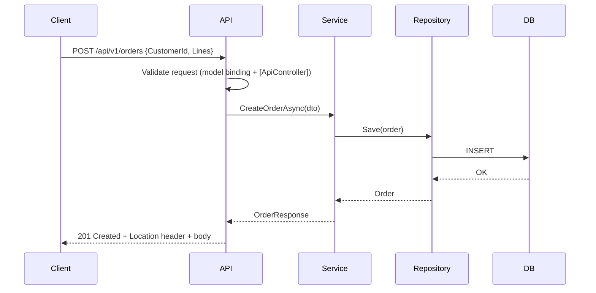

# 19 — Web API

## 🎯 Learning Objectives
- Design a REST API with correct HTTP verbs/status codes, DTOs, pagination, filtering, and versioning.
- Return consistent, standards-based error responses using `ProblemDetails`.
- Document an API with Swagger/OpenAPI.

## 🤔 What is it?
A Web API exposes application functionality over HTTP, typically following REST conventions — resources identified by URLs, manipulated via standard HTTP verbs, represented as JSON.

## 🧠 Core Concept

### HTTP methods & status codes

| Verb | Purpose | Idempotent? |
|---|---|---|
| `GET` | Read a resource | Yes |
| `POST` | Create a resource / non-idempotent action | No |
| `PUT` | Replace a resource entirely | Yes |
| `PATCH` | Partially update a resource | No (typically) |
| `DELETE` | Remove a resource | Yes |

| Code | Meaning | Typical use |
|---|---|---|
| 200 OK | Success with body | GET, successful PUT/PATCH |
| 201 Created | Resource created | Successful POST, with `Location` header |
| 204 No Content | Success, no body | Successful DELETE |
| 400 Bad Request | Client sent invalid data | Failed validation |
| 401 Unauthorized | Not authenticated | Missing/invalid credentials |
| 403 Forbidden | Authenticated but not allowed | Insufficient permissions |
| 404 Not Found | Resource doesn't exist | Invalid id |
| 409 Conflict | State conflict | Duplicate resource, optimistic concurrency clash |
| 422 Unprocessable Entity | Semantically invalid | Valid syntax, invalid business rule |
| 500 Internal Server Error | Unhandled server fault | Bugs, infra failures |

### DTOs — never expose your domain/entity model directly

```csharp
// Request DTO — only what the client is allowed to send
public record CreateOrderRequest(Guid CustomerId, List<OrderLineRequest> Lines);

// Response DTO — only what the client should see (no internal fields, no other entities' full graphs)
public record OrderResponse(Guid Id, string Status, decimal Total, DateTimeOffset PlacedAtUtc);
```
Exposing EF Core entities directly over the wire risks leaking internal fields, causes serialization issues with lazy-loading proxies/circular references, and tightly couples your API contract to your database schema.

### Pagination, filtering, sorting

```csharp
[HttpGet]
public async Task<ActionResult<PagedResult<OrderResponse>>> GetOrders(
    [FromQuery] int page = 1,
    [FromQuery] int pageSize = 20,
    [FromQuery] string? status = null,
    [FromQuery] string sortBy = "PlacedAtUtc",
    CancellationToken ct = default)
{
    var query = _dbContext.Orders.AsQueryable();
    if (status is not null) query = query.Where(o => o.Status == status);
    query = sortBy switch
    {
        "Total" => query.OrderByDescending(o => o.Total),
        _ => query.OrderByDescending(o => o.PlacedAtUtc)
    };

    var total = await query.CountAsync(ct);
    var items = await query.Skip((page - 1) * pageSize).Take(pageSize)
        .Select(o => new OrderResponse(o.Id, o.Status, o.Total, o.PlacedAtUtc))
        .ToListAsync(ct);

    return Ok(new PagedResult<OrderResponse>(items, total, page, pageSize));
}
```

### Versioning
```csharp
// URL-based (simplest, most explicit)
[Route("api/v{version:apiVersion}/orders")]

// Header-based: "X-Api-Version: 2.0"
// Media-type based: Accept: application/json;v=2
```
URL-based versioning is the most discoverable/cache-friendly; header-based keeps URLs stable but is less visible; choose one and be consistent.

### ProblemDetails — standardized error responses (RFC 7807)

```csharp
app.UseExceptionHandler(errorApp =>
{
    errorApp.Run(async context =>
    {
        var feature = context.Features.Get<IExceptionHandlerFeature>();
        var problem = new ProblemDetails
        {
            Status = StatusCodes.Status500InternalServerError,
            Title = "An unexpected error occurred",
            Detail = feature?.Error.Message,
            Instance = context.Request.Path
        };
        context.Response.StatusCode = problem.Status.Value;
        await context.Response.WriteAsJsonAsync(problem);
    });
});
```
`ProblemDetails` gives every client a consistent, machine-parseable error shape (`type`, `title`, `status`, `detail`, `instance`) instead of ad-hoc error JSON per endpoint.

## 🎨 Visual Explanation



## 🚀 Production-Ready Example — Complete CRUD slice

```csharp
[ApiController]
[Route("api/v1/orders")]
public class OrdersController : ControllerBase
{
    private readonly IOrderService _orderService;
    public OrdersController(IOrderService orderService) => _orderService = orderService;

    [HttpGet("{id:guid}")]
    public async Task<ActionResult<OrderResponse>> GetById(Guid id, CancellationToken ct)
    {
        var order = await _orderService.GetAsync(id, ct);
        return order is null ? NotFound() : Ok(order);
    }

    [HttpPost]
    public async Task<ActionResult<OrderResponse>> Create(CreateOrderRequest request, CancellationToken ct)
    {
        var created = await _orderService.CreateAsync(request, ct);
        return CreatedAtAction(nameof(GetById), new { id = created.Id }, created);
    }

    [HttpPut("{id:guid}")]
    public async Task<IActionResult> Update(Guid id, UpdateOrderRequest request, CancellationToken ct)
    {
        var updated = await _orderService.UpdateAsync(id, request, ct);
        return updated ? NoContent() : NotFound();
    }

    [HttpDelete("{id:guid}")]
    public async Task<IActionResult> Delete(Guid id, CancellationToken ct)
    {
        var deleted = await _orderService.DeleteAsync(id, ct);
        return deleted ? NoContent() : NotFound();
    }
}
```

## ⚠️ Common Mistakes
- Returning EF Core entities directly from controllers.
- Using `200 OK` for everything, including creation (should be `201`) and validation failures (should be `400`/`422`).
- Unbounded `GetAll()` endpoints with no pagination, returning millions of rows.
- Inconsistent, ad-hoc error response shapes across different endpoints.

## ✅ Best Practices
- Always use DTOs at the API boundary, never domain/EF entities.
- Paginate any endpoint that could return an unbounded collection.
- Standardize error responses on `ProblemDetails`.
- Version your API from day one, even if v1 is the only version — retrofitting versioning later is painful.
- Document with Swagger/OpenAPI and keep it in sync via source-generated or attribute-based specs.

## ⚡ Performance Considerations
- Push filtering/pagination into the database query (`IQueryable`, see [10 — LINQ](../10-LINQ)) rather than loading everything and paginating in memory.
- Use `AsNoTracking()` for read-only GET endpoints (see [21 — EF Core](../21-Entity-Framework-Core)).

## 🔄 Related Concepts
- [10 — LINQ](../10-LINQ)
- [11 — Exception Handling](../11-Exception-Handling) (`ProblemDetails`)
- [21 — Entity Framework Core](../21-Entity-Framework-Core)
- [23 — Security](../23-Security)

## 🎤 Interview Questions

**Junior:** "What status code should a successful `POST` that creates a resource return?"
*Expected:* `201 Created`, ideally with a `Location` header pointing to the new resource and the created representation in the body.

**Mid-level:** "Why should you never return your EF Core entities directly from an API endpoint?"
*Expected:* Leaks internal/sensitive fields, tightly couples the wire contract to the database schema (a schema change becomes a breaking API change), and can cause serialization failures from lazy-loading proxies or circular navigation properties.

**Senior:** "How would you design API versioning for a public API expected to evolve over years, and what trade-offs does your choice carry?"
*Expected:* Should discuss URL vs header vs media-type versioning trade-offs (discoverability/cacheability vs URL stability), a deprecation policy/timeline communicated to consumers, and how versioning interacts with backward-compatible additive changes (which often don't require a new version at all) vs breaking changes (which do).

## 🧪 Practice Exercises

**Easy**
1. Build a `GET`/`POST` endpoint pair using DTOs, not entities.
2. Return `ProblemDetails` for a 404 case.
3. Add `[Route("api/v1/...")]` versioning to an existing controller.

**Medium**
1. Implement pagination with `Skip`/`Take` pushed to the database and a `PagedResult<T>` wrapper.
2. Add filtering and sorting query parameters to a GET-all endpoint.
3. Add Swagger/OpenAPI and verify the generated spec matches your DTOs.

**Hard**
1. Design and implement a full CRUD slice with correct status codes for every success/failure case (200/201/204/400/404/409).
2. Implement optimistic concurrency (returning 409 Conflict) on an update endpoint using a `RowVersion`/`ETag`.

**Real-world scenario:** A public API's `GET /orders` endpoint has no pagination and a top customer now has 2 million orders, causing timeouts. Fix the endpoint and explain the client-facing migration path (versioning implications).

## 📌 Key Takeaways
- Use DTOs at the boundary, correct HTTP verbs/status codes, and `ProblemDetails` for consistent errors.
- Paginate, filter, and sort at the database level, not in application memory.
- Version your API from the start — it's far cheaper than retrofitting it later.
