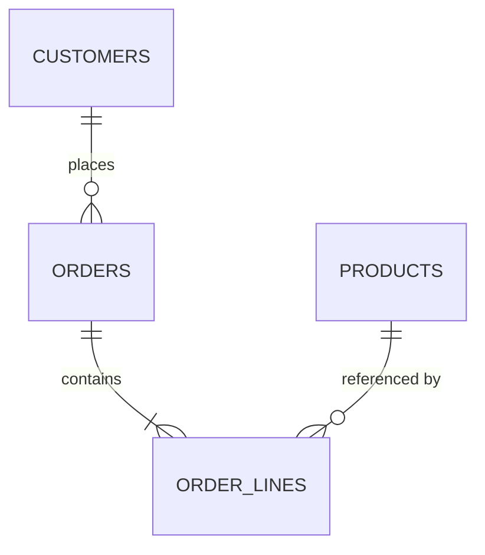

# 20 — SQL Server

## 🎯 Learning Objectives
- Design normalized tables with correct primary/foreign keys and indexes.
- Write and reason about joins, transactions, and isolation levels.
- Read a query execution plan to diagnose a slow query.

## 🤔 What is it?
SQL Server is a relational database management system (RDBMS): data is organized into tables with defined schemas, related via keys, and queried/manipulated with SQL.

## 🧠 Core Concept

### Keys and indexes

```sql
CREATE TABLE Customers (
    Id UNIQUEIDENTIFIER PRIMARY KEY DEFAULT NEWID(),
    Email NVARCHAR(256) NOT NULL,
    CreatedAtUtc DATETIME2 NOT NULL DEFAULT SYSUTCDATETIME()
);

CREATE UNIQUE INDEX IX_Customers_Email ON Customers(Email); -- enforce + speed up lookups by email

CREATE TABLE Orders (
    Id UNIQUEIDENTIFIER PRIMARY KEY DEFAULT NEWID(),
    CustomerId UNIQUEIDENTIFIER NOT NULL,
    Total DECIMAL(18,2) NOT NULL,
    PlacedAtUtc DATETIME2 NOT NULL,
    CONSTRAINT FK_Orders_Customers FOREIGN KEY (CustomerId) REFERENCES Customers(Id)
);

CREATE INDEX IX_Orders_CustomerId ON Orders(CustomerId); -- speeds up the JOIN below
```
- **Primary key** — uniquely identifies each row; SQL Server creates a clustered index on it by default, physically ordering table data by that key.
- **Foreign key** — enforces referential integrity: an `Orders.CustomerId` must reference an existing `Customers.Id`.
- **Index** — a separate, ordered data structure (typically a B-tree) that speeds up lookups on the indexed column(s) at the cost of extra storage and slower writes (every insert/update must also update each index).

### Joins

```sql
SELECT c.Email, o.Total, o.PlacedAtUtc
FROM Customers c
INNER JOIN Orders o ON o.CustomerId = c.Id     -- only customers WITH orders
WHERE o.PlacedAtUtc >= '2024-01-01';

SELECT c.Email, o.Total
FROM Customers c
LEFT JOIN Orders o ON o.CustomerId = c.Id;     -- ALL customers, even with zero orders (NULLs for order columns)
```

### Transactions & isolation levels

```sql
BEGIN TRANSACTION;
    UPDATE Inventory SET Quantity = Quantity - 1 WHERE Sku = 'ABC123';
    INSERT INTO Orders (Id, CustomerId, Total, PlacedAtUtc) VALUES (...);
COMMIT TRANSACTION;
```
A transaction groups multiple statements so they succeed or fail **atomically** — if the `INSERT` fails, the `UPDATE` rolls back too, guaranteeing inventory is never decremented without a corresponding order.

| Isolation Level | Prevents | Allows | Cost |
|---|---|---|---|
| Read Uncommitted | Nothing | Dirty reads | Lowest |
| Read Committed (SQL Server default) | Dirty reads | Non-repeatable reads, phantom reads | Low |
| Repeatable Read | Dirty + non-repeatable reads | Phantom reads | Medium |
| Serializable | All of the above | Nothing (fully serialized) | Highest — most locking/blocking |
| Snapshot | Uses row versioning instead of locks | Configurable | Reduces blocking, adds tempdb overhead |

### Deadlocks
Occur when two transactions each hold a lock the other needs, in reverse order — SQL Server detects the cycle and kills one transaction (the "victim") to break it. Preventable by always acquiring locks/resources in a **consistent order** across all transactions in your codebase.

### Execution plans
```sql
SET STATISTICS IO, TIME ON;
-- Run your query, then inspect the "Actual Execution Plan" in SSMS/Azure Data Studio
```
Look for: **Table Scan** (reading every row — usually means a missing index), **Index Seek** (efficient, targeted lookup), high **estimated vs actual row count** mismatches (stale statistics), and expensive **Key Lookup**s (often fixed by adding covering/included columns to an index).

## 🎨 Visual Explanation



## 🏢 Real-World Example
A `GetOrdersBySku` report query that runs a `Table Scan` on a 50-million-row `OrderLines` table because there's no index on `Sku` — adding `CREATE INDEX IX_OrderLines_Sku ON OrderLines(Sku) INCLUDE (Quantity, UnitPrice);` turns a multi-second scan into a millisecond seek, at the cost of slightly slower writes to that table.

## 🚀 Production-Ready Example — Optimistic concurrency with a rowversion

```sql
ALTER TABLE Orders ADD RowVersion ROWVERSION;
```
```sql
UPDATE Orders
SET Status = 'Shipped'
WHERE Id = @Id AND RowVersion = @OriginalRowVersion; -- 0 rows affected = someone else changed it first
```

## ⚠️ Common Mistakes
- Missing indexes on foreign key columns, making every join a table scan.
- Wrapping long-running logic (e.g. calling an external API) inside a database transaction, holding locks far longer than necessary.
- Using `SELECT *` in production queries, pulling unnecessary columns and preventing some covering-index optimizations.
- Ignoring deadlocks as "random" instead of fixing lock-ordering inconsistencies.

## ✅ Best Practices
- Index foreign keys and any column frequently used in `WHERE`/`JOIN`/`ORDER BY`.
- Keep transactions short — no external calls, no user-interaction waits inside a transaction.
- Use `SET STATISTICS IO, TIME ON` and execution plans routinely when writing non-trivial queries.
- Use parameterized queries always (see [23 — Security](../23-Security) for SQL injection).

## ⚡ Performance Considerations
- Every index speeds up reads on that column but slows down writes (each index must also be updated) — index deliberately, not exhaustively.
- Clustered index choice (usually the primary key) determines physical row order — a poorly chosen clustering key (e.g. a random `GUID` without `NEWSEQUENTIALID()`) can cause page fragmentation under heavy insert load.

## 🔄 Related Concepts
- [21 — Entity Framework Core](../21-Entity-Framework-Core)
- [23 — Security](../23-Security) (SQL injection)

## 🎤 Interview Questions

**Junior:** "What's the difference between `INNER JOIN` and `LEFT JOIN`?"
*Expected:* `INNER JOIN` returns only rows with matches in both tables; `LEFT JOIN` returns all rows from the left table, with `NULL`s for unmatched right-table columns.

**Mid-level:** "What causes a deadlock, and how do you prevent it?"
*Expected:* Two transactions each holding a lock the other needs, in opposite acquisition order; prevented by consistently ordering resource/lock acquisition across all transactions touching the same tables.

**Senior:** "Walk me through how you'd diagnose a suddenly-slow query in production."
*Expected:* Should mention: capturing the actual execution plan, checking for table scans vs seeks, checking statistics freshness, checking for missing/unused indexes, checking for parameter sniffing issues, and checking for blocking/lock contention from concurrent transactions — a methodical, evidence-based process, not guessing.

## 🧪 Practice Exercises

**Easy**
1. Create `Customers`/`Orders` tables with correct PK/FK.
2. Write an `INNER JOIN` and a `LEFT JOIN` between them and explain the difference in output.
3. Add an index to a foreign key column and observe the execution plan change.

**Medium**
1. Wrap two related statements in a transaction and demonstrate a rollback on failure.
2. Reproduce a deadlock with two concurrent transactions locking two tables in opposite order.
3. Implement optimistic concurrency using `ROWVERSION`.

**Hard**
1. Given a slow query, capture and interpret its execution plan, identify the bottleneck, and fix it with an index.
2. Explain and demonstrate the difference between Read Committed and Snapshot isolation under a concurrent read/write scenario.

**Real-world scenario:** A nightly batch job that updates millions of rows inside one giant transaction is causing blocking across the whole application during business hours. Propose a fix.

## 📌 Key Takeaways
- Index foreign keys and frequently filtered/joined columns; every index has a write-time cost.
- Keep transactions short and free of external calls to minimize lock contention.
- Diagnose slow queries with actual execution plans, not guesswork.
