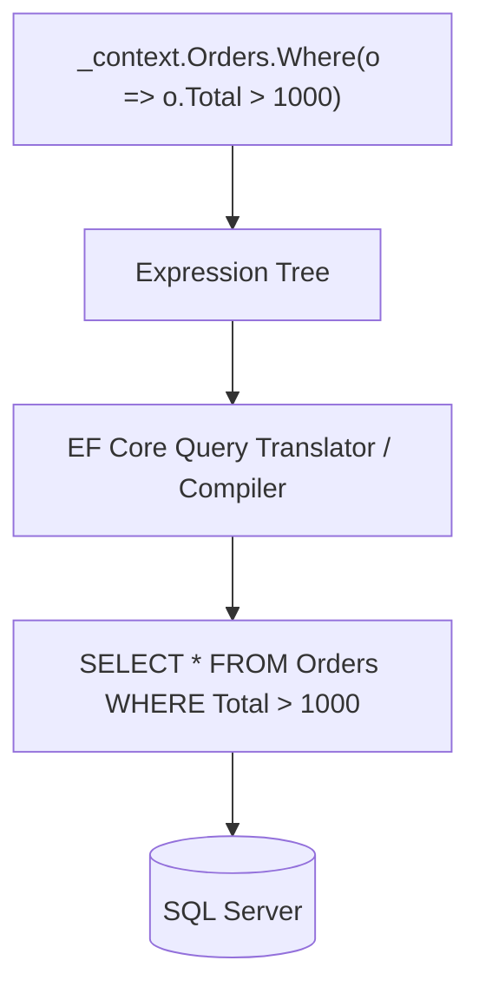

← Back to [21 — EF Core overview](./README.md)

# LINQ → SQL Translation

## The pipeline

## ⚙️ How It Works Internally
The LINQ call builds an `Expression<Func<T,bool>>` on an `IQueryable<T>` (see [10 — LINQ](../10-LINQ)); nothing executes yet — this is deferred execution. When a materializing call (`ToListAsync`, `FirstOrDefaultAsync`, etc.) triggers execution, EF Core's query pipeline compiles the expression tree into a SQL command (caching the compiled query shape for reuse across calls with different parameter values), executes it via ADO.NET, and materializes the returned rows into entity or DTO instances.

This is exactly why staying in `IQueryable` for as long as possible matters: every `.Where()`/`.Select()`/`.OrderBy()` you chain *before* a materializing call becomes part of the SQL sent to the database; anything you do *after* materialization (e.g. `.ToList().Where(...)`) runs in application memory instead, over data you've already paid to transfer.

## 🎤 Interview Questions

**Senior:** "Explain, mechanically, what happens between calling `.Where()` on a `DbSet<T>` and rows arriving from SQL Server."
*Expected:* The LINQ call builds an `Expression<Func<T,bool>>` on an `IQueryable<T>`; nothing executes yet (deferred execution). When a materializing call (`ToListAsync`, `FirstOrDefaultAsync`, etc.) triggers execution, EF Core's query pipeline compiles the expression tree into a SQL command (caching the compiled query shape for reuse), executes it via ADO.NET, and materializes returned rows into entity or DTO instances.

## 🧪 Practice Exercises

**Easy**
1. Enable EF Core SQL logging (`.LogTo(Console.WriteLine)`) and observe the generated SQL for a simple `Where`+`Select` query.

**Medium**
1. Write a LINQ query EF Core cannot translate to SQL (e.g. calling a custom, non-translatable C# method inside `Where`) and observe the resulting error.

---
Previous: [← 02 — Tracking & Loading Strategies](./02-Tracking-and-Loading-Strategies.md) · Next: [04 — Concurrency, Transactions & Filters →](./04-Concurrency-Transactions-Filters.md)
