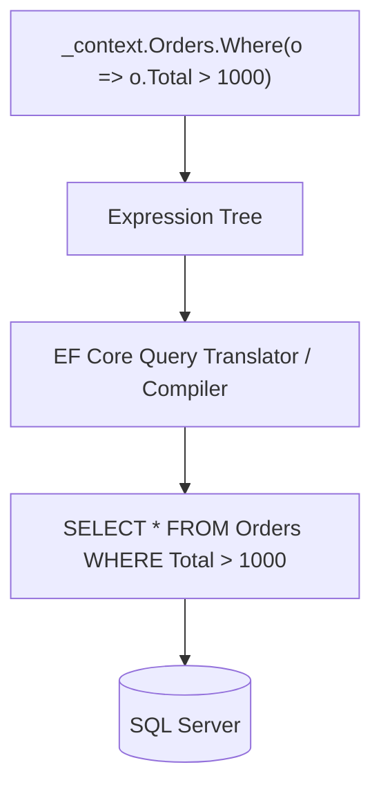

# 21 — Entity Framework Core

## 🎯 Learning Objectives
- Explain how a LINQ query becomes SQL.
- Use tracking vs no-tracking queries, `Include`/`ThenInclude`, and migrations correctly.
- Handle concurrency and transactions with EF Core.

## 🤔 What is it?
EF Core is Microsoft's Object-Relational Mapper (ORM) for .NET: it maps C# classes (entities) to database tables, translates LINQ queries into SQL, and manages change tracking so you can mutate objects in memory and persist the changes with `SaveChanges()`.

## 🧠 Core Concept

### DbContext & DbSet

```csharp
public class AppDbContext : DbContext
{
    public DbSet<Order> Orders => Set<Order>();
    public DbSet<Customer> Customers => Set<Customer>();

    protected override void OnModelCreating(ModelBuilder modelBuilder)
    {
        modelBuilder.Entity<Order>()
            .HasOne(o => o.Customer)
            .WithMany(c => c.Orders)
            .HasForeignKey(o => o.CustomerId);
    }
}
```
`DbContext` represents a unit of work + a session with the database; `DbSet<T>` represents a queryable/updatable table.

### Migrations

```bash
dotnet ef migrations add AddOrderStatus
dotnet ef database update
```
Migrations are auto-generated (and hand-editable) C# classes describing incremental schema changes, letting you version-control your database schema alongside your code and apply it consistently across environments.

### Tracking vs No-Tracking

```csharp
var order = await _context.Orders.FirstAsync(o => o.Id == id);         // TRACKED — EF watches for changes
order.Status = "Shipped";
await _context.SaveChangesAsync();                                      // detects the change, issues UPDATE

var readOnlyOrders = await _context.Orders.AsNoTracking().ToListAsync(); // NOT tracked — faster, less memory, can't be saved back
```
Use `AsNoTracking()` for pure read scenarios (GET endpoints, reports) — it skips the overhead of EF's change-tracking snapshot for every entity returned.

### Loading related data

```csharp
// Eager loading — one query (or a JOIN), related data included upfront
var order = await _context.Orders
    .Include(o => o.Customer)
    .ThenInclude(c => c.Address)
    .FirstAsync(o => o.Id == id);

// Explicit loading — load related data on demand, separately
await _context.Entry(order).Reference(o => o.Customer).LoadAsync();

// Lazy loading — related data fetched automatically the first time a navigation property is accessed
// (requires virtual navigation properties + proxies package; causes the N+1 problem if not careful)
```

### The N+1 problem
```csharp
var orders = await _context.Orders.ToListAsync();     // 1 query
foreach (var order in orders)
{
    Console.WriteLine(order.Customer.Name);            // N additional queries with lazy loading!
}
```
Fixed by eager-loading with `.Include(o => o.Customer)` upfront — turns N+1 queries into 1.

### LINQ → SQL translation



### Concurrency & Transactions

```csharp
public class Order
{
    [Timestamp]
    public byte[] RowVersion { get; set; } = default!; // maps to SQL Server ROWVERSION
}
```
```csharp
try
{
    await _context.SaveChangesAsync();
}
catch (DbUpdateConcurrencyException)
{
    // another user modified this row since it was loaded — reload and let the user decide
}
```

```csharp
using var transaction = await _context.Database.BeginTransactionAsync();
try
{
    _context.Inventory.Update(item);
    _context.Orders.Add(order);
    await _context.SaveChangesAsync();
    await transaction.CommitAsync();
}
catch
{
    await transaction.RollbackAsync();
    throw;
}
```
(Note: a single `SaveChangesAsync()` call is already atomic across all its tracked changes — an explicit transaction is needed mainly when you must combine multiple `SaveChangesAsync()` calls, or mix EF Core changes with raw SQL, into one atomic unit.)

### Global query filters & value converters

```csharp
modelBuilder.Entity<Order>().HasQueryFilter(o => !o.IsDeleted); // soft-delete, applied to EVERY query automatically

modelBuilder.Entity<Order>()
    .Property(o => o.Status)
    .HasConversion<string>(); // store enum as string instead of int
```

## 🏢 Real-World Example
A `GetOrderWithDetails` endpoint uses `.Include(o => o.Lines).ThenInclude(l => l.Product).AsNoTracking()` — a single SQL query (or a small, predictable set of them) fetching everything the DTO needs, read-only, with no unnecessary change-tracking overhead.

## 🚀 Production-Ready Example

```csharp
public async Task<OrderDetailsDto?> GetOrderDetailsAsync(Guid id, CancellationToken ct)
{
    return await _context.Orders
        .AsNoTracking()
        .Where(o => o.Id == id)
        .Select(o => new OrderDetailsDto(
            o.Id,
            o.Customer.Name,
            o.Lines.Select(l => new OrderLineDto(l.Product.Name, l.Quantity, l.UnitPrice)).ToList(),
            o.Total))
        .FirstOrDefaultAsync(ct);
    // Projecting directly with Select() often outperforms Include() —
    // EF Core generates SQL that fetches ONLY the columns the DTO needs.
}
```

## ⚠️ Common Mistakes
- Leaving lazy loading enabled without discipline, causing silent N+1 query storms.
- Using tracked queries for read-only endpoints, wasting memory/CPU on unnecessary change-tracking.
- Calling `.ToList()` before `.Where()`/`.Select()`, forcing full table loads into memory (see [10 — LINQ](../10-LINQ)).
- Forgetting migrations in source control, causing schema drift between environments.

## ❌ What NOT To Do
```csharp
var orders = _context.Orders.ToList(); // loads EVERYTHING
foreach (var o in orders.Where(o => o.Total > 1000)) { } // filters in memory, too late
```

## ✅ Best Practices
- Default to `AsNoTracking()` for reads; only track when you intend to call `SaveChanges()`.
- Prefer `Select()` projections to DTOs over `Include()` when you don't need the full entity graph.
- Keep migrations small, reviewed, and committed alongside the code change that needs them.
- Avoid lazy loading in server applications; prefer explicit eager loading so query shape is visible in the code.

## ⚡ Performance Considerations
- `AsNoTracking()` measurably reduces memory and CPU for read-heavy endpoints at scale.
- Projection (`Select` to a DTO) can generate SQL that only fetches needed columns, reducing I/O versus loading full entities via `Include`.
- The N+1 problem is one of the most common, most severe real-world EF Core performance bugs — always watch for it in code review.

## 🔄 Related Concepts
- [10 — LINQ](../10-LINQ)
- [20 — SQL Server](../20-SQL-Server)
- [18 — Dependency Injection](../18-Dependency-Injection) (`DbContext` lifetime)

## 🎤 Interview Questions

**Junior:** "What is the N+1 problem and how do you fix it?"
*Expected:* Loading a list of entities (1 query) then lazily accessing a navigation property per item (N more queries); fixed by eager-loading the related data upfront with `.Include()`.

**Mid-level:** "When would you use `AsNoTracking()` and when would you avoid it?"
*Expected:* Use it for read-only queries (GETs, reports) to skip change-tracking overhead; avoid it when you intend to modify the entities and call `SaveChanges()`, since untracked entities won't have their changes detected.

**Senior:** "Explain, mechanically, what happens between calling `.Where()` on a `DbSet<T>` and rows arriving from SQL Server."
*Expected:* The LINQ call builds an `Expression<Func<T,bool>>` on an `IQueryable<T>`; nothing executes yet (deferred execution). When a materializing call (`ToListAsync`, `FirstOrDefaultAsync`, etc.) triggers execution, EF Core's query pipeline compiles the expression tree into a SQL command (caching the compiled query shape for reuse), executes it via ADO.NET, and materializes returned rows into entity or DTO instances.

## 🧪 Practice Exercises

**Easy**
1. Define `Order`/`Customer` entities with a one-to-many relationship and create a migration.
2. Query with and without `AsNoTracking()` and compare (conceptually) the tracked entries count.
3. Use `.Include()` to eager-load a related entity and inspect the generated SQL (via logging).

**Medium**
1. Reproduce the N+1 problem with lazy loading enabled, then fix it with eager loading.
2. Implement optimistic concurrency with a `[Timestamp]` `RowVersion` and handle `DbUpdateConcurrencyException`.
3. Add a global query filter for soft-delete and verify deleted rows are excluded automatically.

**Hard**
1. Compare generated SQL and performance (conceptually) between `.Include()` and a `.Select()` projection for the same data shape.
2. Implement a repository pattern over EF Core and discuss whether it adds real value given `DbSet<T>` already implements a similar abstraction (see [24 — Design Patterns](../24-Design-Patterns)).

**Real-world scenario:** An API endpoint listing orders with customer names is timing out under load. Logging reveals hundreds of queries per request. Diagnose and fix.

## 📌 Key Takeaways
- LINQ on `DbSet<T>` builds an expression tree, translated to SQL only when materialized.
- Use `AsNoTracking()` for reads; eager-load with `Include`/`ThenInclude` (or project directly with `Select`) to avoid the N+1 problem.
- Migrations version your schema; commit them alongside the code changes that require them.
