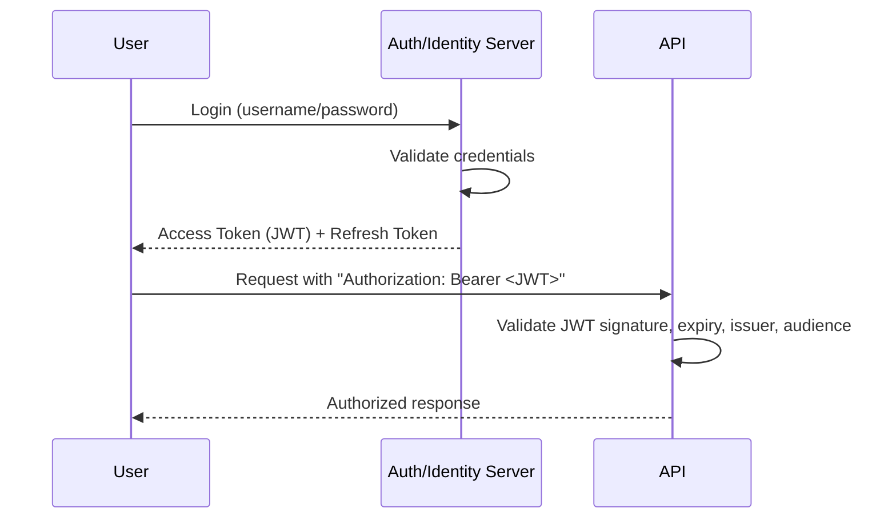

# 22 — Authentication & Authorization

## 🎯 Learning Objectives
- Explain the difference between authentication and authorization.
- Implement JWT-based auth including access/refresh token rotation.
- Choose between claims, roles, and policies for authorization decisions.

## 🤔 What is it?
**Authentication** answers "who are you?" **Authorization** answers "what are you allowed to do?" They're sequential and independent: you can be authenticated (identified) but still not authorized (permitted) for a specific action.

## 🧠 Core Concept

### JWT flow



A JWT (JSON Web Token) is a **self-contained**, signed token: `header.payload.signature`. The API can validate it (signature + expiry + issuer/audience) **without calling back** to the auth server for every request — this statelessness is JWT's core advantage over server-side session storage, at the cost of harder immediate revocation (a JWT is valid until it expires, unless you build a separate revocation/blacklist mechanism).

### Access tokens vs refresh tokens
- **Access token** — short-lived (minutes), sent on every API request, stateless validation.
- **Refresh token** — longer-lived, stored securely (HttpOnly cookie or secure storage), used only to obtain a new access token when the old one expires, without forcing the user to log in again. Refresh tokens should be **rotated** (a new one issued, old one invalidated) on each use to limit the damage of a leaked token.

### Claims, roles, policies

```csharp
// Claims — arbitrary key/value facts about the user, embedded in the token
new Claim("department", "Sales");
new Claim(ClaimTypes.Role, "Manager");

// Role-based authorization — simple, coarse-grained
[Authorize(Roles = "Admin,Manager")]

// Policy-based authorization — flexible, can combine multiple requirements
services.AddAuthorization(options =>
{
    options.AddPolicy("SalesDepartmentOnly", policy =>
        policy.RequireClaim("department", "Sales"));
});
[Authorize(Policy = "SalesDepartmentOnly")]
```
Policies are the more flexible, composable mechanism — prefer them over hardcoded role checks scattered through the codebase once authorization logic gets non-trivial.

### OAuth 2.0 vs OpenID Connect
- **OAuth 2.0** — an *authorization* framework: lets a third-party app get limited access to a resource on a user's behalf (e.g. "Let App X read your Google Calendar") without sharing the password.
- **OpenID Connect (OIDC)** — built on top of OAuth 2.0, adds a standardized *authentication* layer (the ID Token, a JWT identifying who the user is) — this is what "Sign in with Google/Microsoft" actually uses.

### ASP.NET Core Identity
A full membership system (user store, password hashing, lockout, 2FA, external login providers) that integrates with EF Core — appropriate when you're managing your own user database rather than delegating entirely to an external identity provider (Auth0, Azure AD/Entra ID, etc.).

## 💻 Basic Example — JWT issuance & validation

```csharp
// Issuing (login endpoint)
var claims = new[] { new Claim(ClaimTypes.NameIdentifier, user.Id.ToString()), new Claim(ClaimTypes.Role, "User") };
var key = new SymmetricSecurityKey(Encoding.UTF8.GetBytes(jwtSecret));
var creds = new SigningCredentials(key, SecurityAlgorithms.HmacSha256);
var token = new JwtSecurityToken(issuer, audience, claims, expires: DateTime.UtcNow.AddMinutes(15), signingCredentials: creds);
var accessToken = new JwtSecurityTokenHandler().WriteToken(token);

// Validation (Program.cs)
builder.Services.AddAuthentication(JwtBearerDefaults.AuthenticationScheme)
    .AddJwtBearer(options =>
    {
        options.TokenValidationParameters = new TokenValidationParameters
        {
            ValidateIssuer = true,
            ValidateAudience = true,
            ValidateLifetime = true,
            ValidateIssuerSigningKey = true,
            ValidIssuer = issuer,
            ValidAudience = audience,
            IssuerSigningKey = key
        };
    });
```

## ⚙️ How It Works Internally
The JWT's signature is computed over the base64url-encoded header + payload using the issuer's secret (HMAC) or private key (RSA/ECDSA). On each request, the API's JWT middleware decodes the token, recomputes/verifies the signature with the corresponding key, and checks standard claims (`exp`, `iss`, `aud`) — if any check fails, the request is rejected with 401 **before** it ever reaches your controller, because this validation happens in the authentication middleware (see [17 — Middleware](../17-Middleware)), upstream of `UseAuthorization()`.

## 🏢 Real-World Example
A microservices architecture uses a central identity provider (e.g. Azure AD/Entra ID, IdentityServer, Auth0) issuing JWTs that every downstream service validates independently and statelessly — no service needs a live connection to the auth server per request, which is essential for horizontal scalability.

## 🚀 Production-Ready Example — Refresh token rotation

```csharp
public async Task<TokenPair> RefreshAsync(string refreshToken, CancellationToken ct)
{
    var stored = await _refreshTokenStore.FindAsync(refreshToken, ct);
    if (stored is null || stored.IsRevoked || stored.ExpiresAtUtc < DateTimeOffset.UtcNow)
    {
        throw new SecurityTokenException("Invalid or expired refresh token.");
    }

    await _refreshTokenStore.RevokeAsync(stored.Id, ct); // one-time use — rotate on every refresh

    var newAccessToken = _tokenIssuer.CreateAccessToken(stored.UserId);
    var newRefreshToken = await _refreshTokenStore.CreateAsync(stored.UserId, ct);

    return new TokenPair(newAccessToken, newRefreshToken);
}
```

## ⚠️ Common Mistakes
- Storing JWTs in `localStorage` in a browser app (vulnerable to XSS token theft) instead of an `HttpOnly`, `Secure` cookie.
- Using long-lived access tokens instead of short-lived access + rotated refresh tokens, increasing exposure if a token leaks.
- Confusing authentication with authorization, e.g. checking `[Authorize]` alone and assuming that's sufficient permission checking — it only confirms *who*, not *what they can do*.
- Hardcoding role checks (`if (user.Role == "Admin")`) scattered through business logic instead of centralizing via policies.

## ✅ Best Practices
- Short-lived access tokens (minutes), rotated refresh tokens, `HttpOnly`+`Secure`+`SameSite` cookies for token storage in browsers.
- Always validate issuer, audience, lifetime, and signature — never disable any of these checks, even "temporarily."
- Prefer policy-based authorization for anything beyond the simplest role checks.
- Use a well-vetted identity provider rather than hand-rolling password storage/auth flows unless you have a specific, justified reason.

## ⚡ Performance Considerations
- JWT validation is CPU-bound (signature verification) but requires no network call — much cheaper at scale than server-side session lookups requiring a database/cache round trip per request.

## 🔄 Related Concepts
- [17 — Middleware](../17-Middleware)
- [23 — Security](../23-Security)

## 🎤 Interview Questions

**Junior:** "What's the difference between authentication and authorization?"
*Expected:* Authentication verifies identity ("who are you"); authorization determines permissions ("what are you allowed to do") — distinct, sequential concerns.

**Mid-level:** "Why use short-lived access tokens with a separate refresh token instead of one long-lived token?"
*Expected:* Limits the exposure window if an access token is stolen (it expires quickly and is validated statelessly without revocation), while the refresh token (used less often, stored more securely, and rotatable/revocable) provides a controlled way to obtain new access tokens without repeated logins.

**Senior:** "How would you handle JWT revocation given JWTs are inherently stateless?"
*Expected:* Should discuss the trade-off directly — true instant revocation contradicts pure statelessness; options include very short access token lifetimes (minimizing the revocation window), a server-side deny-list/blacklist checked on each request (reintroducing some state/lookup cost), or refresh-token-level revocation combined with short access token TTLs as the practical middle ground most systems use.

## 🧪 Practice Exercises

**Easy**
1. Issue and validate a JWT using `System.IdentityModel.Tokens.Jwt`.
2. Add `[Authorize(Roles = "Admin")]` to an endpoint and test with tokens with/without the role claim.
3. Decode a JWT (e.g. at jwt.io conceptually) and identify its header, payload, and signature.

**Medium**
1. Implement a policy requiring a custom claim and apply it to an endpoint.
2. Implement refresh token issuance and rotation end to end.
3. Configure cookie-based storage of a refresh token with `HttpOnly`/`Secure`/`SameSite` attributes.

**Hard**
1. Design and implement a token revocation strategy (deny-list or short-TTL) and discuss its trade-offs.
2. Integrate OpenID Connect login with an external provider (conceptually walk through the authorization code flow).

**Real-world scenario:** A security review flags that your SPA stores JWTs in `localStorage`. Explain the risk and the recommended remediation.

## 📌 Key Takeaways
- Authentication = who you are; authorization = what you can do — always distinct.
- JWTs are stateless and self-validating but harder to revoke instantly — mitigate with short TTLs and rotated refresh tokens.
- Prefer policy-based authorization over scattered role checks once logic gets non-trivial.
