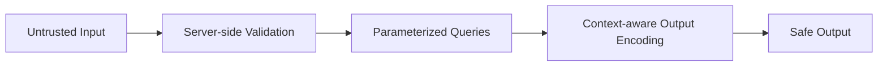

# 23 — Security

## 🎯 Learning Objectives
- Recognize the OWASP Top 10 vulnerability classes and their .NET-specific mitigations.
- Implement input validation, secrets management, and secure defaults correctly.

## 🤔 What is it?
Application security is the practice of designing and building software resistant to common, well-documented attack patterns — most catalogued in the OWASP Top 10.

## 🧠 Core Concept — Attack → Protection, per vulnerability

### SQL Injection
**Attack → How it happens → Example → Impact → Protection → .NET implementation**
- Attacker injects SQL through unsanitized input concatenated into a query.
- Example: `"SELECT * FROM Users WHERE Name = '" + userInput + "'"` with `userInput = "x'; DROP TABLE Users; --"`.
- Impact: data theft, data destruction, full database compromise.
- Protection: **always** use parameterized queries; never concatenate user input into SQL.
- .NET: EF Core's LINQ queries are parameterized automatically; for raw SQL use `FromSqlInterpolated`/parameters, never string concatenation:
```csharp
var users = await _context.Users
    .FromSqlInterpolated($"SELECT * FROM Users WHERE Name = {userInput}") // safely parameterized
    .ToListAsync();
```

### Cross-Site Scripting (XSS)
- Attacker injects malicious script into content later rendered in another user's browser.
- Example: a comment field storing `<script>steal(document.cookie)</script>`, rendered unescaped.
- Impact: session hijacking, credential theft, defacement.
- Protection: encode all output by context (HTML/attribute/URL/JS); never trust `[AllowHtml]` on untrusted input.
- .NET: Razor auto-encodes output by default (`@userInput` is HTML-encoded automatically); avoid `Html.Raw()` on untrusted content; set a Content-Security-Policy header.

### Cross-Site Request Forgery (CSRF)
- Attacker tricks a logged-in user's browser into submitting a request to your site without their knowledge (e.g. via a hidden auto-submitting form on a malicious page).
- Impact: unauthorized state-changing actions performed "as" the victim.
- Protection: anti-forgery tokens on state-changing requests; `SameSite` cookies.
- .NET: `[ValidateAntiForgeryToken]` + `services.AddAntiforgery()`; ASP.NET Core Identity wires this in automatically for Razor Pages/MVC forms.

### CORS misconfiguration
- Overly permissive CORS (`AllowAnyOrigin` combined with credentials) lets malicious sites make authenticated cross-origin requests on a victim's behalf.
- Protection: allow only known, trusted origins; never combine `AllowAnyOrigin()` with `AllowCredentials()` (the framework itself disallows this combination).
```csharp
services.AddCors(options => options.AddPolicy("Prod", p =>
    p.WithOrigins("https://app.example.com").AllowCredentials().WithMethods("GET", "POST")));
```

### SSRF (Server-Side Request Forgery)
- Attacker tricks the server into making a request to an internal/unexpected destination (e.g. a "fetch image from URL" feature pointed at `http://169.254.169.254/` — a cloud metadata endpoint).
- Impact: internal network reconnaissance, cloud credential theft.
- Protection: validate/allow-list destination hosts for any server-initiated outbound request driven by user input; block internal/link-local IP ranges.

### Authentication & authorization flaws
- Weak password policies, missing rate limiting on login (enabling brute force), broken object-level authorization (any authenticated user can access any other user's resource by guessing an ID — "IDOR").
- Protection: strong password hashing, rate limiting, and **always** re-verify ownership/permission server-side per request, never trust a client-supplied ID alone.
```csharp
var order = await _repository.GetByIdAsync(id, ct);
if (order.CustomerId != currentUserId) return Forbid(); // explicit ownership check — don't skip this
```

### Password hashing
- Never store plaintext or reversibly-encrypted passwords.
- .NET: ASP.NET Core Identity uses PBKDF2 by default (configurable iteration count); for custom implementations use `Rfc2898DeriveBytes`/BCrypt/Argon2 — never MD5/SHA1 alone (too fast, enabling brute-force, and lacking salting by default).

### Secrets management
- Never commit API keys/connection strings to source control.
- .NET: `dotnet user-secrets` locally, environment variables or Azure Key Vault (see [39 — Azure](../39-Azure)) in deployed environments.

### HTTPS & data protection
- Unencrypted traffic exposes credentials/data in transit.
- .NET: `app.UseHttpsRedirection()`, HSTS (`app.UseHsts()`), and the Data Protection API for encrypting things like cookies/tokens at rest within the app.

### Rate limiting & input validation
- Missing rate limiting enables brute force/DoS-style abuse; missing input validation enables injection and malformed-data crashes.
- .NET: built-in `Microsoft.AspNetCore.RateLimiting` middleware (see [33 — Resilience](../33-Resilience)); `[Required]`/`[StringLength]`/FluentValidation for input validation, always enforced **server-side** regardless of client-side validation.

## 🎨 Visual Explanation



## 🚀 Production-Ready Example — Defense in depth on one endpoint

```csharp
[HttpPost("{orderId:guid}/notes")]
[Authorize]
[ValidateAntiForgeryToken]
public async Task<IActionResult> AddNote(Guid orderId, [FromBody] AddNoteRequest request, CancellationToken ct)
{
    if (!ModelState.IsValid) return ValidationProblem(ModelState); // input validation

    var order = await _orderRepository.GetByIdAsync(orderId, ct);
    if (order is null) return NotFound();
    if (order.CustomerId != User.GetUserId()) return Forbid(); // object-level authorization (anti-IDOR)

    var sanitizedNote = _sanitizer.Sanitize(request.Text); // defense against stored XSS
    await _orderService.AddNoteAsync(orderId, sanitizedNote, ct); // parameterized persistence via EF Core

    return NoContent();
}
```

## ⚠️ Common Mistakes
- String-concatenating user input into SQL or shell commands.
- Trusting client-side validation alone.
- Checking authentication but skipping object-level authorization ("IDOR" — Insecure Direct Object Reference).
- Overly permissive CORS combined with credentials.
- Logging sensitive data (passwords, tokens, PII) in plaintext.

## ✅ Best Practices
- Validate and authorize on the server, always — the client cannot be trusted.
- Parameterize every query; encode every output by context.
- Principle of least privilege for every credential, connection string, and role.
- Keep dependencies patched — known-vulnerable NuGet packages are a real, common attack vector (`dotnet list package --vulnerable`).

## ⚡ Performance Considerations
- Security controls (rate limiting, input validation, hashing) all add some overhead — negligible compared to the cost of a breach; never trade away security for marginal latency gains.

## 🔄 Related Concepts
- [20 — SQL Server](../20-SQL-Server)
- [22 — Authentication](../22-Authentication)
- [33 — Resilience](../33-Resilience) (rate limiting)

## 🎤 Interview Questions

**Junior:** "How do you prevent SQL injection in .NET?"
*Expected:* Use parameterized queries/EF Core LINQ (parameterized automatically); never concatenate raw user input into SQL strings.

**Mid-level:** "What is IDOR, and how do you prevent it?"
*Expected:* Insecure Direct Object Reference — an authenticated user accesses another user's resource by manipulating an ID, because the server checked authentication but not object-level authorization; prevented by always verifying the requesting user actually owns/can access the specific resource, server-side, on every request.

**Senior:** "Design a defense-in-depth strategy for a public-facing API handling sensitive customer data."
*Expected:* Should layer: server-side validation, parameterized data access, object-level authorization checks, least-privilege credentials, encrypted transport (HTTPS/HSTS), secrets in a vault (not source control), rate limiting, dependency vulnerability scanning, structured logging that excludes sensitive data, and a documented incident response plan — no single control is treated as sufficient alone.

## 🧪 Practice Exercises

**Easy**
1. Demonstrate a SQL injection against a naive string-concatenated query in a sandboxed test project, then fix it.
2. Add `[ValidateAntiForgeryToken]` to a state-changing MVC action.
3. Configure a strict CORS policy allowing only one trusted origin.

**Medium**
1. Implement an object-level authorization check (anti-IDOR) on a resource-fetching endpoint.
2. Configure rate limiting on a login endpoint to mitigate brute force.
3. Run `dotnet list package --vulnerable` on a sample project and interpret the output.

**Hard**
1. Implement a Content-Security-Policy header and explain how it mitigates XSS even if an injection succeeds.
2. Design and implement secure secret retrieval from Azure Key Vault for a deployed environment, contrasted with `user-secrets` for local dev.

**Real-world scenario:** A penetration test reports that any authenticated user can view any other user's invoice by changing the `id` in the URL. Diagnose the vulnerability class and implement the fix.

## 📌 Key Takeaways
- Never trust client input or client-side validation alone — enforce everything server-side.
- Parameterize queries, encode output by context, and always check object-level authorization, not just authentication.
- Security is defense in depth: no single control is sufficient by itself.
