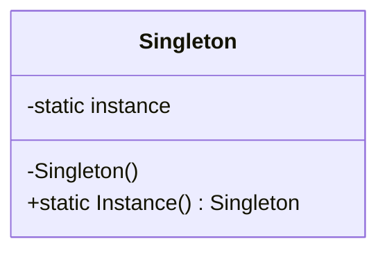

← Back to [24 — Design Patterns overview](./README.md)

# Creational Patterns

## Singleton
**Problem:** Need exactly one instance of a type, globally accessible.

```csharp
public sealed class ConfigurationCache
{
    private static readonly Lazy<ConfigurationCache> _instance = new(() => new ConfigurationCache());
    public static ConfigurationCache Instance => _instance.Value;
    private ConfigurationCache() { }
}
```
**.NET equivalent:** `services.AddSingleton<T>()` — prefer DI-managed singletons over the classic static-instance pattern; it's testable and doesn't hardcode global state.
**When to use:** Truly single, stateless or carefully-synchronized shared resources (config, caches).
**When not to use:** As a substitute for proper DI — hardcoded singletons make unit testing and swapping implementations much harder.

## Factory Method / Abstract Factory
**Problem:** Decouple object creation from the code that uses the object, especially when the concrete type depends on runtime conditions.
```csharp
public interface IPaymentMethodFactory
{
    IPaymentMethod Create(string type);
}
public class PaymentMethodFactory : IPaymentMethodFactory
{
    public IPaymentMethod Create(string type) => type switch
    {
        "card" => new CreditCardPayment(),
        "paypal" => new PayPalPayment(),
        _ => throw new NotSupportedException(type)
    };
}
```
**When to use:** Object creation logic is non-trivial or depends on runtime data. **When not to use:** For simple, single-implementation types — just `new` it, or let DI construct it.

## Builder
**Problem:** Construct a complex object step by step, especially with many optional parameters.
```csharp
var order = new OrderBuilder()
    .WithCustomer(customerId)
    .AddLine("SKU1", 2)
    .AddLine("SKU2", 1)
    .WithDiscount(10)
    .Build();
```
**When to use:** Objects with many optional configuration steps (HTTP request builders, complex test fixtures). **When not to use:** Simple objects better served by a constructor or `with` expression on a record.

## 🎤 Interview Questions

**Junior:** "Why is a DI-managed singleton usually preferred over the classic static-instance Singleton pattern?"
*Expected:* A DI-managed singleton can be swapped for a fake/mock in tests and its lifetime is managed explicitly by the container; a hardcoded static instance bakes global state directly into the class, making it hard to isolate in unit tests.

## 🧪 Practice Exercises

**Easy**
1. Implement a Builder for a multi-field `Order` object.
2. Implement a Factory that creates the right notification sender based on a config value.

**Medium**
1. Compare a hand-rolled Singleton against `services.AddSingleton<T>()` and list the testability differences.

**Hard**
1. Design (and justify) which patterns you'd use for a plugin-based payment processing system supporting runtime-added providers.

---
Next: [02 — Structural Patterns →](./02-Structural-Patterns.md)
