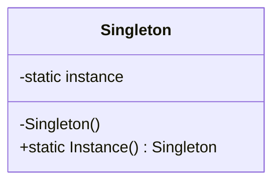

# 24 — Design Patterns

## 🎯 Learning Objectives
- Recognize the problem shape each classic pattern solves, not just its structure.
- Implement the most commonly used Creational, Structural, and Behavioral patterns in idiomatic C#.
- Know when *not* to apply a pattern.

## 🤔 What is it?
Design patterns are named, reusable solutions to recurring design problems — a shared vocabulary ("just use a Strategy here") that lets engineers communicate design intent quickly.

## ❓ Why do we need it?
Without shared vocabulary, every team reinvents (and often gets subtly wrong) the same handful of solutions to problems like "vary behavior at runtime" or "decouple object creation from usage."

---

## Creational Patterns

### Singleton
**Problem:** Need exactly one instance of a type, globally accessible.

```csharp
public sealed class ConfigurationCache
{
    private static readonly Lazy<ConfigurationCache> _instance = new(() => new ConfigurationCache());
    public static ConfigurationCache Instance => _instance.Value;
    private ConfigurationCache() { }
}
```
**.NET equivalent:** `services.AddSingleton<T>()` — prefer DI-managed singletons over the classic static-instance pattern; it's testable and doesn't hardcode global state.
**When to use:** Truly single, stateless or carefully-synchronized shared resources (config, caches).
**When not to use:** As a substitute for proper DI — hardcoded singletons make unit testing and swapping implementations much harder.

### Factory Method / Abstract Factory
**Problem:** Decouple object creation from the code that uses the object, especially when the concrete type depends on runtime conditions.
```csharp
public interface IPaymentMethodFactory
{
    IPaymentMethod Create(string type);
}
public class PaymentMethodFactory : IPaymentMethodFactory
{
    public IPaymentMethod Create(string type) => type switch
    {
        "card" => new CreditCardPayment(),
        "paypal" => new PayPalPayment(),
        _ => throw new NotSupportedException(type)
    };
}
```
**When to use:** Object creation logic is non-trivial or depends on runtime data. **When not to use:** For simple, single-implementation types — just `new` it, or let DI construct it.

### Builder
**Problem:** Construct a complex object step by step, especially with many optional parameters.
```csharp
var order = new OrderBuilder()
    .WithCustomer(customerId)
    .AddLine("SKU1", 2)
    .AddLine("SKU2", 1)
    .WithDiscount(10)
    .Build();
```
**When to use:** Objects with many optional configuration steps (HTTP request builders, complex test fixtures). **When not to use:** Simple objects better served by a constructor or `with` expression on a record.

---

## Structural Patterns

### Adapter
**Problem:** Make an existing class's interface compatible with what client code expects, without modifying the original class.
```csharp
public interface IModernLogger { void Log(string message); }
public class LegacyLoggerAdapter : IModernLogger
{
    private readonly LegacyLogger _legacy;
    public LegacyLoggerAdapter(LegacyLogger legacy) => _legacy = legacy;
    public void Log(string message) => _legacy.WriteToLogFile(message); // translates the call
}
```
**When to use:** Integrating a third-party/legacy API into a codebase expecting a different interface.

### Decorator
**Problem:** Add behavior to an object dynamically without modifying its class or affecting other instances.
```csharp
public interface INotifier { Task SendAsync(string message); }
public class EmailNotifier : INotifier { public Task SendAsync(string m) => /*...*/ Task.CompletedTask; }
public class LoggingNotifierDecorator : INotifier
{
    private readonly INotifier _inner;
    public LoggingNotifierDecorator(INotifier inner) => _inner = inner;
    public async Task SendAsync(string message)
    {
        Console.WriteLine($"Sending: {message}");
        await _inner.SendAsync(message);
    }
}
```
**.NET equivalent:** `IHttpClientFactory`'s `DelegatingHandler` chain is a real-world decorator chain.
**When to use:** Layering cross-cutting behavior (logging, caching, retry) around a core implementation without subclassing.

### Facade
**Problem:** Provide a simple, unified interface over a complex subsystem.
```csharp
public class CheckoutFacade
{
    public async Task<OrderResult> CheckoutAsync(Cart cart)
    {
        await _inventory.ReserveAsync(cart);
        var payment = await _payments.ChargeAsync(cart.Total);
        await _shipping.ScheduleAsync(cart);
        return new OrderResult(payment.Success);
    }
}
```
**When to use:** Simplifying a complex set of collaborating subsystems for common client use cases.

### Proxy
**Problem:** Control access to an object (lazy loading, caching, access control) without changing its interface.
**.NET equivalent:** EF Core's lazy-loading proxies, `Lazy<T>`.

---

## Behavioral Patterns

### Strategy
**Problem:** Select an algorithm/behavior at runtime, from a family of interchangeable options.
```csharp
public interface IShippingCostStrategy { decimal Calculate(Order order); }
public class StandardShipping : IShippingCostStrategy { public decimal Calculate(Order o) => 5.99m; }
public class ExpressShipping : IShippingCostStrategy { public decimal Calculate(Order o) => 15.99m; }

public class ShippingCalculator
{
    private readonly IShippingCostStrategy _strategy;
    public ShippingCalculator(IShippingCostStrategy strategy) => _strategy = strategy;
    public decimal GetCost(Order order) => _strategy.Calculate(order);
}
```
**When to use:** Multiple interchangeable algorithms selected at runtime — directly enabled by DI (see [18](../18-Dependency-Injection)).

### Observer
**Problem:** Notify multiple dependents automatically when an object's state changes.
**.NET equivalent:** C# `event`s (see [09 — Delegates & Events](../09-Delegates-Events)) natively implement this pattern.

### Command
**Problem:** Encapsulate a request as an object, enabling queuing, logging, undo.
```csharp
public interface ICommand { Task ExecuteAsync(); }
public class ShipOrderCommand : ICommand
{
    private readonly Order _order;
    public ShipOrderCommand(Order order) => _order = order;
    public Task ExecuteAsync() => /* ... */ Task.CompletedTask;
}
```
**.NET equivalent:** MediatR's `IRequest`/`IRequestHandler` is essentially the Command pattern plus a mediator.

### Chain of Responsibility
**Problem:** Pass a request along a chain of handlers until one handles it.
**.NET equivalent:** The entire ASP.NET Core **middleware pipeline** (see [17 — Middleware](../17-Middleware)) is a live example of this pattern.

### Template Method
**Problem:** Define the skeleton of an algorithm in a base class, letting subclasses override specific steps.
```csharp
public abstract class ReportGenerator
{
    public async Task GenerateAsync() // the template — fixed skeleton
    {
        var data = await FetchDataAsync();
        var formatted = FormatData(data);
        await SaveAsync(formatted);
    }
    protected abstract Task<IEnumerable<object>> FetchDataAsync();
    protected virtual string FormatData(IEnumerable<object> data) => string.Join("\n", data);
    protected abstract Task SaveAsync(string content);
}
```

## ⚠️ Common Mistakes
- Forcing a pattern where a simpler solution (a plain method, a record, an `if`) would do — pattern overuse is itself an anti-pattern ("pattern-itis").
- Implementing Singleton via a static field instead of DI, hurting testability.
- Confusing Strategy (behavior swapped via composition) with simple method overloading.

## ✅ Best Practices
- Reach for a pattern only when its *problem* genuinely matches your situation — name the problem first, then the pattern.
- Prefer DI-driven Strategy/Factory over hand-rolled static dispatch.
- Recognize that many .NET framework features (middleware, `event`, `DelegatingHandler`) are patterns you're already using.

## 🔄 Related Concepts
- [07 — Interfaces](../07-Interfaces)
- [09 — Delegates & Events](../09-Delegates-Events) (Observer)
- [17 — Middleware](../17-Middleware) (Chain of Responsibility)
- [18 — Dependency Injection](../18-Dependency-Injection) (Strategy, Factory)
- [25 — SOLID](../25-SOLID)

## 🎤 Interview Questions

**Junior:** "What problem does the Strategy pattern solve?"
*Expected:* Lets you select/swap an algorithm or behavior at runtime by depending on an abstraction rather than hardcoding one implementation.

**Mid-level:** "How is Decorator different from inheritance-based extension?"
*Expected:* Decorator composes behavior at runtime around an existing instance (wrapping the same interface), letting you mix and match behaviors freely without an explosion of subclasses; inheritance fixes the extension at compile time per subclass.

**Senior:** "Where in ASP.NET Core itself do you see the Chain of Responsibility and Decorator patterns already in use?"
*Expected:* Middleware pipeline = Chain of Responsibility (each middleware decides to handle/pass along); `IHttpClientFactory`'s `DelegatingHandler` pipeline = Decorator (each handler wraps the next, adding behavior like retry/logging around the core HTTP call).

## 🧪 Practice Exercises

**Easy**
1. Implement a Strategy for 3 discount calculation algorithms.
2. Implement a Decorator adding logging around an existing service interface.
3. Implement a Builder for a multi-field `Order` object.

**Medium**
1. Implement a Chain of Responsibility for request validation (multiple validators, first failure short-circuits).
2. Implement a Factory that creates the right notification sender based on a config value.
3. Refactor a large `switch` statement selecting behavior into a Strategy + DI-registered implementations.

**Hard**
1. Implement a Command pattern with undo support for a simple text editor's operations.
2. Design (and justify) which patterns you'd use for a plugin-based payment processing system supporting runtime-added providers.

**Real-world scenario:** A codebase has a 200-line `switch` statement selecting shipping cost calculation logic, duplicated in 3 places. Refactor it using an appropriate pattern.

## 📌 Key Takeaways
- Patterns are named solutions to recurring problems — learn the *problem* each solves, not just the diagram.
- Many are already built into .NET/ASP.NET Core (middleware = Chain of Responsibility, `event` = Observer, `DelegatingHandler` = Decorator).
- Don't force a pattern where simpler code suffices.
