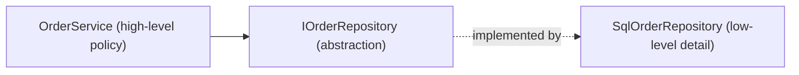

# 25 — SOLID Principles

## 🎯 Learning Objectives
- Explain each SOLID principle and identify violations in real code.
- Refactor a violation into a compliant design with a concrete before/after.

## 🤔 What is it?
SOLID is five design principles (Robert C. Martin) aimed at producing maintainable, extensible object-oriented code.

---

### S — Single Responsibility Principle
**A class should have only one reason to change.**

❌ Before:
```csharp
public class Order
{
    public void CalculateTotal() { /* ... */ }
    public void SaveToDatabase() { /* ... */ }      // persistence concern
    public void SendConfirmationEmail() { /* ... */ } // notification concern
}
```
✅ After:
```csharp
public class Order { public decimal CalculateTotal() => /* ... */ 0m; }
public class OrderRepository { public Task SaveAsync(Order order) => /* ... */ Task.CompletedTask; }
public class OrderNotifier { public Task SendConfirmationAsync(Order order) => /* ... */ Task.CompletedTask; }
```
Each class now has exactly one reason to change: a pricing rule change, a persistence technology change, and a notification channel change no longer ripple through the same file.

### O — Open/Closed Principle
**Open for extension, closed for modification.**

❌ Before:
```csharp
public decimal CalculateDiscount(string customerType, decimal total) => customerType switch
{
    "Regular" => total * 0.95m,
    "VIP" => total * 0.90m,
    // every new customer type requires editing this method
    _ => total
};
```
✅ After:
```csharp
public interface IDiscountPolicy { decimal Apply(decimal total); }
public class RegularDiscount : IDiscountPolicy { public decimal Apply(decimal total) => total * 0.95m; }
public class VipDiscount : IDiscountPolicy { public decimal Apply(decimal total) => total * 0.90m; }
// New customer types = new class, zero changes to existing code
```

### L — Liskov Substitution Principle
**Subtypes must be substitutable for their base type without breaking correctness.**

❌ Before (the classic Rectangle/Square violation):
```csharp
public class Rectangle
{
    public virtual int Width { get; set; }
    public virtual int Height { get; set; }
}
public class Square : Rectangle
{
    public override int Width { set { base.Width = base.Height = value; } }
    public override int Height { set { base.Width = base.Height = value; } }
}
// Code assuming "setting Width doesn't change Height" breaks silently when given a Square
```
✅ After: don't model `Square` as a `Rectangle` subtype at all — use a shared `IShape` abstraction instead, since a square isn't behaviorally substitutable as a rectangle.

### I — Interface Segregation Principle
**Clients shouldn't be forced to depend on methods they don't use.**

❌ Before:
```csharp
public interface IWorker { void Work(); void Eat(); }
public class RobotWorker : IWorker { public void Work() {} public void Eat() => throw new NotSupportedException(); }
```
✅ After:
```csharp
public interface IWorkable { void Work(); }
public interface IFeedable { void Eat(); }
public class RobotWorker : IWorkable { public void Work() {} }
public class HumanWorker : IWorkable, IFeedable { public void Work() {} public void Eat() {} }
```

### D — Dependency Inversion Principle
**High-level modules should depend on abstractions, not low-level concrete details.**

❌ Before:
```csharp
public class OrderService
{
    private readonly SqlOrderRepository _repository = new(); // concrete, hardcoded dependency
}
```
✅ After:
```csharp
public class OrderService
{
    private readonly IOrderRepository _repository; // depends on abstraction
    public OrderService(IOrderRepository repository) => _repository = repository;
}
```

## 🎨 Visual Explanation — Dependency direction under DIP


The arrow of dependency points **toward the abstraction** — both the high-level and low-level modules depend on it, and neither depends on the other directly. This is the core enabler of Clean Architecture (see [26](../26-Clean-Architecture)).

## 🏢 Real-World Example
A payment processing module violating OCP requires editing the same `switch` statement every time a new payment provider is added, risking regressions in unrelated providers each release; applying OCP via a `PaymentMethod` abstraction (see [06 — OOP](../06-OOP)) lets new providers be added as new classes with zero changes to existing, already-tested code.

## ⚠️ Common Mistakes
- Treating SOLID as a checklist to apply everywhere uniformly — over-applying OCP/DIP to code that will never actually vary creates needless abstraction layers ("premature abstraction").
- Confusing DIP with simply "use interfaces everywhere" — DIP is about the *direction* of dependency (who depends on whom), not interface usage for its own sake.
- Violating LSP subtly by throwing `NotImplementedException` in an override, or by strengthening preconditions/weakening postconditions in a subclass.

## ✅ Best Practices
- Apply SRP by asking "what would cause this class to change?" — if you can list more than one unrelated reason, split it.
- Apply OCP where you can already predict recurring variation (new payment types, new discount rules); don't guess speculatively for classes that rarely change.
- Verify LSP by asking "can I substitute this subclass everywhere the base type is used, without surprising behavior?"

## 🔄 Related Concepts
- [06 — OOP](../06-OOP)
- [07 — Interfaces](../07-Interfaces)
- [18 — Dependency Injection](../18-Dependency-Injection)
- [26 — Clean Architecture](../26-Clean-Architecture)

## 🎤 Interview Questions

**Junior:** "What does the 'S' in SOLID stand for, and what does it mean?"
*Expected:* Single Responsibility Principle — a class should have exactly one reason to change, i.e. one cohesive responsibility.

**Mid-level:** "Give an example of a Liskov Substitution Principle violation you've seen or can construct."
*Expected:* Should produce a concrete example (like Rectangle/Square) showing a subclass that breaks an invariant callers reasonably assumed held for the base type.

**Senior:** "How does the Dependency Inversion Principle enable Clean Architecture's dependency rule?"
*Expected:* DIP makes both high-level policy (business rules) and low-level detail (databases, frameworks) depend on shared abstractions defined by/near the high-level policy; this is precisely what lets the domain/application layers in Clean Architecture stay ignorant of infrastructure, with infrastructure implementing interfaces the inner layers define — dependencies point inward, toward abstractions, never outward toward concrete infrastructure.

## 🧪 Practice Exercises

**Easy**
1. Split a class violating SRP (mixing persistence and business logic) into two classes.
2. Refactor a `switch`-based discount calculator into an OCP-compliant strategy set.
3. Identify an ISP violation in a "fat" interface and split it.

**Medium**
1. Construct and then fix a Liskov Substitution violation of your own (not Rectangle/Square).
2. Refactor a class using `new ConcreteType()` internally into constructor-injected DIP-compliant form.
3. Explain, for a real class in a codebase you know, which SOLID principles it already follows and which it violates.

**Hard**
1. Design a small plugin system (e.g. report exporters: PDF, CSV, Excel) that demonstrates OCP, ISP, and DIP together.
2. Debate (in writing) a case where strictly applying SOLID would be over-engineering, and justify a simpler alternative.

**Real-world scenario:** A `NotificationService` class handles email, SMS, and push notifications, and every new channel requires editing its single `Send` method plus its 40-line constructor. Refactor it using SOLID principles.

## 📌 Key Takeaways
- SRP: one reason to change. OCP: extend without modifying. LSP: subtypes must be truly substitutable. ISP: don't force unused dependencies. DIP: depend on abstractions, not concretions.
- SOLID is a set of trade-offs, not absolute rules — apply where real, anticipated variation exists.
- DIP is the principle that makes Clean Architecture's dependency direction possible.
