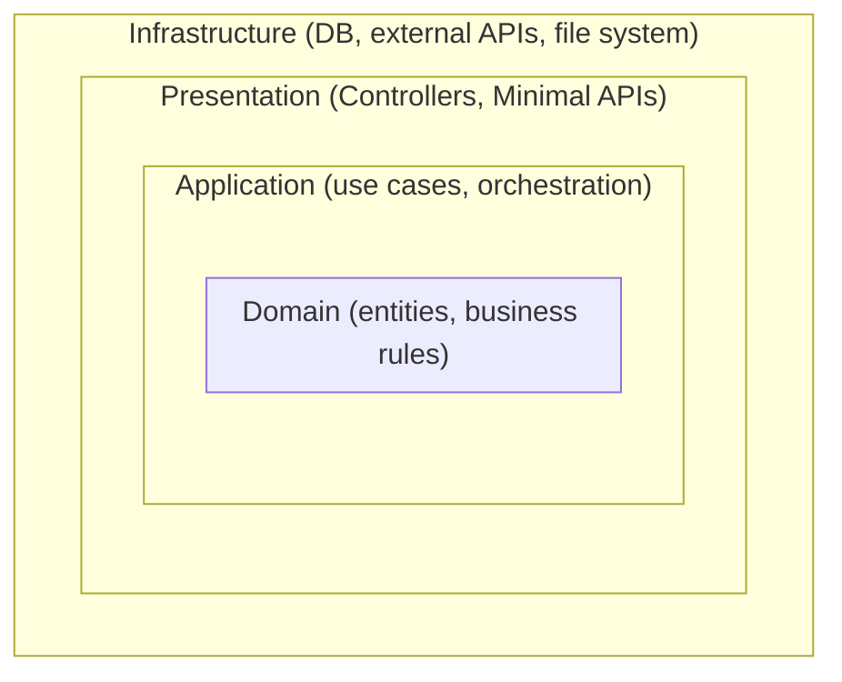

# 26 — Clean Architecture

## 🎯 Learning Objectives
- Explain the dependency rule and why it matters.
- Lay out a solution structure implementing Clean Architecture in ASP.NET Core.

## 🤔 What is it?
Clean Architecture organizes code into concentric layers where **dependencies only point inward**, keeping business logic (the Domain and Application layers) completely independent of frameworks, databases, and UI concerns.

## ❓ Why do we need it?
Without this discipline, business rules become entangled with EF Core, ASP.NET Core, or a specific ORM/UI framework — making it hard to test business logic in isolation and expensive to swap infrastructure (e.g. changing databases) without touching core logic.

## 🧠 Core Concept



**The dependency rule:** dependencies only point **inward**. Domain knows nothing about Application; Application knows nothing about Infrastructure or Presentation. Infrastructure and Presentation depend on Application/Domain's abstractions — never the reverse.

| Layer | Contains | Depends on |
|---|---|---|
| **Domain** | Entities, value objects, domain events, core business rules/invariants | Nothing (no framework references at all) |
| **Application** | Use cases, application services, interfaces for infrastructure (`IOrderRepository`), DTOs | Domain only |
| **Infrastructure** | EF Core `DbContext`, repository implementations, external API clients, email senders | Application (implements its interfaces), Domain |
| **Presentation** | Controllers/Minimal APIs, request/response models, DI wiring | Application (calls use cases) |

This is exactly the **Dependency Inversion Principle** (see [25 — SOLID](../25-SOLID)) applied at the architectural level: `IOrderRepository` is *defined* in the Application layer but *implemented* in Infrastructure — Infrastructure depends on Application's abstraction, not the other way around.

## 💻 Basic Example — Solution structure

```
Orders.Domain/
    Entities/Order.cs
    ValueObjects/Money.cs
Orders.Application/
    Interfaces/IOrderRepository.cs
    UseCases/CreateOrder/CreateOrderHandler.cs
    UseCases/CreateOrder/CreateOrderRequest.cs
Orders.Infrastructure/
    Persistence/AppDbContext.cs
    Persistence/OrderRepository.cs   // implements Orders.Application.Interfaces.IOrderRepository
Orders.Api/
    Controllers/OrdersController.cs
    Program.cs                       // wires DI: services.AddScoped<IOrderRepository, OrderRepository>()
```

```csharp
// Domain — zero framework dependencies
namespace Orders.Domain.Entities;
public class Order
{
    public Guid Id { get; private set; }
    public OrderStatus Status { get; private set; }
    public void Ship()
    {
        if (Status != OrderStatus.Paid) throw new InvalidOperationException("Cannot ship an unpaid order.");
        Status = OrderStatus.Shipped;
    }
}

// Application — defines the abstraction it needs
namespace Orders.Application.Interfaces;
public interface IOrderRepository
{
    Task<Order?> GetByIdAsync(Guid id, CancellationToken ct);
    Task SaveAsync(Order order, CancellationToken ct);
}

// Infrastructure — implements the abstraction, depends INWARD on Application
namespace Orders.Infrastructure.Persistence;
public class OrderRepository : IOrderRepository
{
    private readonly AppDbContext _context;
    public OrderRepository(AppDbContext context) => _context = context;
    public Task<Order?> GetByIdAsync(Guid id, CancellationToken ct) =>
        _context.Orders.FirstOrDefaultAsync(o => o.Id == id, ct);
    public Task SaveAsync(Order order, CancellationToken ct) => _context.SaveChangesAsync(ct);
}
```

## 🔍 Code Walkthrough
- `Order.Ship()` enforces a business invariant (can't ship an unpaid order) **inside the domain entity itself**, not scattered across a controller or service — this is the essence of a "rich domain model" rather than an anemic one.
- `IOrderRepository` lives in `Orders.Application`, meaning the Application layer's project reference graph never points at Infrastructure or EF Core at all — you could delete `Orders.Infrastructure` entirely and `Orders.Application` would still compile.

## ⚙️ How It Works Internally
Enforced primarily via **project references**: `Orders.Domain` has no project references at all; `Orders.Application` references only `Orders.Domain`; `Orders.Infrastructure` and `Orders.Api` reference `Orders.Application` (and transitively `Orders.Domain`) — the compiler itself makes an inward-violating reference (e.g. Domain referencing Infrastructure) a build error, not just a convention people can quietly ignore.

## 🏢 Real-World Example
A team needs to migrate from SQL Server to PostgreSQL. Because `IOrderRepository` is the only contract the Application layer knows about, the migration is contained entirely within `Orders.Infrastructure` — a new `PostgresOrderRepository` implementing the same interface, with zero changes to business logic, use cases, or controllers.

## 🚀 Production-Ready Example — A use case (Application layer)

```csharp
namespace Orders.Application.UseCases.CreateOrder;

public record CreateOrderRequest(Guid CustomerId, List<OrderLineRequest> Lines);

public class CreateOrderHandler
{
    private readonly IOrderRepository _repository;
    private readonly IClock _clock;

    public CreateOrderHandler(IOrderRepository repository, IClock clock)
    {
        _repository = repository;
        _clock = clock;
    }

    public async Task<Guid> HandleAsync(CreateOrderRequest request, CancellationToken ct)
    {
        var order = Order.Create(request.CustomerId, request.Lines.Select(l => (l.Sku, l.Quantity)), _clock.UtcNow);
        await _repository.SaveAsync(order, ct);
        return order.Id;
    }
}
```

## ⚠️ Common Mistakes
- Referencing EF Core types (`DbSet<T>`, `[Key]` attributes) directly on Domain entities, coupling the domain model to a specific ORM.
- Putting business rules in controllers or in the Infrastructure layer instead of the Domain/Application layers.
- Creating a Domain project that still references a web framework package "just in case."
- Over-engineering a simple CRUD app with full Clean Architecture layering when a simpler structure would serve the project better (see [28 — Architecture](../28-Architecture) for when to choose what).

## ✅ Best Practices
- Keep Domain framework-free — no EF Core, no ASP.NET Core references, ever.
- Define infrastructure contracts (repository interfaces, external service interfaces) in the Application layer, implement them in Infrastructure.
- Enforce the dependency rule with actual project references, not just a diagram nobody checks.

## ⚡ Performance Considerations
- Extra layering and mapping (entity ↔ DTO) has a small CPU/allocation cost — negligible compared to I/O costs (database, network) in almost all real systems; the maintainability payoff usually far outweighs it once a codebase reaches meaningful size.

## 🔄 Related Concepts
- [25 — SOLID](../25-SOLID) (Dependency Inversion Principle)
- [27 — DDD](../27-DDD)
- [28 — Architecture](../28-Architecture)

## 🎤 Interview Questions

**Junior:** "What is the 'dependency rule' in Clean Architecture?"
*Expected:* Dependencies point inward only — outer layers (Infrastructure, Presentation) depend on inner layers (Application, Domain), never the reverse.

**Mid-level:** "Why should the Domain layer have zero framework references?"
*Expected:* Keeps business rules testable in complete isolation and portable across infrastructure changes (database, web framework, cloud provider) without touching the code that encodes the actual business behavior.

**Senior:** "When would you deliberately NOT use full Clean Architecture layering for a new project?"
*Expected:* For small, genuinely simple CRUD services/prototypes where the anticipated complexity doesn't justify four projects and the mapping overhead between layers — a simpler layered or even single-project structure can be pragmatically better, with room to extract layers later if complexity grows (see [28 — Architecture](../28-Architecture) for this trade-off in more depth).

## 🧪 Practice Exercises

**Easy**
1. Create the 4-project solution structure shown above for a tiny domain (e.g. `Todo`).
2. Move a business rule (like "cannot ship an unpaid order") from a controller into the domain entity.
3. Verify the Domain project has zero NuGet package references beyond the BCL.

**Medium**
1. Implement one full use case (Application layer) with its own request/response types, backed by a repository interface.
2. Swap out an in-memory repository implementation for an EF Core one without touching the Application layer.
3. Diagram your own real project's current layering and identify any dependency-rule violations.

**Hard**
1. Migrate an existing single-project CRUD API into a 4-layer Clean Architecture structure.
2. Implement a domain event (e.g. `OrderShippedEvent`) raised from the Domain layer and handled in Infrastructure, without Domain knowing about the handler.

**Real-world scenario:** Your team needs to add a second API (a gRPC or GraphQL front-end) reusing the same business logic as the existing REST API. Explain how Clean Architecture's layering makes this straightforward.

## 📌 Key Takeaways
- Dependencies point inward: Presentation/Infrastructure → Application → Domain, never the reverse.
- The Domain layer should have zero framework references — pure business logic.
- Enforced by actual project references, not just documentation — a violation should be a compile error.
