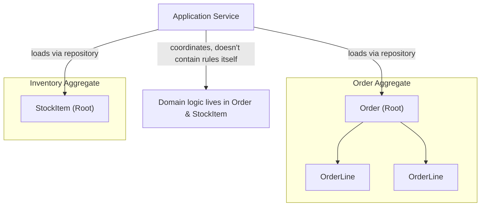
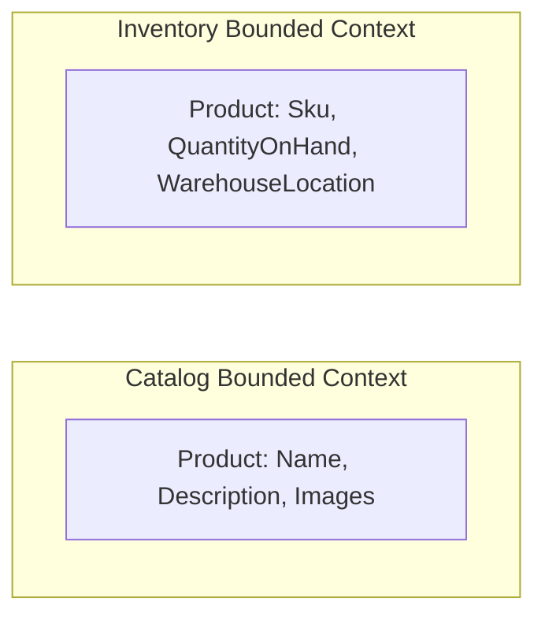

# 27 — Domain-Driven Design (DDD)

## 🎯 Learning Objectives
- Distinguish Entities, Value Objects, Aggregates, and Aggregate Roots.
- Model a realistic domain (warehouse/order management) using DDD building blocks.
- Understand Bounded Contexts and why they matter for large systems.

## 🤔 What is it?
DDD is an approach to software design that puts the **business domain and its language** at the center of the model, structuring code around real business concepts and rules rather than database tables or technical layers.

## ❓ Why do we need it?
Without DDD, business logic tends to leak into services, controllers, or database procedures as scattered `if` statements, disconnected from a coherent model — DDD keeps invariants and rules co-located with the data they govern, expressed in the same language domain experts use ("Ubiquitous Language").

## 🧠 Core Concept — Building Blocks

### Entity
Has a persistent **identity** that matters more than its attribute values — two entities with identical data are still different if their IDs differ.
```csharp
public class Order // Entity — identity (Id) matters
{
    public Guid Id { get; }
    public OrderStatus Status { get; private set; }
}
```

### Value Object
Has **no identity** — defined entirely by its attribute values, immutable, and interchangeable if equal.
```csharp
public record Address(string Street, string City, string PostalCode); // Value Object
public record Money(decimal Amount, string Currency);
```

### Aggregate & Aggregate Root
An **Aggregate** is a cluster of entities/value objects treated as a single consistency boundary. The **Aggregate Root** is the only entity within it that outside code is allowed to reference directly — all modifications go through the root, which enforces the aggregate's invariants.

```csharp
public class Order // Aggregate Root
{
    private readonly List<OrderLine> _lines = new();
    public IReadOnlyCollection<OrderLine> Lines => _lines.AsReadOnly();
    public Guid Id { get; }
    public OrderStatus Status { get; private set; }

    public void AddLine(string sku, int quantity)
    {
        if (Status != OrderStatus.Draft)
            throw new InvalidOperationException("Cannot modify a submitted order."); // invariant enforced HERE
        _lines.Add(new OrderLine(sku, quantity));
    }
}

public class OrderLine // Entity, but only reachable THROUGH the Order aggregate root
{
    public string Sku { get; }
    public int Quantity { get; }
    internal OrderLine(string sku, int quantity) { Sku = sku; Quantity = quantity; }
}
```
External code never does `order.Lines.Add(...)` directly (the collection is exposed read-only) — it must call `order.AddLine(...)`, which is where the aggregate enforces its own consistency rules. This is the core discipline DDD aggregates provide.

### Repository
Provides collection-like access to Aggregate Roots only — never to entities nested inside an aggregate.
```csharp
public interface IOrderRepository
{
    Task<Order?> GetByIdAsync(Guid id, CancellationToken ct); // returns the ROOT, never a bare OrderLine
    Task SaveAsync(Order order, CancellationToken ct);
}
```

### Domain Service
Business logic that doesn't naturally belong to any single entity/value object (often because it coordinates multiple aggregates).
```csharp
public class PricingService // Domain Service
{
    public Money CalculateTotal(Order order, DiscountPolicy policy) => /* ... */ new Money(0, "USD");
}
```

### Application Service
Orchestrates use cases: loads aggregates via repositories, calls domain logic, persists results — contains no business rules itself, only coordination (this maps directly onto the "Application" layer in [26 — Clean Architecture](../26-Clean-Architecture)).

### Domain Event
Represents something meaningful that happened in the domain, letting other parts of the system react without tight coupling.
```csharp
public record OrderShippedEvent(Guid OrderId, DateTimeOffset ShippedAtUtc);
```

### Bounded Context
A boundary within which a specific domain model and its Ubiquitous Language apply consistently. The same real-world concept ("Product") can mean different things in different contexts — a `Product` in the **Catalog** context has descriptions and images; a `Product` in the **Inventory** context has stock levels and warehouse locations. DDD explicitly allows (expects) these to be **separate models**, integrated deliberately at context boundaries, rather than forced into one universal `Product` class.

## 🎨 Visual Explanation — Warehouse/Order example





## 🏢 Real-World Example
A warehouse management system's `StockItem` aggregate root enforces "quantity can never go negative" internally in a `Reserve(int quantity)` method — no matter how many different code paths (API, background job, admin tool) try to reserve stock, the invariant can't be bypassed, because the only way to change quantity is through that one guarded method.

## 🚀 Production-Ready Example

```csharp
public class StockItem // Aggregate Root
{
    public string Sku { get; }
    public int QuantityOnHand { get; private set; }
    public int QuantityReserved { get; private set; }
    public int Available => QuantityOnHand - QuantityReserved;

    public void Reserve(int quantity)
    {
        if (quantity <= 0) throw new ArgumentOutOfRangeException(nameof(quantity));
        if (quantity > Available)
            throw new InsufficientStockException(Sku, quantity, Available); // invariant enforced in ONE place
        QuantityReserved += quantity;
    }
}
```

## ⚠️ Common Mistakes
- **Anemic domain model**: entities that are just property bags (getters/setters, no behavior), with all logic living in separate "service" classes — this defeats the entire purpose of DDD, pushing invariant enforcement out where it can be bypassed.
- Making every entity an Aggregate Root — aggregates should be as small as consistency requirements actually demand; overly large aggregates hurt concurrency (everyone contends for the same lock/row).
- Trying to build one universal domain model shared across unrelated bounded contexts, causing an ever-growing, contradictory "God model."
- Exposing a mutable `List<T>` navigation property directly, letting external code bypass aggregate invariants.

## ✅ Best Practices
- Enforce invariants inside the aggregate root's methods, never in an external service that just sets properties.
- Keep aggregates small — only what truly must be transactionally consistent together.
- Model separate bounded contexts explicitly rather than forcing a single shared entity across unrelated parts of the system.
- Use domain events to decouple side effects (e.g. sending a notification) from the core transactional aggregate change.

## ⚡ Performance Considerations
- Aggregate boundaries directly affect concurrency: a large aggregate that many operations must lock/load in full becomes a contention bottleneck — right-sizing aggregates is a real scalability decision, not just a modeling nicety.

## 🔄 Related Concepts
- [06 — OOP](../06-OOP) (rich domain model)
- [26 — Clean Architecture](../26-Clean-Architecture)
- [32 — Microservices](../32-Microservices) (bounded contexts often map to service boundaries)

## 🎤 Interview Questions

**Junior:** "What's the difference between an Entity and a Value Object?"
*Expected:* An Entity has identity that persists across changes to its attributes (two entities with the same data are still different if IDs differ); a Value Object has no identity — equality is based purely on its values, and it's typically immutable.

**Mid-level:** "Why should only the Aggregate Root be accessible from outside the aggregate?"
*Expected:* So the root can enforce the aggregate's invariants on every modification — if external code could reach into and mutate nested entities directly, the root would have no way to guarantee its own consistency rules hold.

**Senior:** "How do Bounded Contexts inform microservice boundaries, and what goes wrong if you ignore them?"
*Expected:* Bounded Contexts identify where a domain model and its language are internally consistent; aligning service boundaries with them keeps each service's model coherent and avoids forcing incompatible concepts (e.g. Catalog vs Inventory "Product") into one shared model. Ignoring this and splitting services along arbitrary technical lines instead often produces chatty, tightly-coupled services sharing a de facto single model anyway — losing most of the benefit of splitting them up.

## 🧪 Practice Exercises

**Easy**
1. Model `Order` as an Entity and `Address`/`Money` as Value Objects.
2. Convert an anemic `Order` class (public setters, no behavior) into a rich domain model enforcing an invariant.
3. Identify, in a codebase you know, one place business logic leaked outside the entity it should belong to.

**Medium**
1. Model an `Order` aggregate with `OrderLine` entities, enforcing "cannot add lines to a submitted order."
2. Implement a `StockItem` aggregate with `Reserve`/`Release` methods enforcing non-negative availability.
3. Identify two Bounded Contexts in a domain you know and describe how the "same" real-world concept differs between them.

**Hard**
1. Design the full warehouse management domain (Inventory, Orders, Shipping) as separate Bounded Contexts, and specify how they integrate (events, shared IDs, anti-corruption layers).
2. Implement a domain event raised from an aggregate and handled by an application-layer subscriber, keeping the aggregate itself framework/infrastructure-free.

**Real-world scenario:** A "Product" entity has ballooned to 60 properties serving Catalog, Inventory, and Pricing teams, each stepping on each other's changes. Propose a Bounded-Context-based redesign.

## 📌 Key Takeaways
- Entities have identity; Value Objects don't and are compared by value.
- Aggregates are consistency boundaries — only the Aggregate Root should be mutated directly, enforcing invariants for everything inside it.
- Bounded Contexts let the "same" real-world concept have different, locally-consistent models across a large system — a feature, not a bug.
