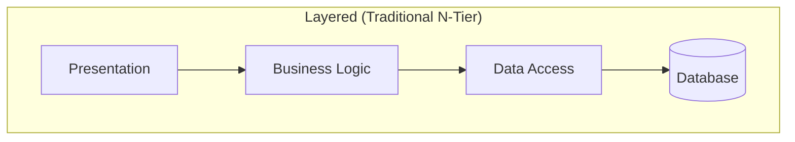
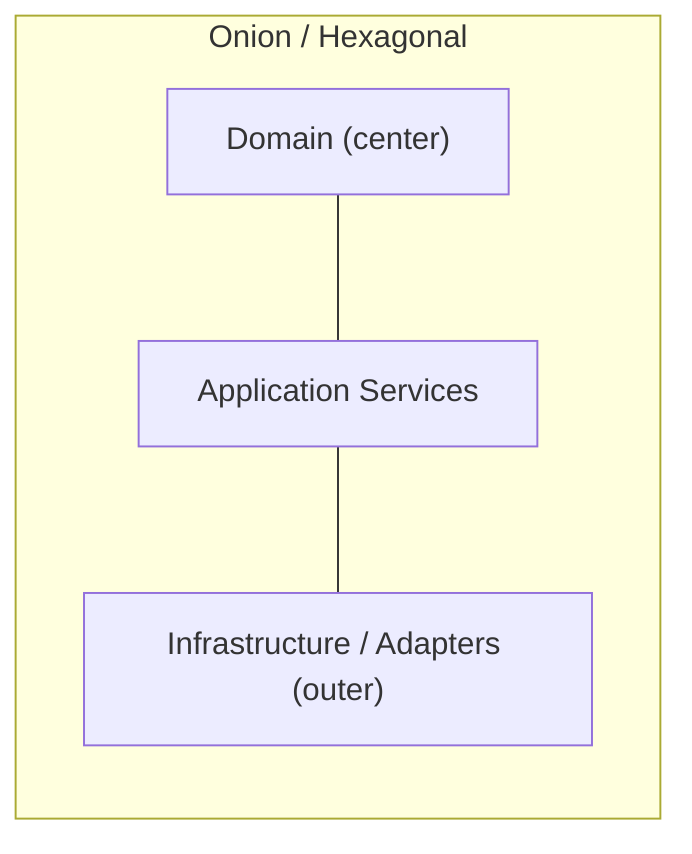
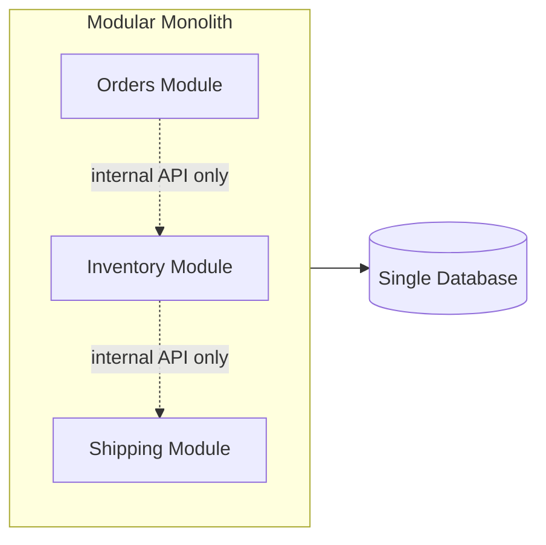
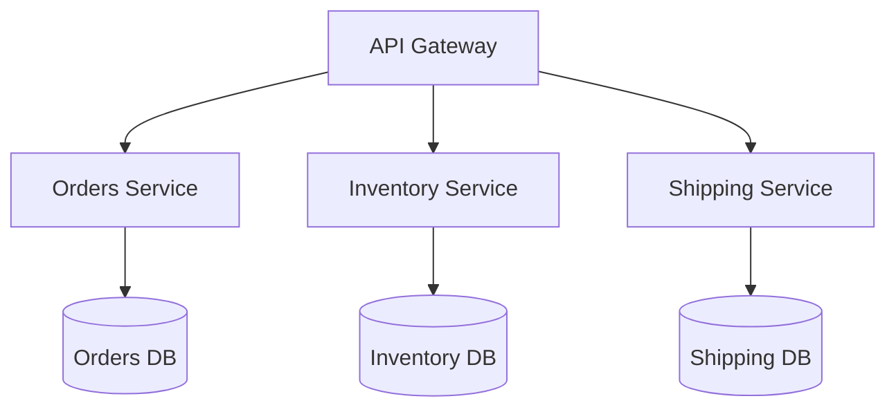

# 28 — Architecture Styles

## 🎯 Learning Objectives
- Compare Layered, Clean/Onion, Hexagonal, Modular Monolith, and Microservices architectures.
- Choose the right style for a given team size, domain complexity, and scale requirement.

## 🤔 What is it?
An architecture style is a high-level pattern for organizing an entire system's components and their dependencies — distinct from design patterns, which operate at the class/object level.

## 🧠 Core Concept — Comparison

**Layered** — each layer depends on the one directly below it. Simple, familiar, but the Business layer often ends up depending on Data Access details, coupling business rules to a specific persistence technology.

**Onion/Hexagonal (Ports & Adapters)** — same dependency-inward idea as Clean Architecture (see [26](../26-Clean-Architecture)): the domain sits at the center, framework/infrastructure concerns are "adapters" plugged in at the edges through "ports" (interfaces) the domain defines. Hexagonal specifically emphasizes symmetry between *driving* adapters (UI, API — things that call into your app) and *driven* adapters (database, external APIs — things your app calls out to).

**Modular Monolith** — one deployable unit, but internally organized into strongly-bounded modules (often aligned to DDD Bounded Contexts) that only interact through well-defined internal interfaces, never by reaching into each other's data — a deliberate discipline that makes a future microservices split easier if ever needed, while avoiding distributed-systems complexity until it's actually justified.

**Microservices** — independently deployable services, each with its own database, communicating over the network (see [32 — Microservices](../32-Microservices)).

### Comparison table

| | Layered | Onion/Hexagonal | Modular Monolith | Microservices |
|---|---|---|---|---|
| Deployment units | 1 | 1 | 1 | Many |
| Coupling risk | High (layers often leak) | Low (domain isolated) | Low, if enforced | Lowest, but network coupling replaces it |
| Operational complexity | Low | Low | Low | High (distributed systems problems) |
| Team scaling | Hard past ~1-2 teams | Moderate | Good | Best for many independent teams |
| Data consistency | Easy (one DB, transactions) | Easy (one DB, transactions) | Easy (one DB, transactions) | Hard (eventual consistency, sagas) |
| Best for | Small apps, prototypes | Most business apps | Medium-large apps, single team/org | Large orgs, independent scaling/deploy needs |

## ❓ Why do we need multiple styles?
There is no universally "best" architecture — each trades operational simplicity against team/organizational scalability and independent deployability. Choosing microservices for a 3-person team's simple CRUD app is as much a mistake as forcing a 200-engineer organization into one tightly-coupled monolith.

## 🏢 Real-World Example
A startup begins with a Modular Monolith organized around DDD Bounded Contexts (Orders, Inventory, Shipping modules, one deployable, one database) — fast to build, simple to operate. As the company grows and the Shipping module needs independent scaling and its own release cadence, it's extracted into its own microservice **because the module boundary was already clean**, making the split mechanical rather than a rewrite.

## ⚠️ Common Mistakes
- Adopting microservices prematurely ("resume-driven architecture") before the organizational/scale need justifies the operational cost.
- Building a "distributed monolith" — microservices that are still tightly coupled (shared database, synchronous call chains, deploy-together dependencies), getting all the network complexity with none of the independence benefits.
- Never revisiting architecture as the system/organization grows — a Layered architecture that made sense for a 3-person team's MVP becoming an unmaintainable tangle at 50 engineers.

## ✅ Best Practices
- Start simpler than you think you need; a well-modularized monolith can scale further (both technically and organizationally) than most teams expect.
- Align module/service boundaries to Bounded Contexts (see [27 — DDD](../27-DDD)), not arbitrary technical layers.
- Revisit the architecture decision explicitly as scale/team-size assumptions change, rather than drifting.

## ⚡ Performance Considerations
- In-process calls (monolith, modular monolith) are orders of magnitude faster and more reliable than network calls between microservices — every service boundary you introduce adds latency, failure modes, and operational overhead that must be justified by a real, corresponding benefit (independent scaling, independent deployment, team autonomy).

## 🔄 Related Concepts
- [26 — Clean Architecture](../26-Clean-Architecture)
- [27 — DDD](../27-DDD)
- [32 — Microservices](../32-Microservices)

## 🎤 Interview Questions

**Junior:** "What's the main difference between a monolith and microservices?"
*Expected:* A monolith is deployed and typically scaled as one unit; microservices are independently deployable, independently scalable services communicating over a network, each usually owning its own data store.

**Mid-level:** "What is a Modular Monolith, and why might a team choose it over microservices?"
*Expected:* A single deployable application internally organized into strongly-isolated modules with well-defined internal boundaries; chosen to get the maintainability/boundary benefits of modular design while avoiding the distributed-systems complexity (network failures, eventual consistency, deployment orchestration) microservices introduce — especially appropriate before the organization/scale genuinely needs independent deployability.

**Senior:** "How would you decide whether a growing modular monolith should be split into microservices, and what makes that split easy or hard?"
*Expected:* Should discuss concrete triggers (a module needing independent scaling, independent release cadence, a separate team owning it exclusively, differing technology needs) versus premature splitting; and note that the split's difficulty is determined almost entirely by how cleanly the module's boundary (data ownership, no direct cross-module DB access, clear internal API) was already maintained — a well-modularized monolith makes extraction mechanical, while a tangled one makes it a rewrite.

## 🧪 Practice Exercises

**Easy**
1. Draw your own current/most familiar project's architecture as one of the four styles above.
2. List two reasons a small startup should avoid microservices at first.
3. Identify a "distributed monolith" smell from a hypothetical description (e.g. two microservices sharing one database).

**Medium**
1. Design a Modular Monolith structure (folder/project layout) for a warehouse system with Orders/Inventory/Shipping modules, showing enforced module boundaries.
2. Identify which of your modules would be the best candidate to extract into a microservice first, and justify why.

**Hard**
1. Design a migration path from a Modular Monolith to Microservices for one specific module, including how you'd handle its data migration and the transitional period where both architectures coexist.
2. Critique a real (or hypothetical) microservices architecture for "distributed monolith" anti-patterns and propose fixes.

**Real-world scenario:** A 6-person startup has already split into 12 microservices, and every feature requires coordinated deploys across 4-5 services. Diagnose the architectural mismatch and recommend a path forward.

## 📌 Key Takeaways
- No single architecture style is universally correct — match the style to team size, scale needs, and organizational structure.
- A well-modularized monolith is often the right starting point and can scale further than expected.
- Module/service boundaries should align with Bounded Contexts, not arbitrary technical layering.
