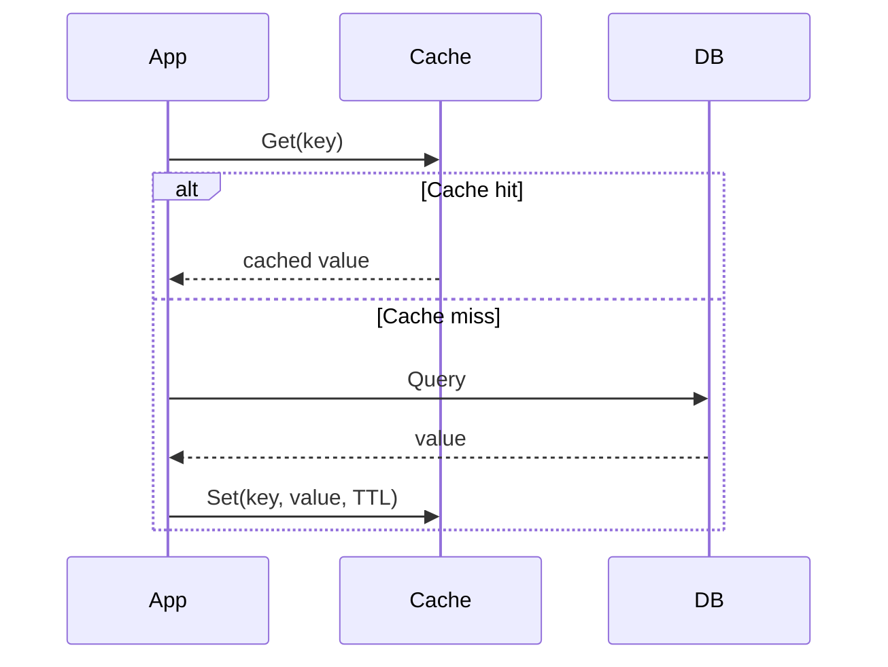

# 29 — Caching

## 🎯 Learning Objectives
- Choose between in-memory and distributed caching.
- Implement cache-aside correctly, including invalidation.
- Explain TTL and why cache invalidation is famously hard.

## 🤔 What is it?
Caching stores a copy of expensive-to-compute or expensive-to-fetch data somewhere faster to access, trading a small risk of staleness for a large reduction in latency and load on the source system.

## 🧠 Core Concept

### In-memory vs distributed cache

| | In-memory (`IMemoryCache`) | Distributed (Redis) |
|---|---|---|
| Location | Same process | Separate service, shared across instances |
| Survives app restart | No | Yes |
| Shared across scaled-out instances | No — each instance has its own copy | Yes — one shared cache |
| Speed | Fastest (no network hop) | Fast, but a network round trip |
| Use case | Single-instance apps, or per-instance data | Multi-instance/scaled-out apps needing a consistent shared cache |

### Cache-aside (the most common pattern)


```csharp
public async Task<Product> GetProductAsync(Guid id)
{
    var cacheKey = $"product:{id}";
    if (_cache.TryGetValue(cacheKey, out Product? cached)) return cached!;

    var product = await _repository.GetByIdAsync(id);
    _cache.Set(cacheKey, product, TimeSpan.FromMinutes(10)); // TTL prevents unbounded staleness
    return product;
}
```

### Write-through vs write-behind
- **Write-through** — every write goes to the cache **and** the underlying store synchronously, keeping them always consistent, at the cost of write latency.
- **Write-behind (write-back)** — writes go to the cache immediately and are asynchronously flushed to the store later — faster writes, but a risk of data loss if the cache fails before flushing.

### Cache invalidation
The two famously hard cache strategies:
1. **TTL (time-to-live)** — simplest: entries expire automatically after a fixed duration; accepts a bounded window of staleness in exchange for never needing explicit invalidation logic.
2. **Explicit invalidation** — actively remove/update the cache entry when the underlying data changes (`_cache.Remove(cacheKey)` in the same method that updates the database) — more accurate, but easy to miss a code path and leave stale data behind.

## 🏢 Real-World Example
A product catalog page reads product details from Redis with a 10-minute TTL; when an admin updates a product's price, the update handler explicitly evicts that product's cache key **in addition to** the TTL — combining both approaches gives fast reads with bounded staleness even if an invalidation call is ever missed somewhere.

## 🚀 Production-Ready Example

```csharp
public class CachedProductRepository : IProductRepository
{
    private readonly IProductRepository _inner;
    private readonly IDistributedCache _cache;

    public async Task<Product?> GetByIdAsync(Guid id, CancellationToken ct)
    {
        var key = $"product:{id}";
        var cached = await _cache.GetStringAsync(key, ct);
        if (cached is not null) return JsonSerializer.Deserialize<Product>(cached);

        var product = await _inner.GetByIdAsync(id, ct);
        if (product is not null)
        {
            await _cache.SetStringAsync(key, JsonSerializer.Serialize(product),
                new DistributedCacheEntryOptions { SlidingExpiration = TimeSpan.FromMinutes(10) }, ct);
        }
        return product;
    }

    public async Task UpdateAsync(Product product, CancellationToken ct)
    {
        await _inner.UpdateAsync(product, ct);
        await _cache.RemoveAsync($"product:{product.Id}", ct); // explicit invalidation on write
    }
}
```
This `CachedProductRepository` is itself a **Decorator** (see [24 — Design Patterns](../24-Design-Patterns)) wrapping the real repository.

## ⚠️ Common Mistakes
- Caching data with no TTL and no invalidation path — guaranteed eventual staleness with no recovery mechanism short of a restart.
- Caching per-user/sensitive data in a shared cache key without including the user's identity in the key, leaking data between users.
- Using in-memory cache in a horizontally-scaled app expecting consistency across instances — each instance has its own independent cache.
- Cache stampede: many concurrent requests all missing the cache simultaneously (e.g. right after expiration) and all hammering the database at once.

## ✅ Best Practices
- Always set a TTL, even when you also do explicit invalidation, as a safety net.
- Use distributed caching (Redis) once you have more than one app instance.
- Include all relevant discriminators (user ID, tenant ID, locale) in the cache key.
- Mitigate cache stampede with a lock/semaphore around cache population, or a "probabilistic early expiration" strategy.

## ⚡ Performance Considerations
- Caching trades memory (and some staleness risk) for dramatically reduced latency and database load — measure hit rate; a low hit rate cache isn't earning its complexity cost.

## 🔄 Related Concepts
- [13 — Memory & GC](../13-Memory-GC) (unbounded in-memory caches as memory leaks)
- [24 — Design Patterns](../24-Design-Patterns) (Decorator)
- [36 — Performance](../36-Performance)

## 🎤 Interview Questions

**Junior:** "What's the difference between `IMemoryCache` and a distributed cache like Redis?"
*Expected:* `IMemoryCache` lives in-process, per instance, lost on restart; a distributed cache is a separate shared service, consistent across multiple app instances, and survives individual app restarts.

**Mid-level:** "Explain the cache-aside pattern."
*Expected:* On read, check the cache first; on a miss, fetch from the source, populate the cache, then return the value; on write, update the source and (ideally) invalidate or update the corresponding cache entry.

**Senior:** "How would you prevent a cache stampede on a very hot key?"
*Expected:* Options include a per-key lock/semaphore so only one request repopulates the cache while others wait or serve slightly-stale data; probabilistic early refresh before actual expiration; or pre-warming/refreshing hot keys proactively via a background job rather than relying purely on reactive cache-aside.

## 🧪 Practice Exercises

**Easy**
1. Implement cache-aside with `IMemoryCache` for a simple lookup.
2. Set a TTL and observe the cache repopulate after expiration.
3. Add explicit invalidation on an update path.

**Medium**
1. Swap `IMemoryCache` for `IDistributedCache` backed by Redis (or an in-memory Redis test double) and confirm shared state across simulated instances.
2. Implement the `CachedProductRepository` decorator pattern above.
3. Reproduce a cache key collision bug from missing a user-identity discriminator and fix it.

**Hard**
1. Implement stampede protection using a semaphore per key.
2. Design a caching strategy for a multi-tenant SaaS product, including key structure and invalidation triggers.

**Real-world scenario:** After scaling a service from 1 to 5 instances, users report inconsistent data — updates made by one user aren't visible to others for several minutes. Diagnose and fix.

## 📌 Key Takeaways
- Use in-memory cache for single-instance/per-instance data; distributed cache (Redis) once scaled out.
- Cache-aside is the default pattern: check cache, miss → fetch + populate.
- Always set a TTL as a safety net, even with explicit invalidation.
