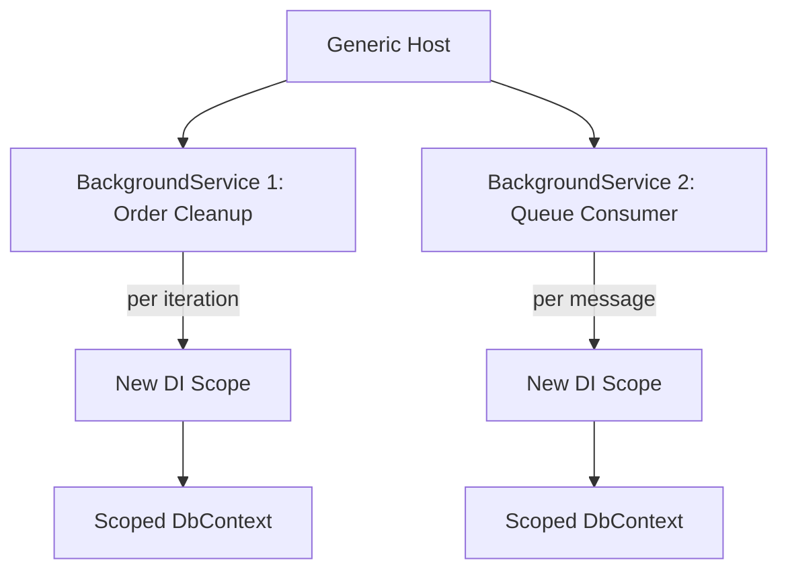

# 30 — Background Services

## 🎯 Learning Objectives
- Implement `IHostedService`/`BackgroundService` for long-running background work.
- Design a resilient background job with retry and proper cancellation handling.

## 🤔 What is it?
Background services are long-running processes hosted alongside (or instead of) your web application, handling work that shouldn't block or run within the request/response cycle — scheduled jobs, queue consumers, periodic cleanup tasks.

## 🧠 Core Concept

### IHostedService & BackgroundService

```csharp
public class OrderCleanupService : BackgroundService // BackgroundService is a convenience base implementing IHostedService
{
    private readonly IServiceScopeFactory _scopeFactory;
    private readonly ILogger<OrderCleanupService> _logger;

    public OrderCleanupService(IServiceScopeFactory scopeFactory, ILogger<OrderCleanupService> logger)
    {
        _scopeFactory = scopeFactory;
        _logger = logger;
    }

    protected override async Task ExecuteAsync(CancellationToken stoppingToken)
    {
        while (!stoppingToken.IsCancellationRequested)
        {
            try
            {
                using var scope = _scopeFactory.CreateScope(); // BackgroundService is a SINGLETON — create a scope per unit of work
                var dbContext = scope.ServiceProvider.GetRequiredService<AppDbContext>();
                await CleanupExpiredDraftOrdersAsync(dbContext, stoppingToken);
            }
            catch (Exception ex)
            {
                _logger.LogError(ex, "Cleanup failed"); // never let an unhandled exception kill the loop silently
            }

            await Task.Delay(TimeSpan.FromMinutes(15), stoppingToken);
        }
    }
}

// Registration
builder.Services.AddHostedService<OrderCleanupService>();
```

### Why a scope must be created manually
`BackgroundService` implementations are registered and constructed as **singletons** by the host — but `DbContext` and most application services are **Scoped** (see [18 — Dependency Injection](../18-Dependency-Injection)). Injecting `IServiceScopeFactory` and creating a fresh `IServiceScope` per unit of work is the correct way to safely resolve scoped services from within a singleton-lifetime background service.

### Worker Service template
`dotnet new worker` scaffolds a project with no web server at all — just the generic host running one or more `BackgroundService`s — appropriate for pure background processors (queue consumers, scheduled batch jobs) that don't need to expose HTTP endpoints.

## 🎨 Visual Explanation



## 🏢 Real-World Example
A `PaymentReconciliationService` runs every hour, comparing internal payment records against a payment provider's settlement report, flagging discrepancies for manual review — this doesn't fit any HTTP request/response cycle, making it a natural `BackgroundService`.

## 🚀 Production-Ready Example — with retry and graceful shutdown

```csharp
protected override async Task ExecuteAsync(CancellationToken stoppingToken)
{
    while (!stoppingToken.IsCancellationRequested)
    {
        try
        {
            await ProcessBatchAsync(stoppingToken);
        }
        catch (OperationCanceledException) when (stoppingToken.IsCancellationRequested)
        {
            break; // graceful shutdown requested — exit cleanly, don't log as an error
        }
        catch (Exception ex)
        {
            _logger.LogError(ex, "Batch processing failed, will retry after delay");
        }

        try
        {
            await Task.Delay(TimeSpan.FromSeconds(30), stoppingToken);
        }
        catch (OperationCanceledException)
        {
            break;
        }
    }
}
```

## ⚠️ Common Mistakes
- Resolving a Scoped service directly in a `BackgroundService`'s constructor (captive dependency — see [18 — Dependency Injection](../18-Dependency-Injection)).
- Letting an unhandled exception escape `ExecuteAsync`, silently terminating the background service forever with no further retries (the host logs it, but the service simply stops running).
- Not honoring `CancellationToken` during shutdown, delaying app shutdown/deployment by however long the current unit of work takes.
- Using `Task.Delay` with a fixed interval for work whose duration varies — can cause overlapping runs if work sometimes takes longer than the interval; consider a "delay after completion" loop (as shown above) instead of a fixed-rate timer for most cases.

## ✅ Best Practices
- Always wrap the work in try/catch inside the loop so one failure doesn't kill the service permanently.
- Create a new DI scope per unit of work for Scoped dependencies.
- Respect `CancellationToken` at every `await` point for responsive, graceful shutdown.
- Prefer a Worker Service project (no web server) for pure background processors; use `AddHostedService` within a Web API project only when the background work is tightly coupled to that API's lifecycle.

## ⚡ Performance Considerations
- Long-running loops with polling (`Task.Delay`) trade responsiveness for simplicity — for high-frequency/low-latency needs, an event-driven trigger (a message queue consumer, see [31 — Messaging](../31-Messaging)) is usually a better fit than polling.

## 🔄 Related Concepts
- [18 — Dependency Injection](../18-Dependency-Injection)
- [31 — Messaging](../31-Messaging)
- [33 — Resilience](../33-Resilience)

## 🎤 Interview Questions

**Junior:** "What is `BackgroundService` used for?"
*Expected:* Running long-lived background work (scheduled jobs, queue processing) hosted alongside the application, outside the HTTP request/response cycle.

**Mid-level:** "Why do you need `IServiceScopeFactory` inside a `BackgroundService`?"
*Expected:* `BackgroundService` instances are singletons; Scoped dependencies (like `DbContext`) can't be safely injected directly into a singleton's constructor, so a new scope must be created explicitly per unit of work to resolve them correctly.

**Senior:** "How would you design a background service to survive transient failures without silently dying?"
*Expected:* Wrap each unit of work in try/catch inside the loop (not around the whole `ExecuteAsync`, which would let one exception end everything), log failures with enough context to diagnose, apply backoff between retries, and expose health/metrics so a persistently failing service is visible to on-call rather than silently stuck.

## 🧪 Practice Exercises

**Easy**
1. Create a `BackgroundService` that logs a heartbeat every 10 seconds.
2. Register it with `AddHostedService` and observe it start/stop with the app.
3. Add graceful cancellation handling and verify shutdown doesn't throw unhandled exceptions.

**Medium**
1. Implement a `BackgroundService` that reads from a Scoped `DbContext` using a manually created scope.
2. Reproduce the "unhandled exception kills the service" bug and fix it with proper try/catch placement.
3. Convert a Web API's inline periodic task into a proper `BackgroundService`.

**Hard**
1. Build a Worker Service project consuming from an in-memory queue (`Channel<T>`) with backoff on failure.
2. Design a background service architecture for a system needing both scheduled batch jobs and real-time queue consumption, and justify the process/hosting layout.

**Real-world scenario:** A `BackgroundService` responsible for sending daily digest emails silently stopped running three weeks ago after an unhandled exception, and nobody noticed until customers complained. Propose both an immediate code fix and a monitoring improvement to prevent recurrence.

## 📌 Key Takeaways
- `BackgroundService` runs long-lived work outside the request/response cycle; it's registered as a singleton.
- Always create a DI scope per unit of work to safely use Scoped dependencies.
- Catch exceptions inside the loop, not around it, so one failure doesn't permanently kill the service.
