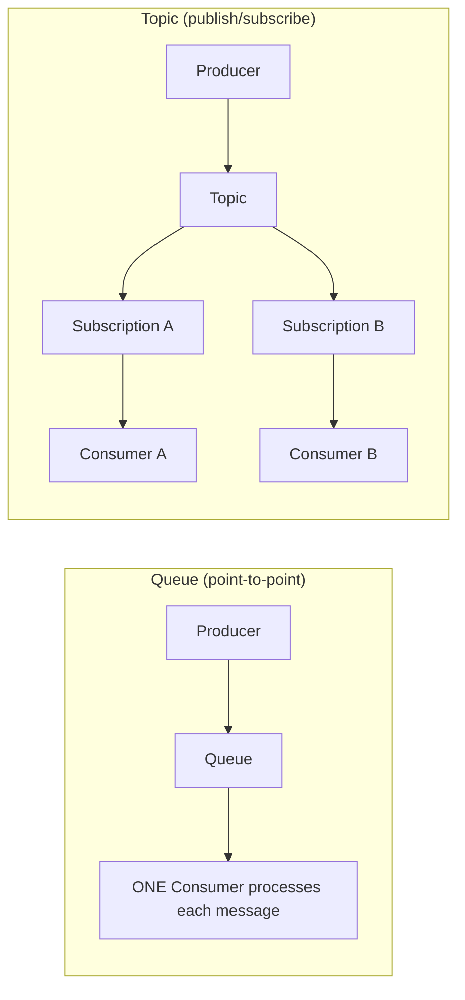
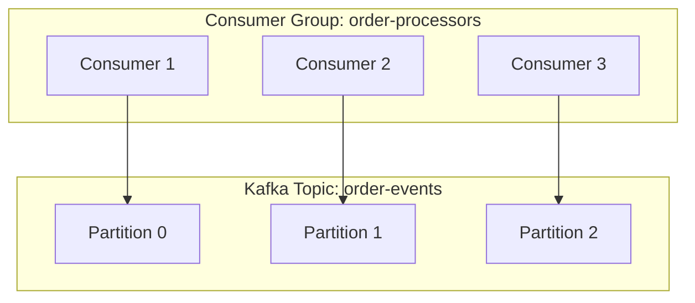
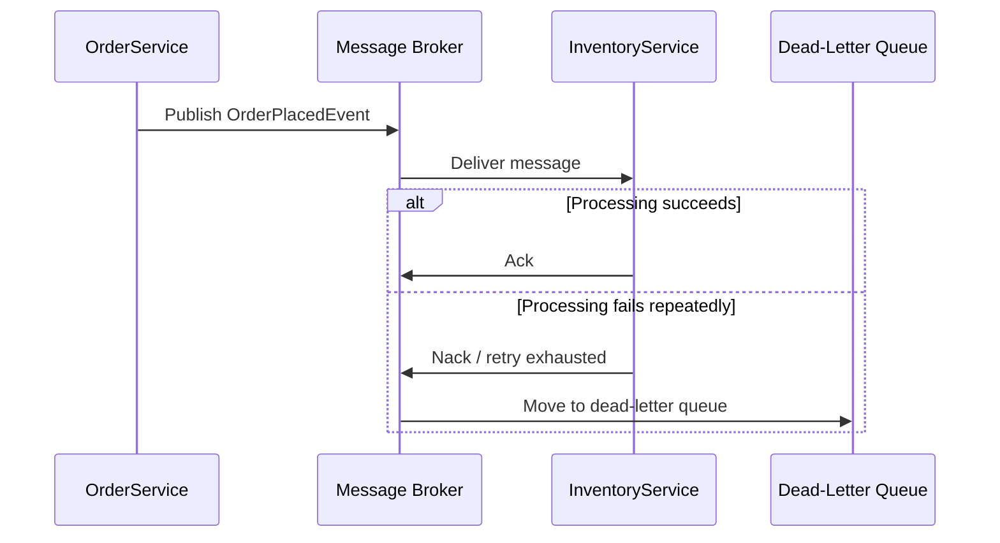

# 31 — Message Queues

## 🎯 Learning Objectives
- Explain queues vs topics, and producer/consumer/consumer-group concepts.
- Design idempotent message handlers and a dead-letter queue strategy.

## 🤔 What is it?
Message queues let services communicate **asynchronously** by sending messages through an intermediary broker (RabbitMQ, Azure Service Bus, Kafka) rather than calling each other directly — the sender doesn't wait for the receiver to process the message.

## ❓ Why do we need it?
Direct synchronous calls between services couple their availability and performance together (if the receiver is down or slow, the sender is blocked/fails too). Messaging decouples them: the sender can succeed and move on even if the consumer is temporarily down, as long as the broker is up.

## 🧠 Core Concept

### Queue vs Topic


- **Queue** — each message is delivered to and processed by exactly **one** consumer (work distribution).
- **Topic** — each message is delivered to **every subscription**, so multiple independent consumers can each process the same event (fan-out/broadcast).

### Kafka concepts: partitions & consumer groups

A **partition** is an ordered, append-only log; a topic is split across partitions for parallelism. A **consumer group** lets multiple consumer instances share the work of consuming a topic, with Kafka assigning each partition to exactly one consumer within the group at a time — this is how Kafka scales consumption horizontally while preserving per-partition ordering.

### Dead-letter queue (DLQ)
When a message repeatedly fails processing (bad data, a persistent downstream failure), it's moved to a separate dead-letter queue after N retries, instead of blocking the main queue forever or being silently dropped — letting engineers inspect and reprocess failed messages without losing them.

### Idempotency
Because most message brokers guarantee **at-least-once** delivery (a message might be delivered more than once, e.g. after a consumer crash before acknowledging), consumers **must** be idempotent — processing the same message twice must produce the same end result as processing it once.

```csharp
public async Task HandleAsync(OrderPlacedMessage message, CancellationToken ct)
{
    // Idempotency check: has this exact message already been processed?
    if (await _processedMessages.ExistsAsync(message.MessageId, ct)) return;

    await _inventoryService.ReserveStockAsync(message.OrderId, message.Lines, ct);
    await _processedMessages.MarkProcessedAsync(message.MessageId, ct); // record BEFORE acking, in the same transaction if possible
}
```

## 🎨 Visual Explanation — end-to-end message flow



## 🏢 Real-World Example
An e-commerce system publishes an `OrderPlaced` event to a topic; the Inventory service subscribes to reserve stock, the Notification service subscribes to send a confirmation email, and the Analytics service subscribes to record the sale — all independently, all without the Order service knowing or caring who's listening, and all can be added/removed without touching the Order service's code (Open/Closed Principle applied at the system level).

## 🚀 Production-Ready Example — idempotent consumer with retry + DLQ awareness

```csharp
public class OrderPlacedConsumer : IConsumer<OrderPlacedMessage>
{
    private readonly IInventoryService _inventory;
    private readonly IProcessedMessageStore _processedStore;

    public async Task Consume(ConsumeContext<OrderPlacedMessage> context)
    {
        var messageId = context.MessageId ?? throw new InvalidOperationException("Message must have an ID for idempotency.");

        if (await _processedStore.IsProcessedAsync(messageId, context.CancellationToken))
        {
            return; // already handled — safe no-op for redelivery
        }

        await _inventory.ReserveStockAsync(context.Message.OrderId, context.Message.Lines, context.CancellationToken);
        await _processedStore.MarkProcessedAsync(messageId, context.CancellationToken);
        // Broker-specific middleware (e.g. MassTransit's retry + DLQ) handles moving
        // permanently-failing messages to a dead-letter queue after N attempts.
    }
}
```

## ⚠️ Common Mistakes
- Writing consumers that assume exactly-once delivery, causing double-processing (double-charging a customer, double-shipping an order) on redelivery.
- No dead-letter strategy — a permanently failing message either blocks the queue indefinitely or is silently lost.
- Using a queue where a topic was needed (only one of several interested services actually receives the message) or vice versa.
- Ignoring message ordering requirements — some brokers/configurations don't guarantee order across partitions/consumers, which matters for state-dependent event sequences.

## ✅ Best Practices
- Always design consumers to be idempotent — track processed message IDs, or make the operation itself naturally idempotent (e.g. "set status to Shipped" rather than "increment shipped count").
- Configure a retry policy with backoff, then a dead-letter queue for messages that exhaust retries.
- Choose queue vs topic based on whether exactly one or potentially many consumers should see each message.

## ⚡ Performance Considerations
- Messaging trades immediate consistency for throughput and resilience — a producer isn't blocked waiting on every possible consumer, and consumers can scale independently and catch up from a backlog after downtime.
- Partitioning (Kafka) or competing consumers (queues) let you scale consumption horizontally, but consumer count beyond the number of partitions/available work provides no additional benefit.

## 🔄 Related Concepts
- [30 — Background Services](../30-Background-Services)
- [32 — Microservices](../32-Microservices) (sagas, eventual consistency)
- [33 — Resilience](../33-Resilience) (retry policies)

## 🎤 Interview Questions

**Junior:** "What's the difference between a queue and a topic?"
*Expected:* A queue delivers each message to exactly one consumer (competing consumers); a topic delivers each message to every subscriber (publish/subscribe fan-out).

**Mid-level:** "Why must message consumers be idempotent?"
*Expected:* Most brokers guarantee at-least-once delivery — a message can be redelivered (e.g. after a consumer crashes before acknowledging) — so processing the same message twice must not double-apply its effect.

**Senior:** "Design a dead-letter and retry strategy for a payment-processing consumer, and explain your reasoning."
*Expected:* Should cover: bounded retries with exponential backoff for transient failures, distinguishing retryable (network blip) from non-retryable (invalid card data) failures to avoid pointlessly retrying the latter, moving exhausted messages to a DLQ with enough context to diagnose and manually reprocess, alerting on DLQ growth, and ensuring the whole pipeline remains idempotent so manual reprocessing is safe.

## 🧪 Practice Exercises

**Easy**
1. Set up a simple queue (RabbitMQ or an in-memory equivalent) with one producer and one consumer.
2. Publish the same message twice and observe a non-idempotent consumer double-process it.
3. Fix the consumer above to be idempotent using a processed-message store.

**Medium**
1. Implement a topic with two independent subscribers reacting to the same event differently.
2. Configure a retry policy with backoff and a dead-letter queue for a failing consumer.
3. Simulate a consumer crash mid-processing and verify at-least-once redelivery behavior.

**Hard**
1. Design a Kafka-based ingestion pipeline with partitioning strategy and consumer group sizing for a given throughput target.
2. Implement the transactional outbox pattern to ensure a database write and a message publish happen atomically (or not at all).

**Real-world scenario:** Customers report occasional duplicate order confirmation emails. Investigation shows the message broker occasionally redelivers messages after brief consumer restarts. Diagnose and fix the root cause.

## 📌 Key Takeaways
- Queues = one consumer per message (work distribution); topics = every subscriber sees each message (fan-out).
- Most brokers guarantee at-least-once delivery — consumers must be idempotent.
- Always pair retry-with-backoff with a dead-letter queue for messages that can't be processed.
