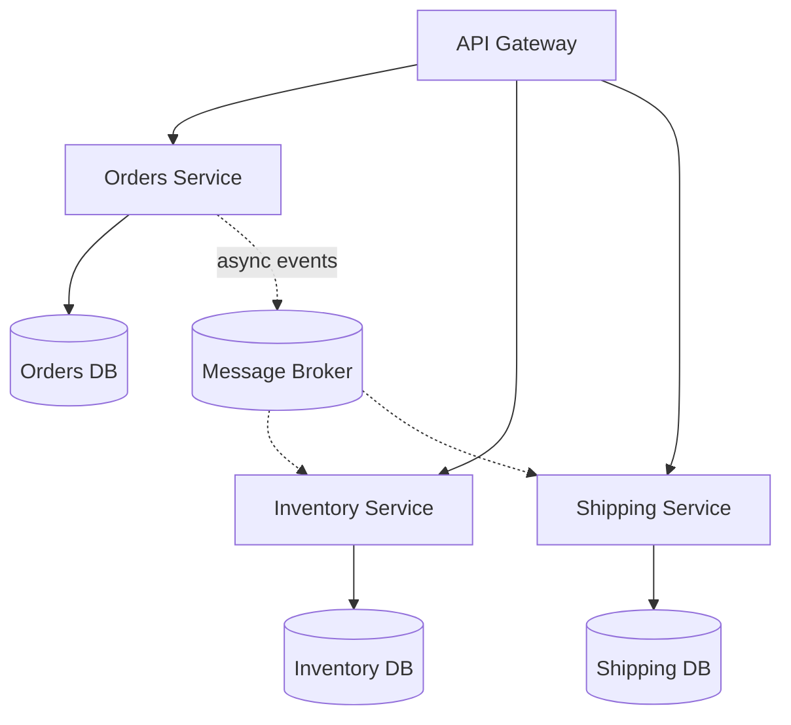
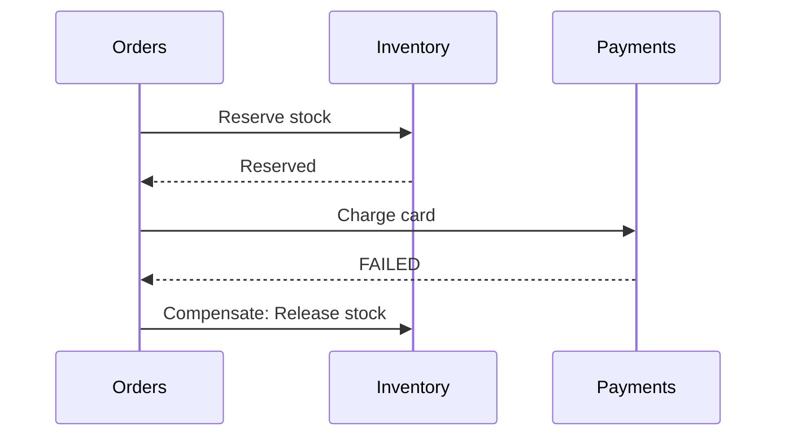

# 32 — Microservices

## 🎯 Learning Objectives
- Define correct service boundaries and understand "database per service."
- Explain the Saga pattern and eventual consistency trade-offs.
- Understand why observability and resilience become mandatory, not optional, in this style.

## 🤔 What is it?
Microservices architecture structures a system as a set of small, independently deployable services, each owning its own data and business capability, communicating over the network.

## 🧠 Core Concept



### Service boundaries
Should align with **Bounded Contexts** (see [27 — DDD](../27-DDD)) — each service owns a cohesive business capability and the data that supports it, not an arbitrary technical slice (e.g. "the database layer service" is a warning sign, not a real boundary).

### Database per service
Each service owns its data exclusively — no other service ever queries another service's database directly. Cross-service data needs are satisfied via that service's API or via events, never a shared schema. This preserves each service's ability to change its internal data model without breaking others, at the cost of needing to handle cross-service consistency deliberately.

### Communication: synchronous vs asynchronous
- **Synchronous (HTTP/gRPC)** — simple, immediate response, but couples the caller's success to the callee's availability at that moment.
- **Asynchronous (events via a message broker)** — decouples availability, but introduces eventual consistency (see [31 — Messaging](../31-Messaging)).

### Saga pattern — distributed transactions without a distributed transaction
A single business operation spanning multiple services (e.g. "place an order" touching Orders, Inventory, and Payments) can't use a traditional ACID transaction across service boundaries. A **Saga** coordinates a sequence of local transactions, each with a **compensating action** to undo it if a later step fails.


Two common implementation styles:
- **Choreography** — each service reacts to events from others, no central coordinator (simpler, but harder to see the overall flow).
- **Orchestration** — a central saga orchestrator explicitly directs each step and compensation (clearer flow, but a new central component to build/maintain).

### Eventual consistency
Because cross-service state changes happen via asynchronous steps (possibly with retries and delays), the overall system may be **temporarily inconsistent** (e.g. an order shows "Pending Payment" for a moment even after payment technically succeeded) before converging to a consistent state — this must be an explicit, accepted, and UX-designed-for trade-off, not an accident.

### Observability & Resilience become mandatory
With calls crossing many services over a network, distributed tracing (see [35 — Observability](../35-Observability)), circuit breakers, retries with backoff, and timeouts (see [33 — Resilience](../33-Resilience)) go from "nice to have" to "required to operate the system at all" — a single slow/unhealthy service can otherwise cascade failures across the whole call graph.

## 🏢 Real-World Example
An `OrderPlaced` saga: Orders service creates the order in "Pending" state and publishes `OrderPlaced`; Inventory reserves stock and publishes `StockReserved` (or `StockUnavailable`); Payments charges the customer and publishes `PaymentSucceeded` (or `PaymentFailed`); Orders listens for all outcomes and either confirms the order or triggers compensating events (release stock, refund) to unwind a partial failure.

## 🚀 Production-Ready Example — orchestrated saga sketch

```csharp
public class PlaceOrderSagaOrchestrator
{
    public async Task ExecuteAsync(PlaceOrderCommand command, CancellationToken ct)
    {
        var order = await _orderService.CreatePendingOrderAsync(command, ct);

        var reserved = await _inventoryClient.TryReserveAsync(order.Id, order.Lines, ct);
        if (!reserved)
        {
            await _orderService.MarkFailedAsync(order.Id, "Insufficient stock", ct);
            return;
        }

        var charged = await _paymentClient.TryChargeAsync(order.Id, order.Total, ct);
        if (!charged)
        {
            await _inventoryClient.ReleaseAsync(order.Id, order.Lines, ct); // compensating action
            await _orderService.MarkFailedAsync(order.Id, "Payment declined", ct);
            return;
        }

        await _orderService.ConfirmAsync(order.Id, ct);
    }
}
```

## ⚠️ Common Mistakes
- Splitting services along technical layers ("API service," "DB service") instead of business capabilities.
- Sharing a database across services — the single most common way teams accidentally build a "distributed monolith" (see [28 — Architecture](../28-Architecture)).
- No compensating actions for multi-step operations — a mid-saga failure leaves the system in a permanently inconsistent state.
- Underinvesting in observability/resilience until a production incident forces the issue.

## ✅ Best Practices
- Align service boundaries to Bounded Contexts, each owning its data exclusively.
- Design every multi-service operation as an explicit saga with defined compensations from the start, not as an afterthought.
- Invest in distributed tracing, correlation IDs, circuit breakers, and timeouts as first-class infrastructure, not optional extras.
- Prefer asynchronous, event-driven communication for cross-service side effects; reserve synchronous calls for genuinely immediate-response needs.

## ⚡ Performance Considerations
- Every network hop between services adds latency and a new failure mode compared to an in-process call — minimize unnecessary synchronous call chains ("chatty" microservices), and consider aggregating data via events/read models instead of live cross-service calls for read-heavy composition.

## 🔄 Related Concepts
- [27 — DDD](../27-DDD) (Bounded Contexts as service boundaries)
- [28 — Architecture](../28-Architecture)
- [31 — Messaging](../31-Messaging)
- [33 — Resilience](../33-Resilience)
- [35 — Observability](../35-Observability)

## 🎤 Interview Questions

**Junior:** "Why does each microservice have its own database?"
<br>*Expected:* To preserve independence — a service can change its internal schema/technology without coordinating with or breaking other services, since nothing else queries its database directly.

**Mid-level:** "What is the Saga pattern, and why is it needed in microservices?"
*Expected:* A way to coordinate a business operation across multiple services' local transactions using a sequence of steps and compensating actions, since a single ACID transaction can't span independent databases/services; needed whenever one business operation must consistently affect data owned by more than one service.

**Senior:** "Choreography vs orchestration for saga implementation — how do you decide, and what's the failure mode of each?"
*Expected:* Choreography (event-reactive, no central coordinator) scales simply for a small number of steps but becomes hard to reason about/debug as the number of participating services grows (the overall flow is implicit, scattered across services). Orchestration (a central coordinator explicitly sequencing steps and compensations) makes the flow visible and easier to test/monitor, at the cost of introducing a new component that itself needs to be reliable and becomes a natural place for the flow's complexity to concentrate. Choice depends on saga complexity and how important explicit visibility of the flow is operationally.

## 🧪 Practice Exercises

**Easy**
1. Diagram a 3-service system with correct database-per-service boundaries.
2. Identify a technical (wrong) vs business-capability (right) service split for a hypothetical system.
3. List two reasons synchronous-only cross-service communication is risky at scale.

**Medium**
1. Implement a simple 2-step saga (reserve, then charge) with one compensating action on failure.
2. Design event contracts (`OrderPlaced`, `StockReserved`, `PaymentFailed`) for a choreography-based saga.
3. Add a correlation ID propagated across 3 simulated service calls and trace a request through logs.

**Hard**
1. Implement an orchestrated saga with 3+ steps, each with its own compensating action, and simulate a mid-saga failure.
2. Design a strategy for handling saga steps that themselves fail intermittently (idempotency + retry combined with compensation logic).

**Real-world scenario:** An order's payment succeeded, but a bug in the Inventory service's compensation logic means stock was never actually reserved, and the item sold out to someone else. Diagnose the saga design flaw and propose a fix.

## 📌 Key Takeaways
- Service boundaries should follow Bounded Contexts/business capabilities, each strictly owning its own data.
- Sagas coordinate cross-service business operations via local transactions plus compensating actions — there's no distributed ACID transaction to rely on.
- Observability and resilience patterns are mandatory infrastructure in microservices, not optional polish.
