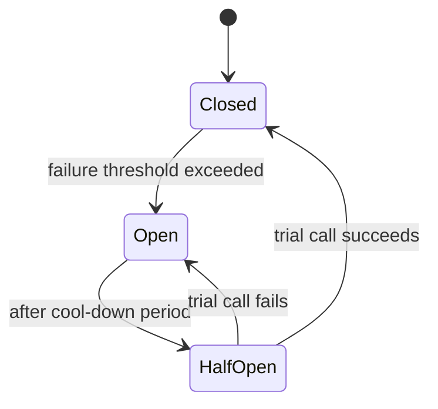
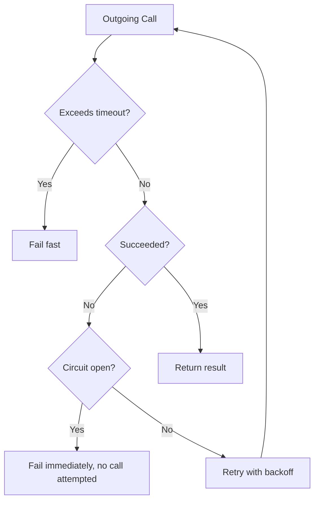

# 33 — Resilience

## 🎯 Learning Objectives
- Implement retry, timeout, circuit breaker, and bulkhead patterns using Polly.
- Explain why blind retries can make an outage worse, not better.

## 🤔 What is it?
Resilience patterns help a distributed system tolerate the inevitable transient failures (network blips, momentarily overloaded dependencies) of calling other services over a network, without those failures cascading into a full outage.

## 🧠 Core Concept

### Retry
Re-attempt a failed operation, typically with **exponential backoff** and **jitter** (randomized delay) to avoid many clients retrying in lockstep and overwhelming a recovering service.
```csharp
var retryPolicy = Policy
    .Handle<HttpRequestException>()
    .WaitAndRetryAsync(3, attempt => TimeSpan.FromSeconds(Math.Pow(2, attempt)) + TimeSpan.FromMilliseconds(Random.Shared.Next(0, 500)));
```

### Timeout
Never wait indefinitely for a dependency — a hung call without a timeout can exhaust threads/connections and take down the calling service too.
```csharp
var timeoutPolicy = Policy.TimeoutAsync(TimeSpan.FromSeconds(5));
```

### Circuit Breaker
After a threshold of consecutive/recent failures, **stop calling** the failing dependency entirely for a cool-down period, failing fast instead — protects both the struggling downstream service (giving it room to recover instead of being hammered by retries) and the calling service's own resources (threads aren't tied up waiting on calls very likely to fail anyway).

```csharp
var circuitBreakerPolicy = Policy
    .Handle<HttpRequestException>()
    .CircuitBreakerAsync(handledEventsAllowedBeforeBreaking: 5, durationOfBreak: TimeSpan.FromSeconds(30));
```

### Bulkhead
Limit the number of concurrent calls to a specific dependency, so one overwhelmed/slow downstream service can't exhaust *all* of the calling service's threads/connections, starving unrelated functionality that doesn't even depend on it (named after ship compartments that contain flooding to one section).
```csharp
var bulkheadPolicy = Policy.BulkheadAsync(maxParallelization: 10, maxQueuingActions: 20);
```

### Fallback
Provide a degraded-but-functional response when the primary path fails, rather than failing the whole user-facing operation.
```csharp
var fallbackPolicy = Policy<List<Recommendation>>
    .Handle<Exception>()
    .FallbackAsync(fallbackValue: new List<Recommendation>()); // e.g. show no personalized recommendations instead of an error page
```

### Combining policies (Polly)
```csharp
var resiliencePipeline = Policy.WrapAsync(fallbackPolicy, circuitBreakerPolicy, retryPolicy, timeoutPolicy);
```

### Why blind retries can be dangerous
Retrying every failure indefinitely, without backoff or a circuit breaker, can turn a brief hiccup into a full outage: as the downstream service struggles, every caller's retries pile additional load on top of the already-degraded service, delaying or preventing its recovery — this is called a **retry storm**. Combining retry with a circuit breaker (stop retrying once it's clearly not transient) and jittered backoff (spread retries out in time) is essential, not optional.

## 🎨 Visual Explanation



## 🏢 Real-World Example
A recommendations widget on a product page calls a Recommendations microservice; if that service is slow or down, a circuit breaker trips after a few failures, and a fallback policy immediately returns an empty recommendations list — the product page still loads fully and fast, just without personalized suggestions, instead of the whole page failing or hanging.

## 🚀 Production-Ready Example — via `Microsoft.Extensions.Http.Resilience` / Polly with `IHttpClientFactory`

```csharp
builder.Services.AddHttpClient<IRecommendationsClient, RecommendationsClient>(client =>
{
    client.BaseAddress = new Uri("https://recommendations.internal");
    client.Timeout = TimeSpan.FromSeconds(2);
})
.AddTransientHttpErrorPolicy(policy => policy
    .WaitAndRetryAsync(3, attempt => TimeSpan.FromMilliseconds(200 * Math.Pow(2, attempt))))
.AddTransientHttpErrorPolicy(policy => policy
    .CircuitBreakerAsync(5, TimeSpan.FromSeconds(30)));
```

## ⚠️ Common Mistakes
- Retrying non-idempotent operations (e.g. "charge card") without ensuring idempotency first — a retry after a false-negative timeout could double-charge (see [31 — Messaging](../31-Messaging) for idempotency).
- Retrying without backoff/jitter, contributing to retry storms.
- No timeout at all on outbound calls, letting one hung dependency exhaust the caller's own thread pool/connections.
- Treating every failure as retryable — a 400 Bad Request should never be retried; only genuinely transient failures (network errors, 5xx, timeouts) should be.

## ✅ Best Practices
- Always pair retry with backoff + jitter, and typically a circuit breaker.
- Set explicit, sensible timeouts on every outbound call.
- Ensure operations are idempotent before making them retryable.
- Use bulkheads to isolate resource contention per dependency, so one bad downstream service doesn't starve unrelated calls.
- Provide fallbacks for non-critical functionality so a dependency's failure degrades gracefully instead of failing the whole request.

## ⚡ Performance Considerations
- Resilience policies add a small amount of overhead (policy evaluation, wrapping) but prevent far larger, systemic performance collapses during partial outages — a clear net win at any meaningful scale.

## 🔄 Related Concepts
- [12 — Async/Await](../12-Async-Await) (`CancellationToken`, `SemaphoreSlim`)
- [31 — Messaging](../31-Messaging) (idempotency)
- [32 — Microservices](../32-Microservices)
- [35 — Observability](../35-Observability) (monitoring circuit breaker state)

## 🎤 Interview Questions

**Junior:** "What does a circuit breaker do?"
*Expected:* After enough recent failures, it stops sending calls to a failing dependency for a cool-down period, failing fast instead of continuing to hammer (and further overload) the struggling service.

**Mid-level:** "Why is retrying without backoff dangerous?"
*Expected:* Many simultaneous callers retrying immediately after a failure pile additional load onto an already-struggling service at the worst possible moment, potentially turning a brief blip into a full outage — a "retry storm."

**Senior:** "How do you decide which operations are safe to retry, and how does that interact with idempotency?"
*Expected:* Only retry operations that are either naturally idempotent (a GET, a "set status to X") or made idempotent via a deduplication mechanism (idempotency keys, processed-message tracking); retrying a non-idempotent operation blindly (e.g. "increment balance," "charge card") risks duplicating its effect if the original request actually succeeded but the response was lost (a false-negative timeout).

## 🧪 Practice Exercises

**Easy**
1. Add a retry policy with exponential backoff to an HTTP call using Polly.
2. Add a timeout policy and observe it trigger on a deliberately slow call.
3. Explain, in your own words, what jitter adds to a retry policy and why.

**Medium**
1. Implement a circuit breaker and observe it open after repeated failures, then half-open after the cool-down.
2. Combine retry + circuit breaker + timeout into one wrapped policy.
3. Add a fallback for a non-critical dependency and verify the overall operation still succeeds when it fails.

**Hard**
1. Implement a bulkhead limiting concurrent calls to a slow dependency and demonstrate it protects unrelated calls from starvation.
2. Design a full resilience strategy (retry, circuit breaker, timeout, bulkhead, fallback) for a payment gateway integration, justifying each choice and its parameters.

**Real-world scenario:** During a partial outage of a downstream service, your own service's error rate and latency spike far worse than the downstream outage alone would explain, and recovery takes much longer than the downstream service's own recovery. Diagnose the likely resilience gap.

## 📌 Key Takeaways
- Retry, timeout, circuit breaker, and bulkhead each protect against a different failure mode — combine them rather than relying on any single one.
- Blind retries without backoff/jitter can cause retry storms that worsen an outage.
- Only retry idempotent operations, or make them idempotent first.
