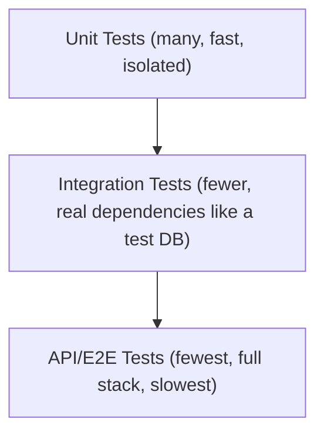

# 34 — Testing

## 🎯 Learning Objectives
- Write unit tests with xUnit and Moq following Arrange-Act-Assert.
- Distinguish unit, integration, and API tests, and know what each should (and shouldn't) cover.
- Use test doubles correctly (mock vs stub vs fake).

## 🤔 What is it?
Automated testing verifies code behaves correctly, both now and after future changes, without manual re-verification every time.

## 🧠 Core Concept

### The testing pyramid


More unit tests than integration tests, more integration tests than end-to-end tests — because each layer up trades speed and isolation for realism, and you want fast feedback for the bulk of your test suite.

### Arrange — Act — Assert

```csharp
public class OrderTests
{
    [Fact]
    public void Ship_WhenOrderIsPaid_TransitionsToShipped()
    {
        // Arrange
        var order = Order.CreatePaid(customerId: Guid.NewGuid());

        // Act
        order.Ship();

        // Assert
        Assert.Equal(OrderStatus.Shipped, order.Status);
    }

    [Fact]
    public void Ship_WhenOrderIsNotPaid_ThrowsInvalidOperationException()
    {
        var order = Order.CreateDraft(customerId: Guid.NewGuid());
        Assert.Throws<InvalidOperationException>(() => order.Ship());
    }

    [Theory]
    [InlineData(-1)]
    [InlineData(0)]
    public void Reserve_WithNonPositiveQuantity_Throws(int quantity)
    {
        var stock = new StockItem("SKU1", quantityOnHand: 10);
        Assert.Throws<ArgumentOutOfRangeException>(() => stock.Reserve(quantity));
    }
}
```

### Test doubles: mock vs stub vs fake

| Type | Purpose | Example |
|---|---|---|
| **Stub** | Returns canned answers, no behavior verification | A repository stub always returning a fixed `Order` |
| **Mock** | Verifies specific interactions occurred | Verify `_emailSender.SendAsync(...)` was called exactly once |
| **Fake** | A working but simplified implementation | An in-memory repository implementing the real interface fully |

```csharp
// Moq example — mocking a dependency and verifying an interaction
var repositoryMock = new Mock<IOrderRepository>();
repositoryMock.Setup(r => r.GetByIdAsync(orderId, It.IsAny<CancellationToken>()))
    .ReturnsAsync(existingOrder);

var service = new OrderService(repositoryMock.Object, emailSenderMock.Object);
await service.ShipOrderAsync(orderId, CancellationToken.None);

emailSenderMock.Verify(e => e.SendShippingConfirmationAsync(existingOrder), Times.Once);
```

### Integration testing with `WebApplicationFactory`

```csharp
public class OrdersApiTests : IClassFixture<WebApplicationFactory<Program>>
{
    private readonly HttpClient _client;
    public OrdersApiTests(WebApplicationFactory<Program> factory) => _client = factory.CreateClient();

    [Fact]
    public async Task GetOrder_ReturnsNotFound_ForUnknownId()
    {
        var response = await _client.GetAsync($"/api/v1/orders/{Guid.NewGuid()}");
        Assert.Equal(HttpStatusCode.NotFound, response.StatusCode);
    }
}
```
This spins up the **real** ASP.NET Core pipeline (middleware, routing, DI) in memory, testing much closer to production behavior than a pure unit test, while still avoiding a real network hop.

### Testcontainers
Runs a **real** dependency (SQL Server, Redis, RabbitMQ) in a disposable Docker container for the duration of a test run — giving integration tests real database/broker behavior (not an in-memory fake that might behave subtly differently) without requiring a shared, stateful test environment.
```csharp
await using var sqlContainer = new MsSqlBuilder().Build();
await sqlContainer.StartAsync();
// point the DbContext at sqlContainer.GetConnectionString() for this test run
```

### Test coverage
A useful signal for finding **completely untested** code, but a dangerous target in itself — 100% coverage with weak assertions (or no assertions at all) provides false confidence. Coverage measures *lines executed*, not *behavior verified*.

## 🏢 Real-World Example
A `PricingService.CalculateTotal` method has a unit test suite covering every discount rule combination (fast, isolated, no database); a smaller integration test suite verifies `OrdersController` correctly wires validation, the service, and the database together for a couple of representative happy-path and failure scenarios; a handful of end-to-end tests verify the full checkout flow works through the real deployed stack.

## 🚀 Production-Ready Example — testing a service with a mocked repository and a fake clock

```csharp
public class OrderServiceTests
{
    [Fact]
    public async Task CreateAsync_SetsPlacedAtToCurrentUtcTime()
    {
        var fixedTime = new DateTimeOffset(2024, 1, 1, 12, 0, 0, TimeSpan.Zero);
        var clockStub = new Mock<IClock>();
        clockStub.Setup(c => c.UtcNow).Returns(fixedTime);

        var repositoryMock = new Mock<IOrderRepository>();
        var service = new OrderService(repositoryMock.Object, clockStub.Object);

        var request = new CreateOrderRequest(Guid.NewGuid(), new List<OrderLineRequest>());
        var orderId = await service.CreateAsync(request, CancellationToken.None);

        repositoryMock.Verify(r => r.SaveAsync(
            It.Is<Order>(o => o.PlacedAtUtc == fixedTime), It.IsAny<CancellationToken>()), Times.Once);
    }
}
```
Injecting `IClock` instead of calling `DateTimeOffset.UtcNow` directly is what makes this test deterministic and fast — a recurring, important testability pattern.

## ⚠️ Common Mistakes
- Testing implementation details (private methods, internal call order) instead of observable behavior — makes tests brittle to safe refactors.
- Writing integration/E2E tests for logic that a fast unit test could verify just as well — slows the whole suite down for no benefit.
- Chasing 100% coverage with shallow assertions instead of meaningful behavior verification.
- Non-deterministic tests (relying on real `DateTime.Now`, real network calls, shared mutable test state) causing flaky failures.

## ✅ Best Practices
- Follow the testing pyramid: many fast unit tests, fewer integration tests, fewest E2E tests.
- Inject time (`IClock`), randomness, and other non-deterministic sources so tests are reproducible.
- Test behavior/outcomes, not internal implementation details.
- Use `WebApplicationFactory` for realistic integration tests and Testcontainers for tests needing a real database/broker.

## ⚡ Performance Considerations
- A slow test suite erodes the fast feedback loop that makes automated testing valuable in the first place — keep the (much larger) unit test layer fast by avoiding real I/O there entirely.

## 🔄 Related Concepts
- [18 — Dependency Injection](../18-Dependency-Injection) (testability via abstraction)
- [19 — Web API](../19-Web-API) (`WebApplicationFactory`)
- [37 — Docker](../37-Docker) (Testcontainers)

## 🎤 Interview Questions

**Junior:** "What's the difference between a mock and a stub?"
*Expected:* A stub returns predetermined values with no verification of how it was called; a mock additionally lets you verify specific interactions (e.g. a method was called exactly once with certain arguments) actually occurred.

**Mid-level:** "Why is 100% code coverage not a reliable quality goal?"
*Expected:* Coverage only measures whether a line executed during tests, not whether its behavior was actually verified with meaningful assertions — it's possible to have 100% coverage with tests that would pass even if the logic were completely wrong.

**Senior:** "How do you decide what belongs in a unit test versus an integration test?"
*Expected:* Unit tests should cover business logic and decision branches in isolation, with dependencies replaced by test doubles, optimizing for speed and precise failure localization; integration tests should verify that components are wired together correctly and that real infrastructure (database queries, HTTP pipeline, serialization) behaves as expected — reserved for the subset of scenarios where that wiring/integration is actually the risk, not for re-testing business logic already covered at the unit level.

## 🧪 Practice Exercises

**Easy**
1. Write 3 unit tests (happy path, edge case, failure case) for a simple method using xUnit.
2. Use `[Theory]`/`[InlineData]` to parameterize a test across multiple inputs.
3. Mock a dependency with Moq and verify a method was called.

**Medium**
1. Write an integration test using `WebApplicationFactory` for one GET and one POST endpoint.
2. Inject an `IClock` abstraction to make a time-dependent method testable, and write a deterministic test for it.
3. Identify and refactor a brittle test that asserts on implementation details rather than behavior.

**Hard**
1. Set up a Testcontainers-based integration test against a real SQL Server container.
2. Design a test strategy (pyramid shape, what goes where) for a multi-service checkout flow.

**Real-world scenario:** A refactor that changes a private helper method's internal logic (but not its public behavior) breaks 15 unit tests. Diagnose whether the tests or the refactor are at fault, and explain how to prevent this class of brittleness going forward.

## 📌 Key Takeaways
- Follow the testing pyramid: mostly fast unit tests, fewer integration tests, fewest E2E tests.
- Test observable behavior, not implementation details — inject time/randomness for determinism.
- Coverage percentage is a tool for finding gaps, not a quality target in itself.
