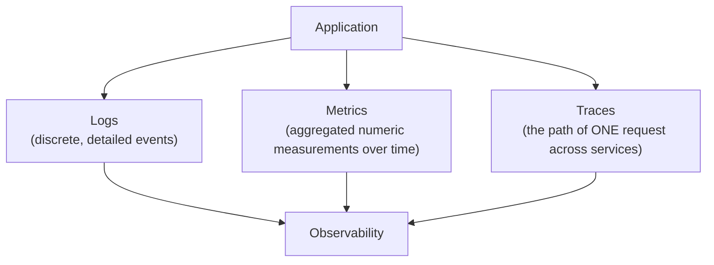
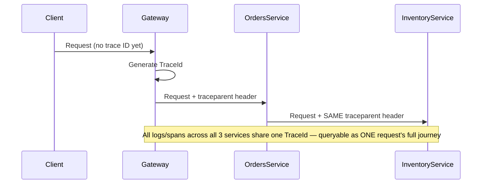

# 35 — Logging & Observability

## 🎯 Learning Objectives
- Implement structured logging with `ILogger` and a correlation ID strategy.
- Explain the difference between logs, metrics, and traces, and when each is the right tool.
- Configure health checks for a production service.

## 🤔 What is it?
Observability is the ability to understand a system's internal state from its external outputs — primarily **logs**, **metrics**, and **traces** — essential once a system is too complex (or too distributed) to reason about by just reading the code.

## 🧠 Core Concept

### Logs vs Metrics vs Traces



| | Logs | Metrics | Traces |
|---|---|---|---|
| Granularity | Per-event, detailed | Aggregated numbers (counters, histograms) | Per-request, spans across services |
| Question answered | "What exactly happened at 14:32:07?" | "Is error rate/latency trending up?" | "Where did *this specific* slow request spend its time?" |
| Volume | High | Low (pre-aggregated) | Medium |
| Tooling | Serilog/Seq, ELK | Prometheus/Grafana | OpenTelemetry, Jaeger, Zipkin |

### Structured logging with ILogger

```csharp
_logger.LogInformation("Order {OrderId} placed by customer {CustomerId} for {Total:C}",
    order.Id, order.CustomerId, order.Total);
```
Using **message templates** with named placeholders (not string interpolation) lets the logging provider capture `OrderId`, `CustomerId`, and `Total` as **structured, queryable fields**, not just baked into a flattened text string — this is what makes a query like "show me all orders over $500 placed by customer X" possible directly against the log store.

### Correlation ID & distributed tracing


OpenTelemetry standardizes this via the `traceparent` header and the concepts of **traces** (a full request's journey) made up of **spans** (a single unit of work within that journey, e.g. one service's handling of the request, or one database call).

### Health checks

```csharp
builder.Services.AddHealthChecks()
    .AddSqlServer(connectionString, name: "database")
    .AddCheck<RedisHealthCheck>("cache")
    .AddUrlGroup(new Uri("https://payments.internal/health"), name: "payments-dependency");

app.MapHealthChecks("/health/live", new HealthCheckOptions { Predicate = _ => false }); // liveness: is the process running at all?
app.MapHealthChecks("/health/ready", new HealthCheckOptions { Predicate = check => true }); // readiness: can it actually serve traffic?
```
**Liveness** vs **readiness** is an important distinction in orchestrated environments (Kubernetes): liveness failing means "restart this instance"; readiness failing means "stop routing traffic here, but don't restart it" (e.g. temporarily overloaded, or a dependency is down).

## 🏢 Real-World Example
A production incident: checkout latency spikes. **Metrics** (a Grafana dashboard) show p99 latency rising on the Orders service starting at 14:30. **Traces** for slow requests in that window show most time is spent in a call to the Inventory service. **Logs** from the Inventory service in that time window, filtered by the shared trace ID, reveal a specific SQL query timing out — the actual root cause. Each tool answered a different part of the question; none alone would have found it as fast.

## 🚀 Production-Ready Example — Serilog structured logging + correlation

```csharp
builder.Host.UseSerilog((context, services, configuration) => configuration
    .ReadFrom.Configuration(context.Configuration)
    .Enrich.FromLogContext()
    .Enrich.WithProperty("Service", "Orders.Api")
    .WriteTo.Console(new CompactJsonFormatter())
    .WriteTo.Seq("http://seq:5341"));

app.Use(async (context, next) =>
{
    var traceId = context.TraceIdentifier;
    using (LogContext.PushProperty("TraceId", traceId))
    {
        await next(context);
    }
});
```

## ⚠️ Common Mistakes
- Logging with string interpolation (`_logger.LogInformation($"Order {id} placed")`) instead of message templates, losing structured field querying.
- No correlation ID strategy — impossible to trace one user's request across multiple log streams/services.
- Logging sensitive data (passwords, full card numbers, tokens) in plaintext.
- Treating a single liveness/readiness check as sufficient without actually checking real dependencies (or, conversely, checking so many dependencies in liveness that a transient blip needlessly restarts a healthy process).

## ✅ Best Practices
- Always use structured logging (message templates), never string interpolation, for log calls.
- Propagate a correlation/trace ID through every service in a request's path.
- Separate liveness (is the process alive) from readiness (can it serve traffic) health checks.
- Alert on metrics/SLOs (error rate, latency percentiles), not on individual log lines.

## ⚡ Performance Considerations
- Excessive logging (especially at `Debug`/`Trace` level in production) has real I/O and storage cost — use log level filtering per environment, and sampling for very high-volume traces.

## 🔄 Related Concepts
- [17 — Middleware](../17-Middleware) (correlation ID middleware)
- [32 — Microservices](../32-Microservices) (why tracing becomes essential)
- [33 — Resilience](../33-Resilience) (observing circuit breaker state)

## 🎤 Interview Questions

**Junior:** "What's the difference between logs and metrics?"
*Expected:* Logs are detailed, discrete records of individual events; metrics are aggregated numeric measurements over time (counts, rates, percentiles) suited for dashboards and alerting on trends.

**Mid-level:** "Why use structured logging with message templates instead of string interpolation?"
*Expected:* Message templates preserve each value as a separate, typed, queryable field in the log store, enabling structured queries and aggregations; string interpolation flattens everything into unstructured text that's much harder to query/filter reliably at scale.

**Senior:** "How would you diagnose a slow request in a system with 10 microservices?"
*Expected:* Should describe using distributed tracing (a shared trace ID/OpenTelemetry spans) to see where time was actually spent across the call graph, then metrics to see if it's an isolated incident or a trend, then structured logs (filtered by that trace ID) from the specific slow service/span to find the root cause — a layered, evidence-driven diagnostic process rather than guessing which service to investigate first.

## 🧪 Practice Exercises

**Easy**
1. Replace string-interpolated log calls with structured message templates.
2. Add a liveness and a readiness health check to a Web API.
3. Configure Serilog to write structured JSON logs to the console.

**Medium**
1. Implement a correlation ID middleware and verify it appears in every log line for a request.
2. Add a custom health check verifying a specific downstream dependency.
3. Set up basic OpenTelemetry tracing across two services and view a trace spanning both.

**Hard**
1. Diagnose a simulated slow-request scenario using logs, metrics, and traces together, documenting which tool revealed which part of the picture.
2. Design an alerting strategy (which metrics, what thresholds) for a production Web API's SLOs.

**Real-world scenario:** Support receives a complaint about a failed checkout from a specific user, but there's no way to find their request in the logs among millions of others. Propose the observability changes needed to make this diagnosable next time.

## 📌 Key Takeaways
- Logs, metrics, and traces each answer a different question — use all three together, not just one.
- Structured logging with message templates (not string interpolation) is what makes logs queryable at scale.
- Separate liveness from readiness health checks; propagate a correlation/trace ID through every service a request touches.
