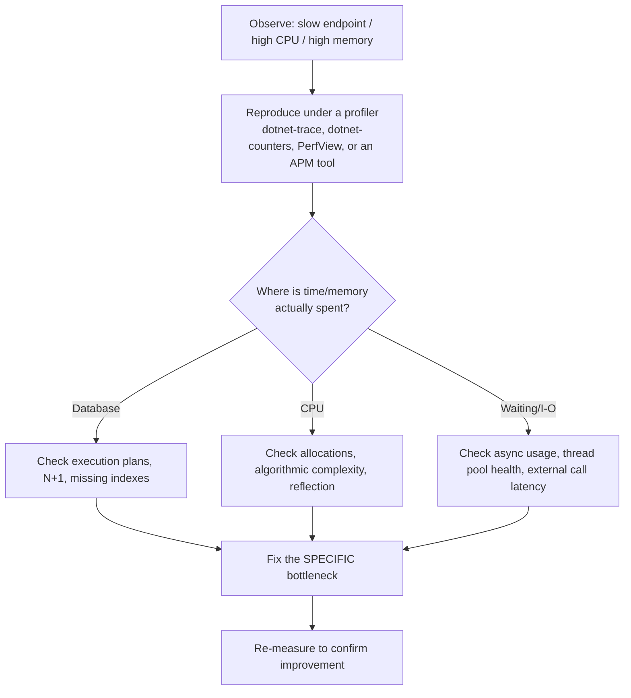

# 36 — Performance

## 🎯 Learning Objectives
- Know the highest-impact, most common .NET performance issues and their fixes.
- Use a profiler-driven, evidence-based approach instead of guessing.

## 🤔 What is it?
Performance engineering is the practice of identifying and eliminating the actual bottlenecks limiting a system's throughput/latency — driven by measurement, not intuition.

## 🧠 Core Concept — the usual suspects

### 1. Excessive allocations / GC pressure
Covered in depth in [13 — Memory & GC](../13-Memory-GC). Hot-path fixes: avoid boxing (use generics, [08](../08-Advanced-CSharp)), use `Span<T>`/`ArrayPool<T>` for buffer-heavy code, avoid unnecessary LINQ allocations (`.ToList()` calls that aren't needed) in tight loops.

### 2. Database performance
The single most common real-world bottleneck in business applications:
- N+1 queries (see [21 — EF Core](../21-Entity-Framework-Core)).
- Missing indexes (see [20 — SQL Server](../20-SQL-Server)).
- Loading full entities when only a few columns are needed — project with `.Select()` instead.
- Not reusing connections — always let connection pooling (on by default in ADO.NET/EF Core) do its job; don't manually open/close connections per tiny operation unnecessarily.

### 3. Async misuse
Blocking on async code (`.Result`/`.Wait()`), sequential awaits that could be `Task.WhenAll` (see [12 — Async/Await](../12-Async-Await)), and `async void` swallowing exceptions.

### 4. Serialization
`System.Text.Json` (source-generated serializers, in particular) is significantly faster and lower-allocation than `Newtonsoft.Json` for most workloads in modern .NET — worth benchmarking for high-throughput JSON-heavy services.

### 5. Caching
Recomputing/refetching the same expensive result repeatedly instead of caching (see [29 — Caching](../29-Caching)).

### 6. LINQ performance
`IEnumerable` LINQ has real per-call overhead (iterator allocation, delegate invocation) compared to a hand-written loop — usually negligible, but measurable in extremely hot, high-iteration-count paths. Also: multiple enumeration of an `IEnumerable` (calling `.Count()` then `.ToList()` on the same un-materialized query) can silently re-run the whole pipeline (or re-query a database) each time.

### 7. Reflection
Reflection-heavy code (naive property mapping, some older serializers/DI containers) is significantly slower than direct code — mitigated by caching `PropertyInfo`/compiled delegate lookups, or avoiding reflection in hot paths entirely via source generators.

### 8. Thread pool starvation
Blocking thread-pool threads (via `.Result`/`.Wait()`, or long synchronous CPU work on threads meant for I/O-bound async continuations) can starve the pool, causing seemingly unrelated requests to queue and slow down across the whole application.

### Connection pooling
ADO.NET (and therefore EF Core) pools physical database connections automatically behind the scenes — closing/disposing a `SqlConnection` returns it to the pool rather than actually tearing down the TCP connection, making "open late, close early" (via `using`) both correct **and** cheap.

## 🎨 Visual Explanation — how to actually find a bottleneck


The discipline that matters most: **never optimize without measuring first and after.** Intuition about where time goes is frequently wrong, even for experienced engineers.

## 🏢 Real-World Example
A checkout endpoint's p99 latency is 2 seconds. Profiling with `dotnet-trace` shows 90% of the time is spent in a single EF Core call — further investigation reveals it's the N+1 problem from a missing `.Include()`. Fixing that one query drops p99 to 150ms; no other change was needed, and no amount of "general" performance tuning elsewhere would have found this as fast as measuring first.

## 🚀 Production-Ready Example — before/after a targeted fix

```csharp
// BEFORE — N+1 query, string-based projection loaded as full entities
var orders = await _context.Orders.ToListAsync();
var result = orders.Select(o => new { o.Id, CustomerName = o.Customer.Name }).ToList(); // N additional queries

// AFTER — one query, only needed columns, no tracking overhead
var result = await _context.Orders
    .AsNoTracking()
    .Select(o => new { o.Id, CustomerName = o.Customer.Name })
    .ToListAsync();
```

## ⚠️ Common Mistakes
- Optimizing based on guesswork instead of profiler data ("premature optimization").
- Micro-optimizing CPU-bound code while the actual bottleneck is a database round trip 100x more expensive.
- Adding caching as a band-aid for a fundamentally inefficient query instead of fixing the query.
- Ignoring startup/cold-start performance in serverless/container environments where it directly affects cost and user-perceived latency.

## ✅ Best Practices
- Profile before optimizing, and measure again after, to confirm the fix actually helped.
- Fix the highest-impact bottleneck first (usually database access in business applications), not the easiest one to fix.
- Load-test realistic scenarios, not just isolated micro-benchmarks, before declaring a system "fast enough."

## ⚡ Performance Considerations
This entire module *is* performance considerations — the meta-lesson is that performance work should be **evidence-driven**: identify the actual bottleneck with a profiler/APM tool, fix specifically that, and measure the improvement, rather than applying "performance best practices" reflexively without knowing whether they address your system's actual bottleneck.

## 🔄 Related Concepts
- [08 — Advanced C#](../08-Advanced-CSharp) (generics, `Span<T>`)
- [10 — LINQ](../10-LINQ) (`IQueryable` vs `IEnumerable`)
- [12 — Async/Await](../12-Async-Await)
- [13 — Memory & GC](../13-Memory-GC)
- [21 — Entity Framework Core](../21-Entity-Framework-Core)
- [29 — Caching](../29-Caching)

## 🎤 Interview Questions

**Junior:** "What's the most common cause of slow performance in a typical business web application?"
*Expected:* Database access patterns — most commonly the N+1 query problem, missing indexes, or loading more data than necessary.

**Mid-level:** "Why is profiling before optimizing considered essential rather than optional?"
*Expected:* Intuition about where time/memory is actually spent is frequently wrong, even for experienced engineers; optimizing the wrong part wastes effort and risks introducing complexity/bugs for zero measurable benefit, while the real bottleneck remains untouched.

**Senior:** "Walk through your process for diagnosing a production service that's suddenly slower after a deployment."
*Expected:* Should describe a structured process: check recent changes/diffs first, use metrics to see what changed (latency, error rate, resource usage) and when, use tracing/profiling to localize where time is spent, form a hypothesis, verify it against evidence (not assumption), apply a targeted fix, and re-measure to confirm resolution — explicitly rejecting "just try things and see."

## 🧪 Practice Exercises

**Easy**
1. Identify and fix an N+1 query in a sample EF Core project.
2. Replace a hand-rolled string-interpolated log call in a hot loop with a properly leveled, cheap check.
3. Add `.AsNoTracking()` to a read-only query and explain the expected benefit.

**Medium**
1. Use `dotnet-counters` (or equivalent) to observe GC and thread pool metrics for a running app under load.
2. Benchmark `System.Text.Json` vs `Newtonsoft.Json` for a representative payload.
3. Reproduce and fix a multiple-enumeration bug on a deferred LINQ query.

**Hard**
1. Profile a deliberately inefficient sample application, identify the top bottleneck, fix it, and quantify the improvement.
2. Design and run a load test for an API endpoint, then use the results to justify (or rule out) a proposed optimization.

**Real-world scenario:** After a "performance improvement" release, CPU usage dropped but p99 latency got worse. Explain how this can happen and how you'd investigate.

## 📌 Key Takeaways
- Database access is the most common real-world bottleneck in business applications — check there first.
- Always profile before and after optimizing; intuition is frequently wrong.
- Fix the highest-impact bottleneck, not the easiest one.
