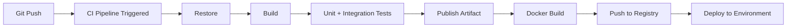

# 38 — CI/CD

## 🎯 Learning Objectives
- Design a GitHub Actions pipeline covering restore/build/test/publish/containerize/deploy.
- Explain why each pipeline stage exists and what failing at each stage should mean.

## 🤔 What is it?
**Continuous Integration (CI)** automatically builds and tests every code change; **Continuous Deployment/Delivery (CD)** automatically (or semi-automatically) ships passing changes toward production.

## ❓ Why do we need it?
Manual build/test/deploy processes are slow, inconsistent, and error-prone (a step forgotten under deadline pressure). Automating the pipeline makes every change go through the exact same verification and deployment steps, every time, catching regressions before they reach users.

> 📎 **This repository has a real, working CI pipeline**: [`.github/workflows/ci.yml`](../.github/workflows/ci.yml) discovers every `.sln` under [`40-Projects/`](../40-Projects) and runs `restore` → `build` → `test` on each, in a matrix, on every push and PR. It's the restore/build/test portion of the example below, not a hypothetical snippet — read it alongside this module.

## 🧠 Core Concept — Pipeline stages


Each stage should **fail fast**: if `Restore` fails (bad dependency), don't waste time running `Build`; if `Test` fails, never reach `Deploy` — a failing stage should hard-stop the pipeline.

### GitHub Actions example

```yaml
name: CI/CD

on:
  push:
    branches: [main]
  pull_request:
    branches: [main]

jobs:
  build-and-test:
    runs-on: ubuntu-latest
    steps:
      - uses: actions/checkout@v4

      - name: Setup .NET
        uses: actions/setup-dotnet@v4
        with:
          dotnet-version: '8.0.x'

      - name: Restore
        run: dotnet restore

      - name: Build
        run: dotnet build --no-restore -c Release

      - name: Test
        run: dotnet test --no-build -c Release --logger "trx" --collect:"XPlat Code Coverage"

      - name: Publish test results
        if: always()
        uses: dorny/test-reporter@v1
        with:
          path: "**/*.trx"
          reporter: dotnet-trx

  docker-build-push:
    needs: build-and-test
    if: github.ref == 'refs/heads/main'
    runs-on: ubuntu-latest
    steps:
      - uses: actions/checkout@v4
      - name: Build and push image
        run: |
          docker build -t myregistry.azurecr.io/orders-api:${{ github.sha }} .
          docker push myregistry.azurecr.io/orders-api:${{ github.sha }}

  deploy:
    needs: docker-build-push
    runs-on: ubuntu-latest
    environment: production
    steps:
      - name: Deploy to Azure App Service
        uses: azure/webapps-deploy@v3
        with:
          app-name: orders-api-prod
          images: myregistry.azurecr.io/orders-api:${{ github.sha }}
```

### Key design decisions
- **Trigger on both `push` to main and `pull_request`** — PRs get build/test feedback before merge; main branch pushes additionally trigger deployment stages.
- **`needs:` dependencies** — `docker-build-push` only runs after `build-and-test` succeeds; `deploy` only after the image is pushed — this *is* the fail-fast principle expressed structurally.
- **Tag images with the commit SHA**, not just `latest` — makes every deployed artifact traceable to an exact commit, and rollback trivial (redeploy a previous SHA's image).
- **`environment: production`** — can require manual approval gates in GitHub before deployment proceeds, appropriate for production even in an otherwise automated pipeline.

## 🏢 Real-World Example
A pull request triggers `build-and-test` only (no deploy stages run, since the `if: github.ref == 'refs/heads/main'` condition isn't met) — reviewers see a green/red check directly on the PR before approving, catching regressions pre-merge rather than post-deploy.

## ⚠️ Common Mistakes
- No automated tests in the pipeline — CI becomes just "does it compile," missing the majority of real regressions.
- Deploying directly from a developer's machine instead of exclusively through the pipeline, causing "it worked when I deployed it manually" drift from what's actually tested.
- Tagging images only as `latest`, making rollback and audit trails impossible ("which commit is actually running in production right now?").
- No fail-fast: letting a build with failing tests continue to a deploy stage anyway.

## ✅ Best Practices
- Every stage should fail fast and block subsequent stages.
- Tag artifacts/images with immutable identifiers (commit SHA), never solely `latest`.
- Require CI to pass before a PR can merge (branch protection rules).
- Keep production deployment behind an explicit approval gate, even in a highly automated pipeline, for genuinely high-risk services.

## ⚡ Performance Considerations
- Cache NuGet packages and Docker layers between runs to keep CI fast — slow CI directly slows down the whole team's iteration speed.
- Run test suites in parallel where possible (splitting by project/category) to reduce pipeline wall-clock time.

## 🔄 Related Concepts
- [34 — Testing](../34-Testing)
- [37 — Docker](../37-Docker)
- [39 — Azure](../39-Azure)

## 🎤 Interview Questions

**Junior:** "What's the difference between Continuous Integration and Continuous Deployment?"
*Expected:* CI automatically builds and tests every change to catch integration issues early; CD automatically (or with a gated approval) ships passing changes further toward, or into, production.

**Mid-level:** "Why should you tag Docker images with a commit SHA instead of only `latest`?"
*Expected:* `latest` is mutable and ambiguous — you can't tell which code is actually running or safely roll back to a known-good version; a SHA tag makes every deployed image traceable to an exact commit and trivially reproducible/rollback-able.

**Senior:** "Design a CI/CD pipeline for a multi-service application where services should be deployable independently but share common quality gates."
*Expected:* Should discuss per-service pipelines (triggered by changes scoped to that service's path) sharing common reusable workflow definitions/templates for quality gates (build, test, security scan), independent versioning/tagging per service, and a deployment strategy (e.g. per-service approval gates) that doesn't force unrelated services to deploy together.

## 🧪 Practice Exercises

**Easy**
1. Write a GitHub Actions workflow running `dotnet restore`/`build`/`test` on every push.
2. Add branch protection requiring the workflow to pass before merging to main.
3. Add test result reporting visible directly on the PR.

**Medium**
1. Add a Docker build/push stage that only runs on `main`, tagged with the commit SHA.
2. Add a deployment stage to a free-tier cloud target, gated on the previous stages succeeding.
3. Add NuGet package caching to speed up the restore step.

**Hard**
1. Design a pipeline for a multi-project solution where only changed projects rebuild/redeploy.
2. Implement a blue/green or canary deployment strategy conceptually within a GitHub Actions workflow targeting Azure App Service slots.

**Real-world scenario:** A production incident traces back to a hotfix a developer deployed manually, bypassing the pipeline's test suite, which would have caught the regression. Propose process and technical changes to prevent recurrence.

## 📌 Key Takeaways
- Every pipeline stage should fail fast, blocking subsequent stages on failure.
- Tag every build artifact with an immutable identifier (commit SHA) for traceability and rollback.
- CI/CD should be the *only* path to production — manual deploys bypass exactly the verification the pipeline exists to provide.
