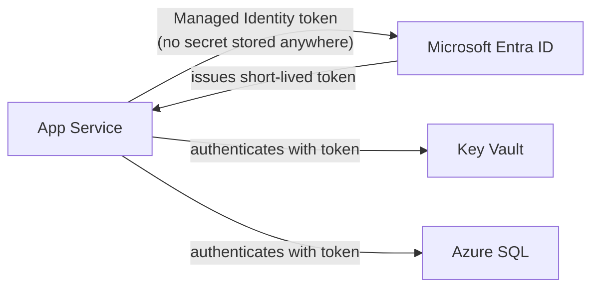

# 39 — Azure / Cloud

## 🎯 Learning Objectives
- Understand the purpose of the core Azure services a typical .NET application uses.
- Understand Managed Identity and why it replaces stored credentials.
- Focus on architectural understanding, not service-by-service memorization.

## 🤔 What is it?
Cloud platforms like Azure provide managed infrastructure (compute, storage, databases, messaging, identity) so teams don't have to build and operate their own data centers — the goal of this module is understanding **what role each service plays architecturally**, not memorizing every product name.

## 🧠 Core Concept — Mapping .NET concepts to Azure services

| .NET/Architecture concept | Azure service | Role |
|---|---|---|
| Hosting a Web API | **App Service** | Managed hosting for web apps — handles OS patching, scaling, TLS |
| Serverless background/event processing | **Azure Functions** | Event-triggered, pay-per-execution compute — natural fit for [30 — Background Services](../30-Background-Services)-style work without managing a host |
| SQL Server database ([20](../20-SQL-Server)) | **Azure SQL Database** | Managed relational database — same T-SQL surface, no server patching/backup management |
| File/blob storage | **Azure Storage (Blob)** | Durable object storage for files, images, backups |
| Secrets management ([15](../15-DotNet-Fundamentals), [23](../23-Security)) | **Key Vault** | Centralized, access-controlled secret/certificate/key storage |
| Distributed cache ([29](../29-Caching)) | **Azure Cache for Redis** | Managed Redis instance |
| Message broker ([31](../31-Messaging)) | **Service Bus** | Managed queues/topics with dead-lettering, sessions |
| Container hosting ([37](../37-Docker)) | **Container Apps / AKS** | Managed container orchestration (Container Apps = simpler, AKS = full Kubernetes control) |
| Observability ([35](../35-Observability)) | **Application Insights** | Distributed tracing, metrics, logs — an Azure-native APM/OpenTelemetry-compatible service |
| Service-to-service auth without secrets | **Managed Identity** | Lets an Azure resource (App Service, Function) authenticate to other Azure services (Key Vault, SQL, Storage) without any stored credential at all |

### Managed Identity — the architecturally important one


Instead of storing a connection string/API key (which could leak), the App Service is granted an **identity** in Microsoft Entra ID (formerly Azure AD); Azure's platform automatically issues it short-lived tokens it can use to authenticate to other Azure services that trust that identity and have been explicitly granted it access — eliminating an entire class of "leaked secret" security incidents, because there's no long-lived secret to leak in the first place.

```csharp
// With Managed Identity, no connection string secret needed for Key Vault access
builder.Configuration.AddAzureKeyVault(
    new Uri("https://myvault.vault.azure.net/"),
    new DefaultAzureCredential()); // resolves to the Managed Identity automatically when running in Azure
```

## 🏢 Real-World Example
An Orders API runs on App Service with a system-assigned Managed Identity, granted read access to a Key Vault secret (the SQL connection string) and direct SQL access via Azure SQL's Entra ID authentication — no credential is ever stored in `appsettings.json`, an environment variable, or a CI/CD pipeline secret at all, closing off the most common real-world path to a credential leak.

## ⚠️ Common Mistakes
- Storing connection strings/API keys in App Service configuration as plaintext when Managed Identity + Key Vault would eliminate the secret entirely.
- Treating cloud services as a checklist to memorize rather than understanding the architectural role each fills (which is directly transferable to AWS/GCP equivalents).
- Over-provisioning (always-on, maximum-tier resources) without understanding the actual load profile, driving unnecessary cost.
- Ignoring region/latency — placing compute and its database in different regions, adding needless network latency to every call.

## ✅ Best Practices
- Prefer Managed Identity over stored credentials wherever the target service supports it.
- Use Key Vault for any secret that must exist, and reference it rather than copying its value into app configuration.
- Right-size and autoscale compute resources based on actual observed load ([36 — Performance](../36-Performance)), not guesswork.
- Keep compute and its primary data store co-located in the same region.

## ⚡ Performance Considerations
- Cross-region calls add real, often underestimated latency — architecture diagrams should include region placement, not just logical service boundaries.
- Serverless (Functions) cold starts matter for latency-sensitive, infrequently-invoked workloads — mitigated by "Always Ready" instances/premium plans, or by choosing App Service/containers instead for consistently warm, latency-sensitive workloads.

## 🔄 Related Concepts
- [23 — Security](../23-Security) (secrets management)
- [29 — Caching](../29-Caching)
- [31 — Messaging](../31-Messaging)
- [37 — Docker](../37-Docker)

## 🎤 Interview Questions

**Junior:** "What is Azure App Service used for?"
*Expected:* Managed hosting for web applications/APIs — Azure handles the underlying OS, patching, and scaling, so teams deploy code without managing servers directly.

**Mid-level:** "What problem does Managed Identity solve?"
*Expected:* Eliminates the need to store long-lived credentials (connection strings, API keys) for authenticating to other Azure services — the compute resource itself has a platform-issued identity and short-lived tokens, removing an entire class of credential-leak risk.

**Senior:** "How would you design secret and credential management for a multi-service application deployed to Azure?"
*Expected:* Should describe: Managed Identity as the default authentication mechanism between Azure resources wherever supported, Key Vault for any secret that must exist independently (third-party API keys), least-privilege role assignments scoped per service/identity (not one shared identity for everything), and no secrets ever committed to source control or baked into container images.

## 🧪 Practice Exercises

**Easy**
1. Deploy a simple Web API to Azure App Service (or a free-tier equivalent).
2. Store a secret in Key Vault and reference it from `appsettings.json`-style configuration.
3. Map 5 Azure services to the .NET concepts they support, from the table above, in your own words.

**Medium**
1. Configure a system-assigned Managed Identity for an App Service and grant it Key Vault read access.
2. Set up Application Insights and observe a trace for a sample request.
3. Configure Azure SQL Database with Entra ID (Managed Identity) authentication instead of a SQL login.

**Hard**
1. Design a full architecture diagram for the Warehouse Management System capstone project ([40](../40-Projects)) using appropriate Azure services for each concern.
2. Compare Container Apps vs AKS for a given workload and justify a choice based on operational complexity vs control trade-offs.

**Real-world scenario:** A security audit finds a database connection string stored in plaintext in an App Service's application settings. Propose the Managed Identity + Key Vault migration path to eliminate it.

## 📌 Key Takeaways
- Understand the architectural *role* each cloud service fills — this knowledge transfers across cloud providers.
- Managed Identity eliminates stored credentials for service-to-service authentication within Azure — prefer it by default.
- Keep compute and data co-located by region; right-size resources based on measured load, not guesswork.
