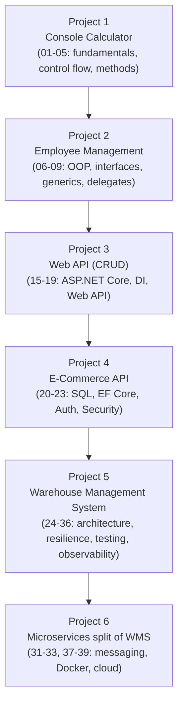

# 40 — Projects: Progressive Learning Path

Real skill comes from building, not just reading. Work through these projects **in order** — each introduces new concepts on top of the last.

## Project 1 — Console Calculator
**Concepts:** variables, control flow, methods, exception handling.
Build a REPL-style calculator supporting `+ - * /`, parentheses, and graceful error messages for invalid input (division by zero, malformed expressions). Add a history feature using a `List<string>`.

## Project 2 — Employee Management (OOP)
**Concepts:** OOP, interfaces, generics, collections, LINQ.
Model `Employee → Manager → Executive` with polymorphic `CalculateBonus()`. Store employees in a generic `Repository<T>`. Use LINQ to report headcount by department, average salary, and top earners.

## Project 3 — Web API (CRUD)
**Concepts:** ASP.NET Core, DI, Web API, in-memory or simple file-based persistence.
Build a Task/Todo API with full CRUD, DTOs, pagination, and Swagger. No database yet — focus entirely on getting the API layer right.

## Project 4 — E-Commerce API
**Concepts:** SQL Server, EF Core, JWT auth, security.
Extend to Products/Orders/Customers backed by EF Core + SQL Server, with JWT authentication, role-based authorization (`Customer` vs `Admin`), and OWASP-aware input handling.

## Project 5 — Warehouse Management System (capstone)
See [`WarehouseManagementSystem/README.md`](./WarehouseManagementSystem/README.md) — the full capstone applying Clean Architecture, DDD, caching, background jobs, resilience, testing, and observability together.

## Project 6 — Microservices split of WMS
**Concepts:** messaging, sagas, Docker, CI/CD, cloud deployment.
Extract the WMS's Shipping module into its own service communicating via events (see [31](../31-Messaging), [32](../32-Microservices)), containerized and deployed via the CI/CD pipeline from [38](../38-CI-CD).

## 📌 How to use these projects
- Don't skip ahead — each project deliberately withholds concepts from later modules so you build them with what you've actually learned so far, then refactor once you learn better tools.
- After finishing each project, go back and refactor it using the *next* module's concepts as a deliberate exercise (e.g. after learning SOLID, refactor Project 2).
