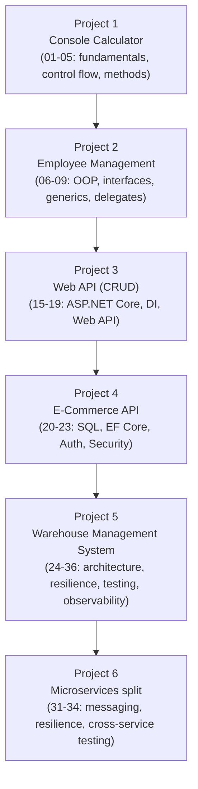

# 40 — Projects: Progressive Learning Path

Real skill comes from building, not just reading. Work through these projects **in order** — each introduces new concepts on top of the last. **All six are implemented, buildable, and tested** — this isn't just a reading plan, it's real code:

```bash
# From the repo root — every project's tests, all in one run:
for d in 40-Projects/*/; do sln=$(find "$d" -maxdepth 1 -name "*.sln"); [ -n "$sln" ] && (cd "$d" && dotnet test); done
```
CI runs exactly this discovery logic on every push — see [`.github/workflows/ci.yml`](../.github/workflows/ci.yml).



## Project 1 — Console Calculator ✅
**Concepts:** variables, control flow, methods, exception handling.
[`01-ConsoleCalculator/`](./01-ConsoleCalculator) — a REPL-style calculator supporting `+ - * /`, parentheses, and unary minus via a hand-written recursive-descent parser, with a `history` command. **14 tests.**

## Project 2 — Employee Management (OOP) ✅
**Concepts:** OOP, interfaces, generics, collections, LINQ.
[`02-EmployeeManagement/`](./02-EmployeeManagement) — `Employee → Manager → Executive` with polymorphic `CalculateBonus()`, a generic `Repository<T>`, and LINQ-based reporting. **17 tests.**

## Project 3 — Web API (CRUD) ✅
**Concepts:** ASP.NET Core, DI, Web API, in-memory persistence.
[`03-TodoApi/`](./03-TodoApi) — full Todo CRUD via Minimal APIs, DTOs, correct status codes, `WebApplicationFactory` integration tests. **9 tests.**

## Project 4 — E-Commerce API ✅
**Concepts:** EF Core, JWT auth, security.
[`04-ECommerceApi/`](./04-ECommerceApi) — Products/Orders/Users backed by EF Core (SQLite), JWT authentication, role-based authorization (`Customer` vs `Admin`), and a passing anti-IDOR test (object-level authorization). **17 tests.**

## Project 5 — Warehouse Management System (capstone) 🚧
See [`WarehouseManagementSystem/README.md`](./WarehouseManagementSystem/README.md) — the full capstone applying Clean Architecture, DDD, caching, background jobs, resilience, testing, and observability together. **First milestone done** (`StockItem` aggregate, full Clean Architecture skeleton, EF Core + SQLite, 21 tests); `Order` aggregate and the remaining modules are the documented next steps.

## Project 6 — Microservices Split ✅
**Concepts:** service boundaries, resilience, idempotency, cross-service testing.
[`06-Microservices/`](./06-Microservices) — two independently runnable services (OrdersService, NotificationsService) communicating over HTTP with a Polly retry policy, an idempotent webhook consumer, and a genuine cross-service integration test wiring two separate `WebApplicationFactory` instances together. **7 tests.** (Uses HTTP instead of a real message broker — see that project's README for exactly what changes with one.)

## 📌 How to use these projects
- Don't skip ahead — each project deliberately withholds concepts from later modules so you build them with what you've actually learned so far, then refactor once you learn better tools.
- After finishing each project, go back and refactor it using the *next* module's concepts as a deliberate exercise (e.g. after learning SOLID, refactor Project 2).
- Every project's own `README.md` has a **What to try next** section — treat those as the natural continuation once you've understood what's there.
