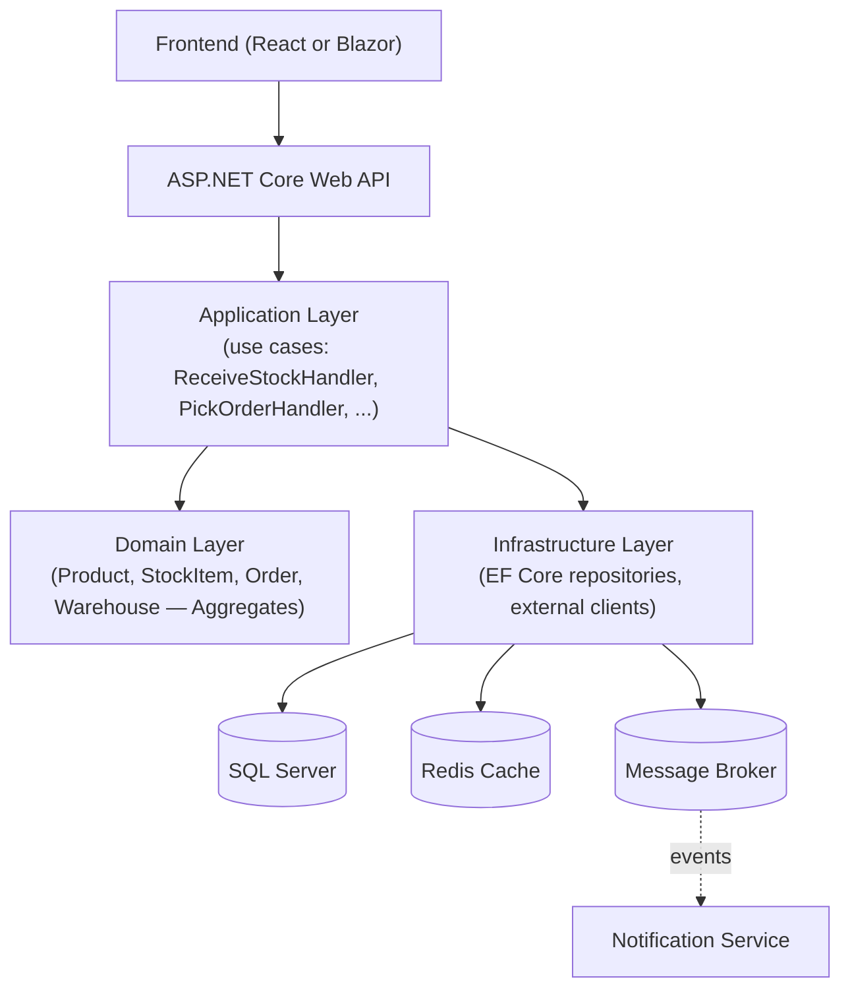
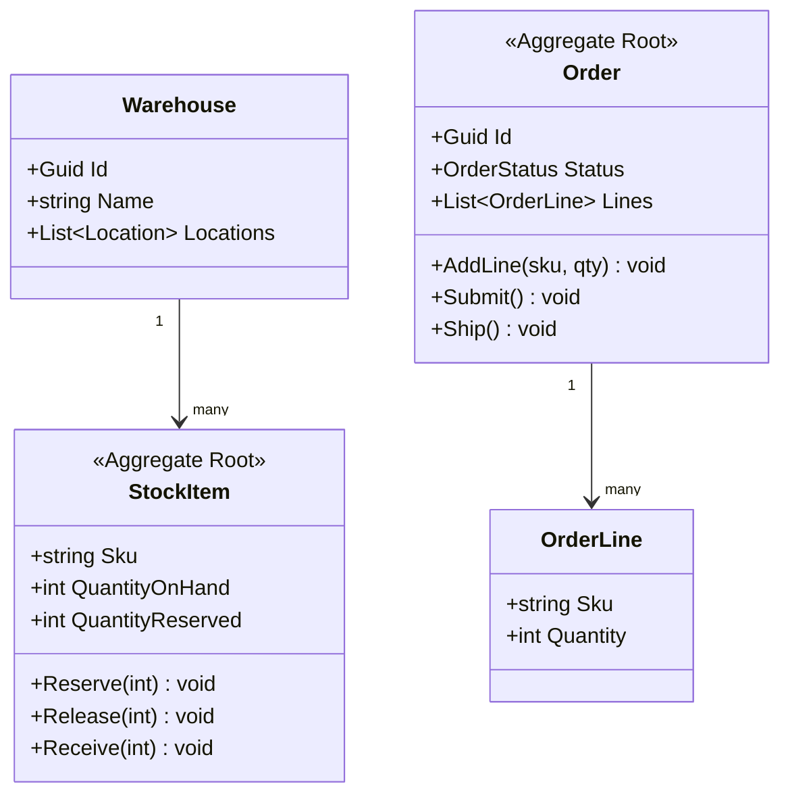

# Warehouse Management System (WMS) — Capstone Project

## 🎯 Purpose
This project is where every module in this repository comes together into one realistic, production-shaped enterprise system. It is deliberately larger than a tutorial CRUD app: it has enough real business complexity (inventory consistency, multi-step workflows, concurrent operations) to justify the architectural decisions taught throughout this repo.

## ✅ Implementation status

The **first milestone** (see bottom of this file) is implemented, buildable, and tested — this is real, runnable code, not just a plan:

```
WMS.sln
├── src/
│   ├── WMS.Domain/          — StockItem aggregate root (zero package/project references)
│   ├── WMS.Application/     — IStockRepository + CreateStockItem/ReceiveStock/ReserveStock use cases
│   ├── WMS.Infrastructure/  — EF Core (SQLite) WmsDbContext + StockRepository + DI wiring
│   └── WMS.Api/             — Minimal API endpoints + global exception-handling middleware
└── tests/
    ├── WMS.Domain.Tests/    — 14 unit tests on StockItem's invariants
    └── WMS.Api.Tests/       — 7 integration tests via WebApplicationFactory + real in-memory SQLite
```

```bash
dotnet test    # from this directory — 21 tests, all passing
dotnet run --project src/WMS.Api    # then browse /swagger
```

Everything below **Modules** and **Architecture** describes the *full* target scope (Orders, Auth, Shipping, Redis, message broker, Azure/Docker deployment) — those are the next milestones, not yet implemented. Read the [Definition of Done](#-definition-of-done-for-the-capstone) checklist to see exactly what's left.

## 🧩 Modules

- Authentication & Users & Roles
- Warehouses & Locations
- Products & Inventory
- Inbound (receiving stock)
- Outbound (picking, packing, shipping)
- Orders
- Reports
- Notifications

## 🏗️ Architecture


This is [26 — Clean Architecture](../../26-Clean-Architecture) applied directly: Domain has zero framework references; Application defines repository/service interfaces; Infrastructure implements them; the API project wires everything via DI ([18](../../18-Dependency-Injection)).

## 🧠 Domain Model (DDD — see [27](../../27-DDD))



- `StockItem` and `Order` are separate **Aggregate Roots** with their own consistency boundaries — an order being placed doesn't lock the entire warehouse; only the specific `StockItem`s it touches are affected, via a **Saga** (see [32 — Microservices](../../32-Microservices)) coordinating "reserve stock → confirm order."

## 📋 Implementation Plan (progressive, module-mapped)

1. **Domain + Application layers** — pure C#, no framework (modules [06](../../06-OOP), [25](../../25-SOLID), [27](../../27-DDD)).
2. **Persistence** — EF Core, migrations, repository implementations (module [21](../../21-Entity-Framework-Core)).
3. **API layer** — Controllers/Minimal APIs, DTOs, versioning (module [19](../../19-Web-API)).
4. **Auth** — JWT-based login, role-based authorization for Warehouse Staff vs Managers vs Admins (module [22](../../22-Authentication)).
5. **Caching** — cache product catalog lookups (module [29](../../29-Caching)).
6. **Background jobs** — nightly stock reconciliation, expired-reservation cleanup (module [30](../../30-Background-Services)).
7. **Resilience** — retries/circuit breakers around any external shipping-carrier API integration (module [33](../../33-Resilience)).
8. **Testing** — unit tests for domain invariants, integration tests for the API + database (module [34](../../34-Testing)).
9. **Observability** — structured logging, correlation IDs, health checks (module [35](../../35-Observability)).
10. **Containerize & deploy** — Docker + CI/CD pipeline to a cloud environment (modules [37](../../37-Docker), [38](../../38-CI-CD), [39](../../39-Azure)).
11. **(Extension) Microservices split** — extract Shipping as an independent service communicating via events (modules [31](../../31-Messaging), [32](../../32-Microservices)).

## ✅ Definition of Done for the capstone
- [x] Domain layer has zero framework/NuGet references — verified: `WMS.Domain.csproj` has no `<PackageReference>` or `<ProjectReference>` at all.
- [x] The `StockItem` invariant (reserved can never exceed on-hand) is enforced inside the aggregate, not in a service or controller — see `StockItem.Reserve()`.
- [x] `StockItem`'s write operations are covered by unit tests (14) and its API endpoints by integration tests (7).
- [ ] `Order` aggregate + picking/packing/shipping workflow (module [27 — DDD](../../27-DDD)'s `Order`/`OrderLine`).
- [ ] JWT authentication + role-based authorization (module [22](../../22-Authentication)).
- [ ] Caching for product catalog lookups (module [29](../../29-Caching)).
- [ ] Background jobs for reconciliation/cleanup (module [30](../../30-Background-Services)).
- [ ] The API runs correctly via `docker-compose up` with a real SQL Server and Redis instance (currently uses SQLite for zero-dependency local development).
- [ ] CI pipeline builds, tests, and containerizes on every push (module [38](../../38-CI-CD)).
- [ ] Structured logs include a correlation ID traceable across a full request (module [35](../../35-Observability)).

## 🧪 First milestone — done; here's what to build next
The suggested first milestone (`StockItem` aggregate + `IStockRepository` + `ReceiveStockHandler`, end to end, with unit and integration tests) is complete — see **Implementation status** above. The natural next vertical slice is the `Order` aggregate: add `Order`/`OrderLine` to `WMS.Domain`, an `IOrderRepository` + `PlaceOrderHandler`/`ShipOrderHandler` to `WMS.Application`, an EF Core mapping + repository to `WMS.Infrastructure`, and endpoints to `WMS.Api` — then wire `PlaceOrderHandler` to call `StockItem.Reserve()` across the two aggregates, which is where you'll first feel the need for the **Saga**-style coordination described in [32 — Microservices](../../32-Microservices) even within a single monolith's application layer.
