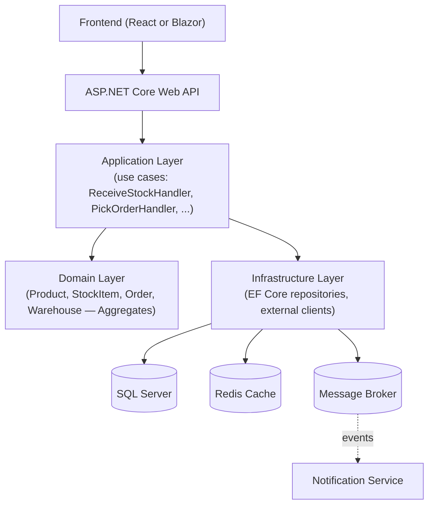
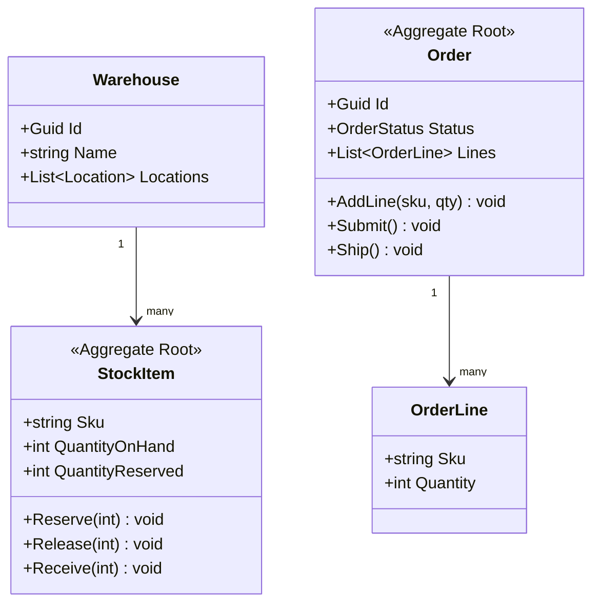

# Warehouse Management System (WMS) — Capstone Project

## 🎯 Purpose
This project is where every module in this repository comes together into one realistic, production-shaped enterprise system. It is deliberately larger than a tutorial CRUD app: it has enough real business complexity (inventory consistency, multi-step workflows, concurrent operations) to justify the architectural decisions taught throughout this repo.

## 🧩 Modules

- Authentication & Users & Roles
- Warehouses & Locations
- Products & Inventory
- Inbound (receiving stock)
- Outbound (picking, packing, shipping)
- Orders
- Reports
- Notifications

## 🏗️ Architecture

This is [26 — Clean Architecture](../../26-Clean-Architecture) applied directly: Domain has zero framework references; Application defines repository/service interfaces; Infrastructure implements them; the API project wires everything via DI ([18](../../18-Dependency-Injection)).

## 🧠 Domain Model (DDD — see [27](../../27-DDD))

- `StockItem` and `Order` are separate **Aggregate Roots** with their own consistency boundaries — an order being placed doesn't lock the entire warehouse; only the specific `StockItem`s it touches are affected, via a **Saga** (see [32 — Microservices](../../32-Microservices)) coordinating "reserve stock → confirm order."

## 📋 Implementation Plan (progressive, module-mapped)

1. **Domain + Application layers** — pure C#, no framework (modules [06](../../06-OOP), [25](../../25-SOLID), [27](../../27-DDD)).
2. **Persistence** — EF Core, migrations, repository implementations (module [21](../../21-Entity-Framework-Core)).
3. **API layer** — Controllers/Minimal APIs, DTOs, versioning (module [19](../../19-Web-API)).
4. **Auth** — JWT-based login, role-based authorization for Warehouse Staff vs Managers vs Admins (module [22](../../22-Authentication)).
5. **Caching** — cache product catalog lookups (module [29](../../29-Caching)).
6. **Background jobs** — nightly stock reconciliation, expired-reservation cleanup (module [30](../../30-Background-Services)).
7. **Resilience** — retries/circuit breakers around any external shipping-carrier API integration (module [33](../../33-Resilience)).
8. **Testing** — unit tests for domain invariants, integration tests for the API + database (module [34](../../34-Testing)).
9. **Observability** — structured logging, correlation IDs, health checks (module [35](../../35-Observability)).
10. **Containerize & deploy** — Docker + CI/CD pipeline to a cloud environment (modules [37](../../37-Docker), [38](../../38-CI-CD), [39](../../39-Azure)).
11. **(Extension) Microservices split** — extract Shipping as an independent service communicating via events (modules [31](../../31-Messaging), [32](../../32-Microservices)).

## ✅ Definition of Done for the capstone
- [ ] Domain layer has zero framework/NuGet references.
- [ ] All aggregate invariants (no negative stock, no shipping unpaid orders) are enforced inside the aggregate, not in a service or controller.
- [ ] Every write endpoint is covered by at least one integration test; every domain invariant by at least one unit test.
- [ ] The API runs correctly via `docker-compose up` with a real SQL Server and Redis instance.
- [ ] CI pipeline builds, tests, and containerizes on every push.
- [ ] Structured logs include a correlation ID traceable across a full request.

## 🧪 Suggested first milestone
Implement just the `StockItem` aggregate + `IStockRepository` + one use case (`ReceiveStockHandler`) end to end, with unit and integration tests, before adding any other module — get one vertical slice fully working through every architectural layer before expanding horizontally.
