# C# & .NET End-to-End Learning Repository

A complete, self-contained learning system for C# and .NET — from absolute fundamentals to enterprise-grade architecture. This is not a collection of shallow notes. It is structured as a **course + interview prep guide + practical reference + architecture handbook**, meant to take you from "can write basic code" to **architect-level understanding**.

## How this repository is built

Every topic follows a fixed teaching progression so concepts are never just defined — they're *understood*:

```
Concept → Why? → Real-world analogy → Visual explanation → Simple example
    → Code walkthrough → Internal working → Real-world example
    → Enterprise implementation → Common mistakes → Best practices
    → Performance → Interview questions → Practice exercises → Mini project
```

And every topic is explained at four levels of depth:

```
Beginner understanding → Developer understanding → Senior developer understanding → Architect understanding
```

See [`_template/TOPIC_TEMPLATE.md`](./_template/TOPIC_TEMPLATE.md) for the exact Markdown structure every topic file follows.

## Curriculum Map

```mermaid
flowchart TD
    subgraph L["Language: C#"]
        A[01 C# Fundamentals] --> B[02 Data Types]
        B --> C[03 Value vs Reference Types]
        C --> D[04 Control Flow]
        D --> E[05 Methods]
        E --> F[06 OOP]
        F --> G[07 Interfaces]
        G --> H[08 Advanced C#]
        H --> I[09 Delegates & Events]
        I --> J[10 LINQ]
        J --> K[11 Exception Handling]
        K --> M[12 Async/Await]
        M --> N[13 Memory & GC]
        N --> O[14 Modern C#]
    end

    subgraph P["Platform: .NET & Web"]
        O --> P1[15 .NET Fundamentals]
        P1 --> P2[16 ASP.NET Core]
        P2 --> P3[17 Middleware]
        P3 --> P4[18 Dependency Injection]
        P4 --> P5[19 Web API]
        P5 --> P6[20 SQL Server]
        P6 --> P7[21 EF Core]
        P7 --> P8[22 Authentication]
        P8 --> P9[23 Security]
    end

    subgraph AR["Architecture & Design"]
        P9 --> AR1[24 Design Patterns]
        AR1 --> AR2[25 SOLID]
        AR2 --> AR3[26 Clean Architecture]
        AR3 --> AR4[27 DDD]
        AR4 --> AR5[28 Architecture Styles]
    end

    subgraph SC["Scale & Production"]
        AR5 --> SC1[29 Caching]
        SC1 --> SC2[30 Background Services]
        SC2 --> SC3[31 Messaging]
        SC3 --> SC4[32 Microservices]
        SC4 --> SC5[33 Resilience]
        SC5 --> SC6[34 Testing]
        SC6 --> SC7[35 Observability]
        SC7 --> SC8[36 Performance]
    end

    subgraph OPS["Ship It"]
        SC8 --> OP1[37 Docker]
        OP1 --> OP2[38 CI/CD]
        OP2 --> OP3[39 Azure/Cloud]
        OP3 --> OP4[40 Projects: WMS]
    end
```



## Repository Structure

| # | Module | Focus |
|---|--------|-------|
| 01 | [C# Fundamentals](./01-CSharp-Fundamentals) | CLR, IL, JIT, assemblies, compilation pipeline |
| 02 | [Data Types](./02-Data-Types) | Primitives, `var`, `dynamic`, `DateTime`, `Guid` |
| 03 | [Value vs Reference Types](./03-Value-vs-Reference-Types) | Stack/heap, boxing, structs vs classes vs records |
| 04 | [Control Flow](./04-Control-Flow) | Operators, branching, loops, pattern matching |
| 05 | [Methods](./05-Methods) | Parameters, overloading, local functions |
| 06 | [OOP](./06-OOP) | Encapsulation, inheritance, polymorphism |
| 07 | [Interfaces vs Abstract Classes](./07-Interfaces) | Contracts vs partial implementation |
| 08 | [Advanced C#](./08-Advanced-CSharp) | Generics, collections, `Span<T>` |
| 09 | [Delegates & Events](./09-Delegates-Events) | `Func`, `Action`, pub/sub |
| 10 | [LINQ](./10-LINQ) | Deferred execution, `IEnumerable` vs `IQueryable` |
| 11 | [Exception Handling](./11-Exception-Handling) | `try/catch`, custom exceptions, global handling |
| 12 | [Async/Await](./12-Async-Await) | Task, state machines, `CancellationToken` |
| 13 | [Memory & GC](./13-Memory-GC) | Generations, `IDisposable`, memory leaks |
| 14 | [Modern C#](./14-Modern-CSharp) | Records, pattern matching, primary constructors |
| 15 | [.NET Fundamentals](./15-DotNet-Fundamentals) | SDK, runtime, NuGet, csproj |
| 16 | [ASP.NET Core](./16-ASPNet-Core) | Request pipeline, Kestrel, Minimal APIs |
| 17 | [Middleware](./17-Middleware) | Pipeline ordering, custom middleware |
| 18 | [Dependency Injection](./18-Dependency-Injection) | Lifetimes, IoC container internals |
| 19 | [Web API](./19-Web-API) | REST, DTOs, versioning, ProblemDetails |
| 20 | [SQL Server](./20-SQL-Server) | Indexes, joins, transactions, execution plans |
| 21 | [Entity Framework Core](./21-Entity-Framework-Core) | DbContext, migrations, tracking, LINQ→SQL |
| 22 | [Authentication](./22-Authentication) | JWT, OAuth2, OpenID Connect, Identity |
| 23 | [Security](./23-Security) | OWASP Top 10, mitigations in .NET |
| 24 | [Design Patterns](./24-Design-Patterns) | Creational, structural, behavioral |
| 25 | [SOLID](./25-SOLID) | Each principle, before/after refactors |
| 26 | [Clean Architecture](./26-Clean-Architecture) | Dependency rule, layering |
| 27 | [DDD](./27-DDD) | Entities, aggregates, bounded contexts |
| 28 | [Architecture Styles](./28-Architecture) | Layered, Onion, Hexagonal, Microservices |
| 29 | [Caching](./29-Caching) | In-memory, Redis, invalidation strategies |
| 30 | [Background Services](./30-Background-Services) | `IHostedService`, worker services |
| 31 | [Messaging](./31-Messaging) | Queues, topics, dead-letter, idempotency |
| 32 | [Microservices](./32-Microservices) | Boundaries, sagas, eventual consistency |
| 33 | [Resilience](./33-Resilience) | Retry, circuit breaker, bulkhead |
| 34 | [Testing](./34-Testing) | xUnit, Moq, integration tests |
| 35 | [Observability](./35-Observability) | Logging, tracing, metrics, health checks |
| 36 | [Performance](./36-Performance) | Profiling, allocations, pooling |
| 37 | [Docker](./37-Docker) | Images, multi-stage builds, Compose |
| 38 | [CI/CD](./38-CI-CD) | GitHub Actions pipelines |
| 39 | [Azure/Cloud](./39-Azure) | App Service, Functions, Key Vault, managed identity |
| 40 | [Projects](./40-Projects) | Warehouse Management System (capstone) |
| — | [Interview Preparation](./Interview-Preparation) | Junior/Mid/Senior questions per topic |
| — | [Cheat Sheets](./Cheat-Sheets) | One-page comparison tables |
| — | [Exercises](./Exercises) | Easy/Medium/Hard drills per module |

## Suggested Learning Path

```
Console Calculator → Employee Management (OOP) → Web API (CRUD)
    → E-Commerce API (EF Core + Auth) → Warehouse Management System (Clean Architecture)
    → Microservices split of WMS
```

## How to Use This Repo

1. Go in numeric order the first time through — later modules assume earlier ones.
2. Every module's `README.md` is self-contained: read it top to bottom, run the code samples, then do the exercises before checking the answer.
3. Use [`Cheat-Sheets/`](./Cheat-Sheets) for quick pre-interview review.
4. Use [`Interview-Preparation/`](./Interview-Preparation) to rehearse explaining *why*, not just *what*.
